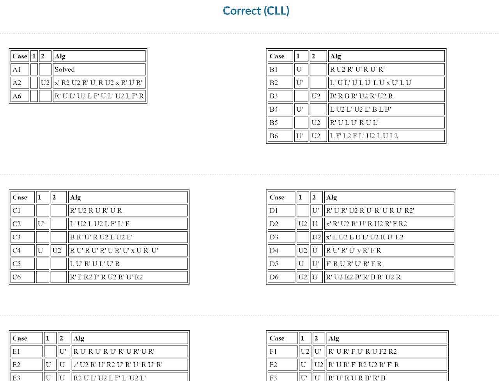
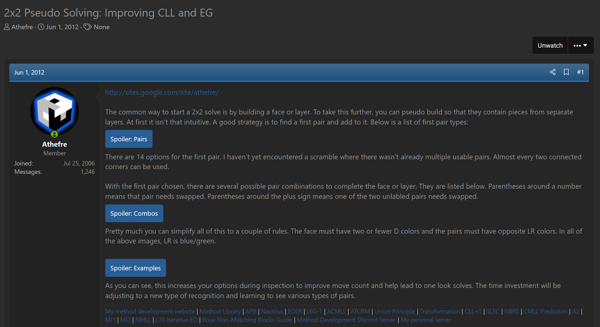

import AnimCube2x2 from "@site/src/components/AnimCube2";

# NMCLL

<AnimCube2x2 params="config=../../InteractConfig.txt&move={Solve last layer corners: R U R' U R U2 R'}R U R' U R U2 R'.{Undo pseudo: U' R'}U' R'" width="600px" height="400px" />

## Description

**Proposer:** [Michael James Straughan](CubingContributors/MethodDevelopers.md#straughan-michael-james-athefre)

**Proposed:** 2012

**Steps:**

1. Solve the four bottom layer corners with one side free to have pieces from another part of that side.
2. Solve the four upper layer corners then correct the pseudo layers.

[Click here for more step details on the SpeedSolving wiki](https://www.speedsolving.com/wiki/index.php?title=NMCLL)

### Origin and Development

NMCLL is when the bottom layer consists of pieces from outside of the bottom layer. This creates a pseudo layer and the term non-matching and the acronym NM is added to CLL.

A non-matching layer of corners was first proposed for the Roux method by Gilles Roux in 2004 [1]. A recognition method was devised by Roux and development was completed by Roux and Michael James Straughan [2, 3, 4].

In 2010, Straughan developed NMCLL specifically for 2x2x2 CLL [5, 6].

### Recognition

The original recognition method from 2006 involved first checking the orientation of the stickers that belong on the left and right sides of the upper layer. Then the user finds the locations of the stickers that belong on the upper layer.

In 2010, Straughan developed an improved recognition method [7, 8]. The first step remains the same, but in the second step the user checks pre-determined positions for a pattern.

In 2021, Straughan devised a new recognition method that was then developed into a document by Tim Mosher [9]. The steps are the same as the previous method, with the difference being that only two pre-determined positions need to be checked in the second step.

## References

[1] 	G. Roux, ""LL" corners," Yahoo! Groups - Speed Solving Rubik's Cube, 12 December 2004. [Online]. 

[2] 	G. Roux, "Step 3," Roux's website, 2004. [Online]. Available: https://web.archive.org/web/20041214140729/http://grrroux.free.fr:80/method/Step_3.html.

[3] 	M. J. Straughan and G. Roux, Personal communication, 3 October 2006. [Online]. 

[4] 	G. Roux, "Step 3," Roux's website, 2006. [Online]. Available: http://grrroux.free.fr/method/Step_3.html.

[5] 	M. J. Straughan, "2x2 Pseudo Solving: Improving CLL and EG," SpeedSolving.com, 1 June 2012. [Online]. Available: https://www.speedsolving.com/threads/2x2-pseudo-solving-improving-cll-and-eg.37073/.

[6] 	M. J. Straughan, "A2," Straughan's website, 2012. [Online]. Available: https://sites.google.com/site/athefre/other/nmcll?authuser=0.

[7] 	M. J. Straughan and G. Roux, Personal communication, 26 April 2010. [Online]. 

[8] 	G. Roux, "Step 3," Roux's website, 2010. [Online]. Available: https://web.archive.org/web/20111204185452/http://grrroux.free.fr/method/Step_3.html.

[9] 	M. J. Straughan and T. Mosher, "ATCRM," Straughan's Website, 2021. [Online]. Available: https://sites.google.com/site/athefre/atcrm?authuser=0.