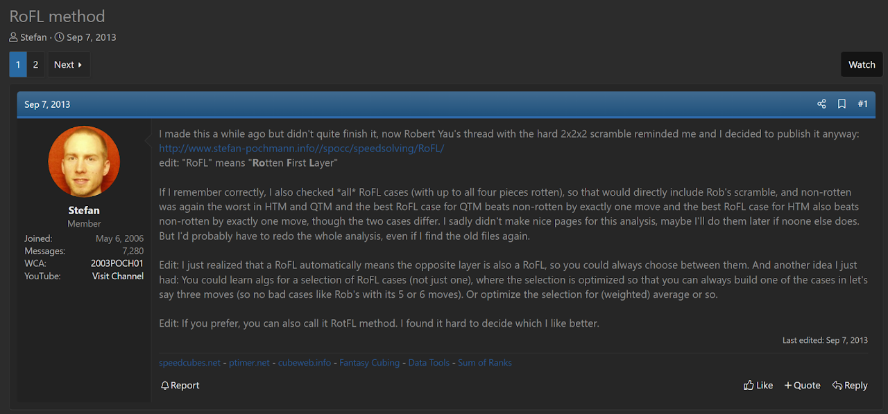
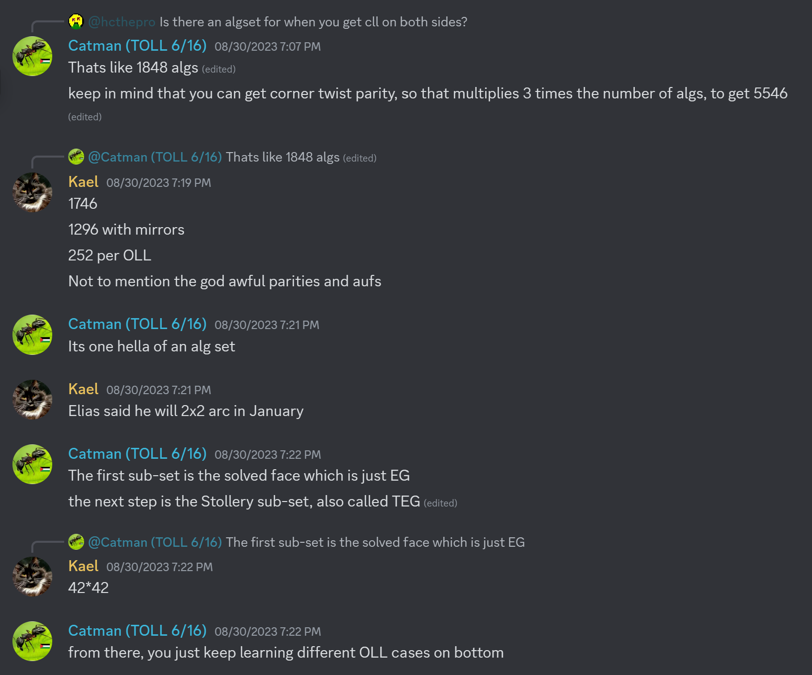
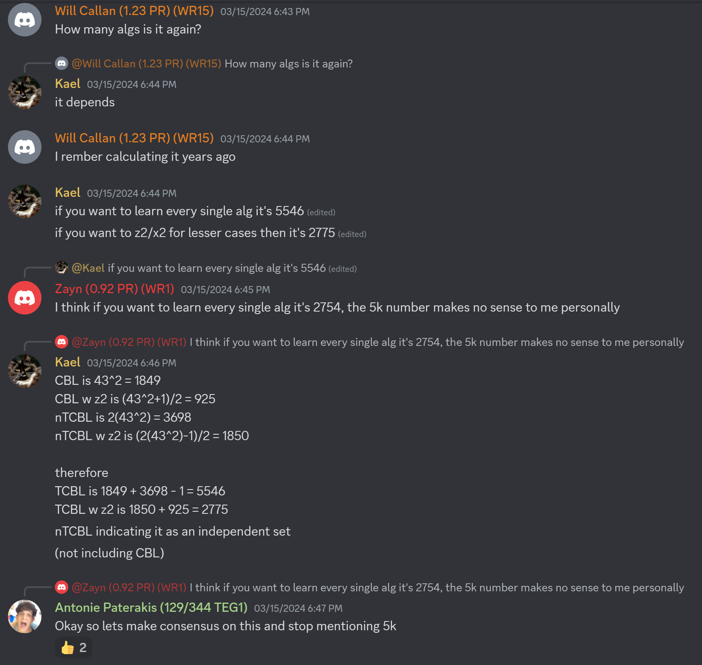
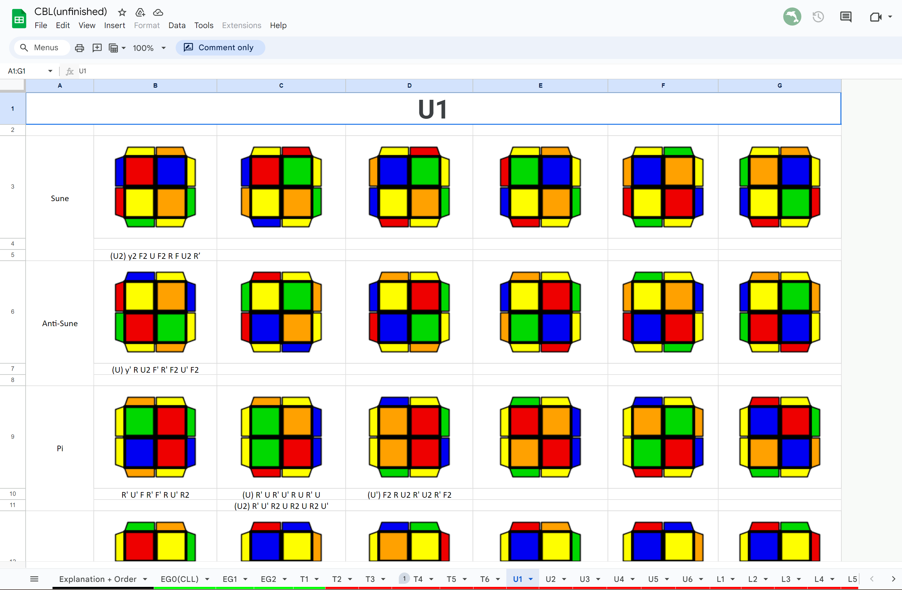

import AnimCube2x2 from "@site/src/components/AnimCube2";

# RoFL

<AnimCube2x2 params="config=../../InteractConfig.txt&move={Solve both layers: F U' R U R'}F U' R U R'" width="600px" height="400px" />

## Description

**Proposer:** [Stefan Pochmann](CubingContributors/MethodDevelopers.md#pochmann-stefan)

**Proposed:** 2009

**Steps:**

1. Move all bottom layer corners to the bottom layer, disregarding orientation or permutation.
2. Solve the upper and bottom layer corners simultaneously.

[Click here for more step details on the SpeedSolving wiki](https://www.speedsolving.com/wiki/index.php?title=RoFL)

## Origin and Development

### Stefan Pochmann

Around 2009, Stefan Pochmann began developing an idea he called Rotten First Layer (RoFL). The bottom layer pieces are free to be in any orientation or permutation. Then an algorithm set is used to solve the upper layer corner case while correcting the bottom layer. The method can be seen as executing CLL or TCLL on both sides. Although development of the method occurred in 2009, it wasn't until 2013 that Pochmann published the method to the online community [1, 2].

Along with the proposal of the method, Pochmann provided some techniques that can be used. Because both sides are CLL or TCLL cases, it is often possible to use an alternate, better algorithm by flipping the 2x2x2 over. It also isn’t necessary to learn all of the possible algorithms for the method. The cube flipping technique can again be used to reduce the number of cases.

### CBL and TCBL

In 2023, the method idea resurfaced on the Discord server dedicated to 2x2x2 discussion [3]. Initial discussions among Bilal Mourad, Kael Hitchcock, Antonie Paterakis, Jules Porteners, Will Callan, and Zayn Khanani had a heavy focus on determining the number of required algorithms [4, 5]. The community came to some of the same conclusions as Pochmann as it relates to flipping the cube.

In November, 2023, Hitchcock started development on the entire method, eventually making the document public to the community for everyone to learn and contribute [6]. The 2x2x2 community refers to the method as Corners of Both Layers (CBL) and Twisty Corners of Both Layers (TCBL).

<iframe width="640" height="360" src="https://www.youtube.com/embed/3fnvk7kclDw" frameborder="0" allow="accelerometer; autoplay; encrypted-media; gyroscope; picture-in-picture" allowfullscreen></iframe>

## TCLL

An interesting part of history is the development of TCLL. TCLL is a subset of RoFL and Pochmann generated the algorithms for the two TCLL sets. The sets are included on the RoFL webpage along with the other sets of RoFL that were generated by Pochmann.

In 2013, Robert Yau and Christopher Olson identified TCLL from RoFL as a method that they would like to develop. Yau and Olson generated new algorithms, gave the method the name Twisty CLL (TCLL), and presented to speedsolving.com. See the [TCLL](2x2/Methods/TCLL.md) page for the complete history.

## References

[1] 	S. Pochmann, "RoFL 2x2x2," Pochmann's Website, 2009. [Online]. Available: https://www.stefan-pochmann.info//spocc/speedsolving/RoFL/.

[2] 	S. Pochmann, "RoFL method," SpeedSolving.com, 7 September 2013. [Online]. Available: https://www.speedsolving.com/threads/rofl-method.43898/.

[3] 	hcthepro, Discord, 8 May 2023. [Online]. Available: https://discord.com/channels/987246070750924870/987246942809649224/1105085400227258449.

[4] 	B. Mourad, K. Hitchcock, A. Paterakis, J. Porteners, W. Callan and Z. Khanani, Discord, August 2023. [Online]. Available: https://discord.com/channels/987246070750924870/987246942809649224/1146582096903688192.

[5] 	B. Mourad, K. Hitchcock, A. Paterakis, J. Porteners, W. Callan and Z. Khanani, Discord, March 2024. [Online]. Available: https://discord.com/channels/987246070750924870/1139255360545362033/1218328846093520989.

[6] 	K. Hitchcock, "CBL(unfinished)," Google Sheets, 18 November 2023. [Online]. Available: https://docs.google.com/spreadsheets/d/1ZByoB9a4eDOKzr8N1s3yckhMy5VRo-Mn6VDkK4WVgI4/edit#gid=1159375609.