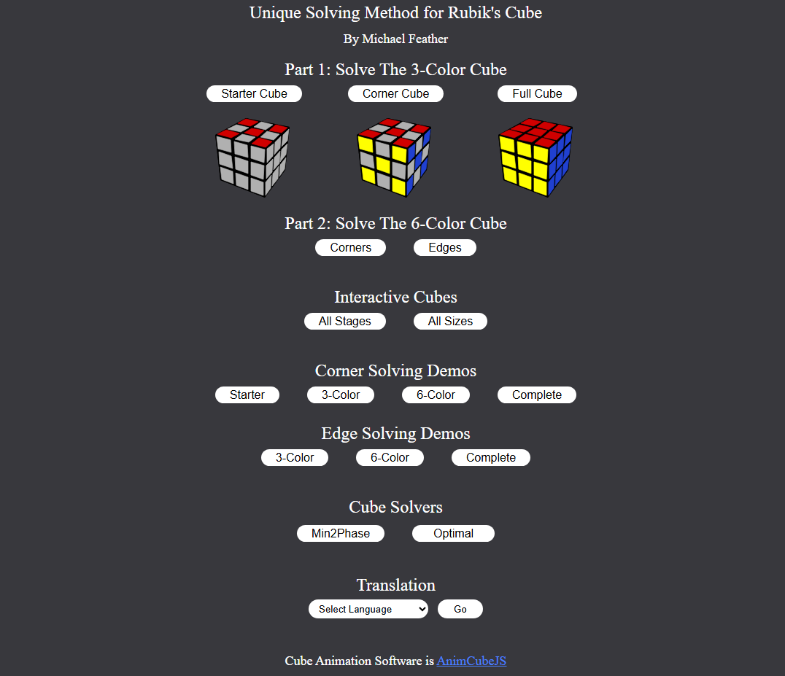
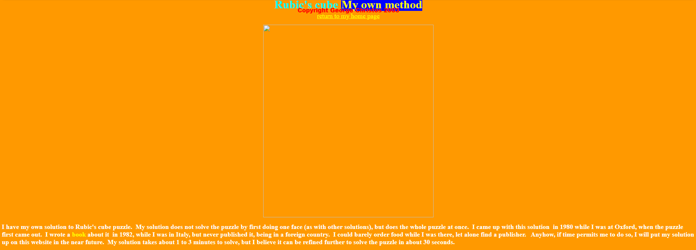

import AnimCube from "@site/src/components/AnimCube";
import ReactPlayer from 'react-player'
import ImageCollage from '@site/src/components/ImageCollage';

# 3-Color

<AnimCube params="config=../../ExhibitConfig.txt&facelets=wyywyywwywwwywwyyybgggbbbbgbbgbggbggrrorooroorrrrroooo" width="400px" height="400px" />

## Description

**Proposer:** [Michael Feather](CubingContributors/MethodDevelopers.md#feather-michael), [George Christos](CubingContributors/MethodDevelopers.md#christos-george)

**Proposed:** 1980

**Steps:**

1. Orient and position pieces, treating opposite faces as the same color.
2. Permute pieces to their correct layers.

[Click here for more step details on the SpeedSolving wiki](https://www.speedsolving.com/wiki/index.php?title=3-Color_Cube_Method)

## Introduction

In 1980, two individuals independently arrived at the idea of a human solving method based on reducing a scrambled Rubik's Cube to a 3-Color version of Rubik's Cube. One being Michael Feather and the other George Christos. However, the steps each person follows are different to reach the 3-Color state and solve from that point.

The 3 Color method is described as a human solving method to distinguish it from the very similar, and prior existing, computer algorithm [Thistlethwaite](3x3/3x3ComputerAlgorithms.md#morwen-thistlethwaite-1980). There is also the method called [Human Thistlethwaite](HumanThistlethwaite.md), which is an adaption of the Thistlethwaite algorithm for human use. For now, Human Thistlethwaite is kept as a separate entity due to its steps intentionally closely following those of the computer algorithm.

## Michael Feather

### Origin and Publication

During an email exchange with CubingHistory.com, Michael Feather described the origin of his development of the idea [1]. In 1980 he obtained a cube and initially had been attempting to solve using the layer by layer method. He then tried to solve the corners or the edges first and eventually realized that it would be possible to simplify the solve by treating opposite face pieces as the same color. The method wasn't published at the time and the earliest known initial publication occurred in 2011 on a personal website. This is potentially confirmed based on dated files provided to CubingHistory.com by Feather. The method made its appearance on a domain, which may or may not be the 2011 original, starting at least as far back as 2015 [2, 3].

> I created my 3-color method in 1980 after getting my first cube which I saw on a TV commercial. Solving took a few weeks, not exactly sure how long. After initial attempts to solve it became apparent that the last layer would be difficult so tried to simplify by doing either corners or edges first but it was still too tedious. In need of a way to further simplify I noticed that it would be much easier if opposite faces were the same color so tried solving as if it were a 3-color cube and had much more success. Nothing was written down, everything was done from memory.
>
> As for publishing, that wasn't until after I was able to get a cube simulator to work in the browser and despite the java version of Josef Jelínek's AnimCube being available since 2001, wasn't able to use it until many years later. Had looked at several different simulators over the years with varying degrees of success and finally got Josef's to work. Initial use was a website for my cube solver and eventually got the idea to publish my solving method. The oldest backup I found of website for solving method is from 2011 (see attached zip file, the pages have been updated to use the cheerpj jvm but the originals are in file rz.tar.gz within the zip).

<a href="/archive/MethodFiles/rc.zip">Backup Files</a>

In 2024, Feather published the method on a new web page that is more detailed than the original, with more in-depth explanations, even more applets to demonstrate instructions, and solvers [4].

### Steps

1. Corners
   1. Solve the corners as a 3-Color cube. This means to simply orient all corners on Rubik's Cube (a six color cube).
   2. Reduce the corners to be half turn solvable.
   3. Permute the corners using half turns.
2. Edges
   1. Solve the edges as a 3-Color cube. This means to orient and position opposite colored edges on either side.
   2. Permute edges to their correct sides.

A note is that the corners and edges can be solved in either order, with an additional possible step if the edges are solved first.

## George Christos

### Origin and Publication

On a personal website in 2004, George Christos stated that while in university in 1980, he obtained a cube and devised a custom solution [5]. He stated that his solution was different from the layer by layer solutions that were popular at the time, and instead "does the whole puzzle at once". In 1982 he wrote a book detailing the solution, but wasn't able to publish it due to living in a foreign country at the time.

In February 2009, Christos published his 3-Color solution, making it available for purchase in booklet form [6]. The booklet could be purchased on three different websites [7, 8, 9]. Accompanying the post was a video providing an example solve [10]. In March 2009, Christos posted another video that discusses the booklet [11].

 

  <iframe loading="lazy" width="100%" height="100%"
    src="https://www.youtube.com/embed/upub1rOvfqI"
    frameborder="0" allowfullscreen
    style={{position: 'absolute', top: 0, left: 0}}>
  </iframe>

 

  <iframe loading="lazy" width="100%" height="100%"
    src="https://www.youtube.com/embed/18_WoFQp8WQ"
    frameborder="0" allowfullscreen
    style={{position: 'absolute', top: 0, left: 0}}>
  </iframe>

 
In July 2016, Christos made the booklet available for free through a YouTube video that displays each page of the booklet [12]. On January 18 2025, Christos posted a comment on the video with a link to the .pdf version of the booklet [13]. A backup link to the booklet is <a href="/archive/MethodFiles/g_christos_soln_rubics_cube_3x3.pdf ">here</a>. On the same day, Christos posted a short video to his Facebook page with an example solve of his method [14, 15].

  <iframe loading="lazy" width="100%" height="100%"
    src="https://www.youtube.com/embed/2t_EIyowSIY"
    frameborder="0" allowfullscreen
    style={{position: 'absolute', top: 0, left: 0}}>
  </iframe>

 
<ImageCollage
images={[
{ src: require("@site/docs/3x3/Methods/img/3-Color/Booklet1.png").default},
{ src: require("@site/docs/3x3/Methods/img/3-Color/Booklet2.png").default},
{ src: require("@site/docs/3x3/Methods/img/3-Color/Booklet3.png").default}
]}
/>

### Steps

1. Solve as a 3-Color cube on each face.
   1. Create two opposite oriented faces consisting of colors from either side.
   2. Form another two faces consisting of opposite colors.
   3. Form the final two faces consisting of opposite colors.
   4. Permute the corners, if necessary, to be half turn solvable.
2. Solve each opposite colored face.
   1. Solve a pair of opposite faces.
   2. Solve another pair of opposite faces.
   3. Solve the final pair of opposite faces.

## Credit

Thanks to Tadeáš Miler for suggesting the creation of this page and for providing the various websites by Feather and Christos.

## References

[1] M. Feather and M. J. Straughan, "Personal Communication," 8 August 2025. [Online].

[2] M. Feather, "How to Solve Rubik's Cube - A 3-Color Method," 19 September 2016. [Online]. Available: https://web.archive.org/web/20160919154216/http://www.irbsystems.com/test2/rc/.

[3] T. Miler, "Programmers wanted," SpeedSolving.com, 29 June 2015. [Online]. Available: https://www.speedsolving.com/threads/programmers-wanted.53140/page-2#post-1095551.

[4] M. Feather, "Unique Solving Method for Rubik's Cube," GitHub, 2024. [Online]. Available: https://mfeather1.github.io/3ColorCube/.

[5] G. Christos, "Rubic's cube My own method," 2004. [Online]. Available: https://web.archive.org/web/20040307094950/http://www.maths.curtin.edu.au:80/~christos/rubic.shtml.

[6] G. Christos, "'NEW' alternate illustrated solution to Rubik's cube puzzle," SpeedSolving.com, 25 February 2009. [Online]. Available: https://www.speedsolving.com/threads/new-alternate-illustrated-solution-to-rubiks-cube-puzzle.9909/.

[7] G. Christos, "'NEW' alternate illustrated solution to Rubik's cube puzzle," February 2009. [Online]. Available: https://web.archive.org/web/20110706123719/http://www.members.iinet.net.au/~justgeorgeous/solvingRubikscube.html.

[8] G. Christos, "'NEW' alternate illustrated solution to Rubik's cube puzzle," February 2009. [Online]. Available: https://web.archive.org/web/20090228055942/https://ubuyonline.com.au/rubik_cube.html.

[9] G. Christos, eBay, February 2009. [Online]. Available: http://shop.ebay.com.au/merchant/justgeorgeous.

[10] G. Christos, "solve Rubik Cube puzzle, solution, learn how to NEW quick easy METHOD," YouTube.com, 21 February 2009. [Online]. Available: https://www.youtube.com/watch?v=upub1rOvfqI.

[11] G. Christos, "NEW SOLUTION to Rubik's Cube. Fully illustrated step-by-step booklet by Dr George Christos," YouTube.com, 3 March 2009. [Online]. Available: https://www.youtube.com/watch?v=18_WoFQp8WQ.

[12] G. Christos, "New Solution to Rubik's Cube: step by step solution booklet. FREE!!," YouTube.com, 22 July 2016. [Online]. Available: https://www.youtube.com/watch?v=2t_EIyowSIY.

[13] G. Christos, "NEW solution to Rubik's cube," 2009. [Online]. Available: https://justgeorgeous.net/g%20christos%20soln%20rubics%20cube%203x3.pdf.

[14] G. Christos, Facebook, 18 January 2025. [Online]. Available: https://www.facebook.com/reel/1600959130532266.

[15] G. Christos, "Alternate Rubik Cube solution by Dr George Christos," Facebook, 19 July 2016. [Online]. Available: https://www.facebook.com/DrGeorgeChristos/.
