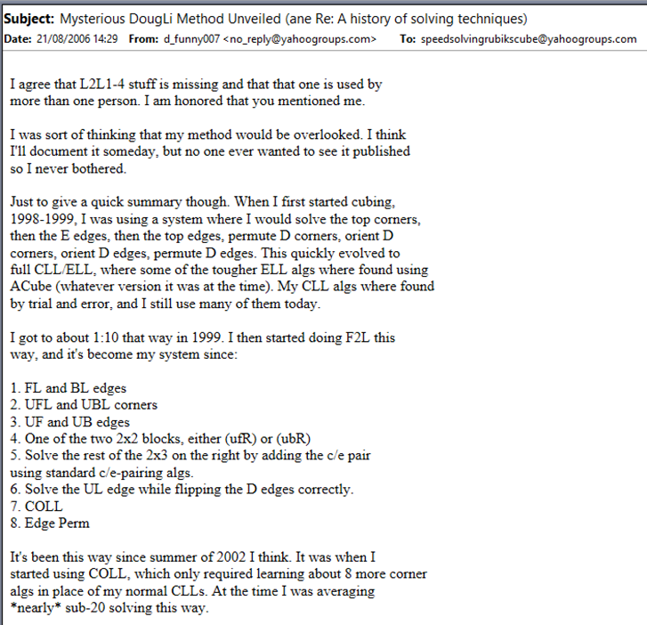

# Doug Li

## Description

**Proposer:** [Doug Li](CubingContributors/MethodDevelopers.md#li-doug)

**Proposed:** 2002

**Steps:**

1. Solve the FL and BL edges.
2. Solve the UFL and UBL corners.
3. Solve the UF and UB edges.
4. Solve either 1x2x2 at the top right.
5. Solve the corner and edge pair that belongs with the 1x2x2 from the previous step.
6. Solve the remaining edge of the first two layers while orienting the last layer edges.
7. Solve the corners of the last layer, preserving the edge orientation.
8. Permute the last layer edges.

>It was common in the early 2000s and prior to solve pieces from the top down, leaving unsolved pieces on the bottom of the cube. The method as originally described has the last layer on the bottom of the cube.

[Click here for more step details on the SpeedSolving wiki](https://www.speedsolving.com/wiki/index.php/Doug_Li_Method)

## Origin

### First Description

Doug Li revealed his method in August, 2006 [1]. He stated that it was created in 2002.

**Doug Li's original website:**

https://web.archive.org/web/20050403232005/http://www-personal.umich.edu:80/~dlli/

### Doug Li Block

Doug Li requested that a 2x2x3 block minus the edge between the two corners be called a "Doug Li Block" [2].

## References

1. D. Li, "Mysterious DougLi Method Unveiled (ane Re: A history of solving techniques)," Yahoo! Groups - Speed Solving Rubik's Cube, 21 August 2006. [Online]. 
2. D. Li, "Mysterious DougLi Method Unveiled (ana Re: A history of solving techniques)," Yahoo! Groups - Speed Solving Rubik's Cube, 21 August 2006. [Online].