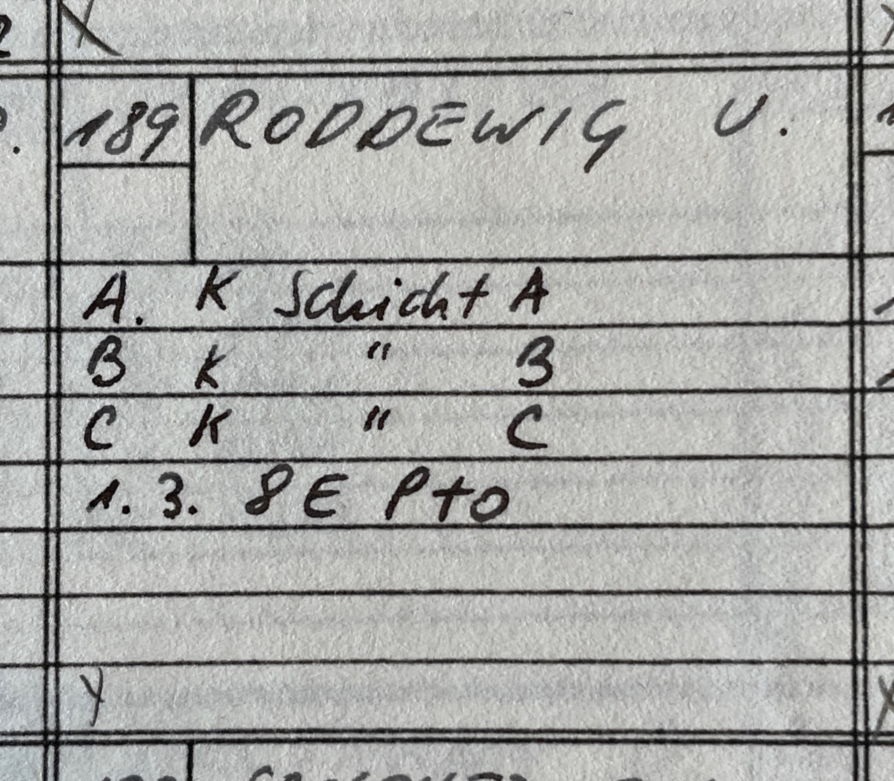
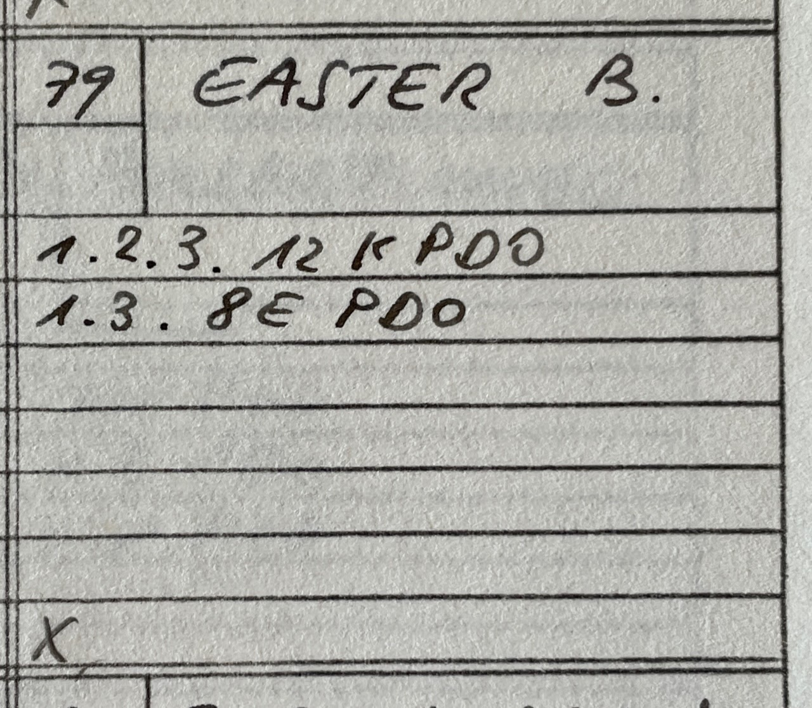
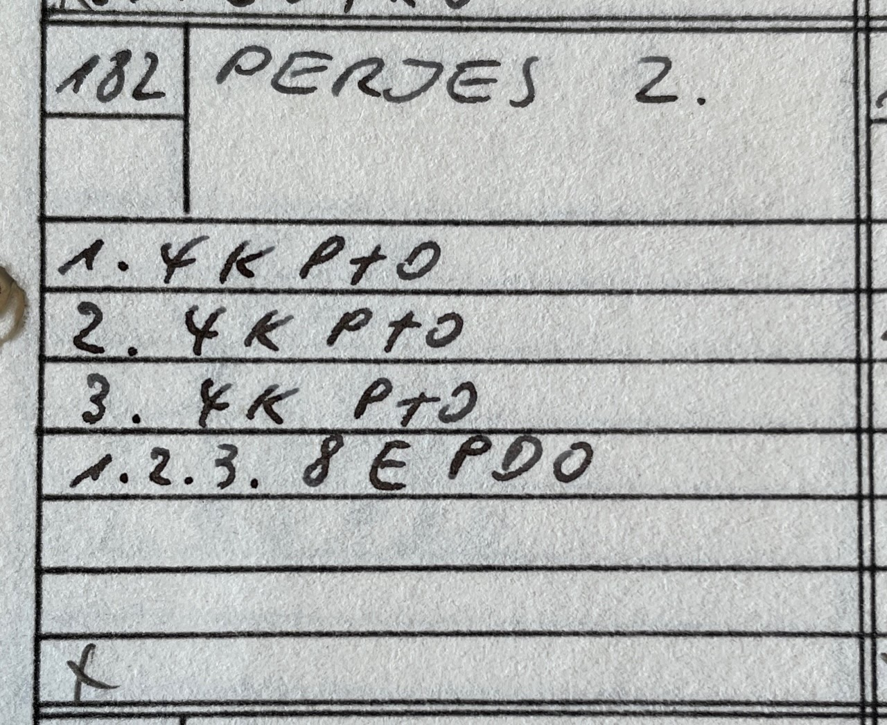

import AnimCube from "@site/src/components/AnimCube";

# Edges First

<AnimCube params="buttonbar=0&position=lluuu&scale=6&hint=10&hintborder=1&borderwidth=10&facelets=dydyyydyddwdwwwdwddbdbbbdbddgdgggdgddodooododdrdrrrdrd" width="400px" height="400px" />

## Description

**Proposer:** Various

**Proposed:** ~1979

**Steps:**

1. Solve all edges.
2. Solve all corners.

[Click here for more step details on the SpeedSolving wiki](https://www.speedsolving.com/wiki/index.php/Edges_First)

## Origin

### First Publication

The first known publication of an Edges First method is from June 1979 [1]. The method appeared in Ulrich Roddewig's *Solution Guide for the Hungarian Magic Cube*.

>I contacted Georges Helm to ask the method steps in all of the books he owns from 1980 and earlier. This is a handwritten list of steps. "K" is for edges and "E" is for corners. The numbers on the left indicate the bottom, middle, and upper layer. "P" is for "position" and "O" is for "orient". Hanke Bremer's publication is the earliest of the books he owns that describes edges first.

>The steps are: Edges of first layer, edges of middle layer, edges of last layer, then solve the 8 corners.

### Others

Other Edges First solutions appeared later in 1979. One example is Bob Easter's solution published in *Magic cube solution* from October, 1979 [2]. Georges Helm provided the steps.

In September, 1981 in the Cube Lovers mailing list [3], Stan Isaacs described Easter's method as using a single four move sequence of turns, F R' F' R, for every process of solving the cube.

In *Notes on Rubik's Magic Cube*, other edges first methods are described [4]. One included statement is "R. Penrose believes that his method, which puts edges in place first, takes about 100 moves, but he hasn't analysed it in detail."

Another mention of an edges first in *Notes on Rubik's Magic Cube* says "Michael Vaughn-lee has just sent me a detailed analysis of his general algorithm, which works by doing the edges first and takes at most 173 moves and he says one of the 3-cycles on corners would cut this down by 8 moves." [5]

Hungarian physicist Zoltán Perjés, a relative of Ernő Rubik [6], published an Edges First method. However, the original publication date is unknown. The bibliography in *Notes on Rubik's 'Magic Cube'* states January, 1980 for the revised version. This means that the original version likely appeared in 1979 or earlier. This method is based on an edges first method by Roger Penrose according to *Notes on Rubik's 'Magic Cube'*. "Zoltan Perjés has written out an algorithm, based on Penrose's, which does D edges, middle slice edges, U edges, then corners in place and then oriented." [7]

>The steps are: First layer edges, second layer edges, third layer edges, permute all corners, orient all corners.

## References

[1] U. Roddewig, Solution Guide for the Hungarian Magic Cube, Cologne, Germany, 1979. 

[2] B. Easter, Magic Cube Solution, San Francisco, 1979. 

[3] S. Isaacs, "misc," Cube Lovers, 8 September 1981. [Online]. Available: https://www.math.rwth-aachen.de/~Martin.Schoenert/Cube-Lovers/Stan_Isaacs__misc.html.

[4] D. Singmaster, in Notes on Rubik’s 'Magic Cube', Hillside, NJ, Enslow Publishers, 1981, p. 26.

[5] D. Singmaster, in Notes on Rubik's 'Magic Cube', Hillside, NJ, Enslow Publishers, 1981, p. 29.

[6] P. Forgács, "fizikai szemle," January 2007. [Online]. Available: http://www.epa.oszk.hu/00300/00342/00200/pdf/FizSzem_EPA00342_2007_01.pdf.

[7] D. Singmaster, in Notes on Rubik's 'Magic Cube', Hillside, NJ, Enslow Publishers, 1981, p. 40.
