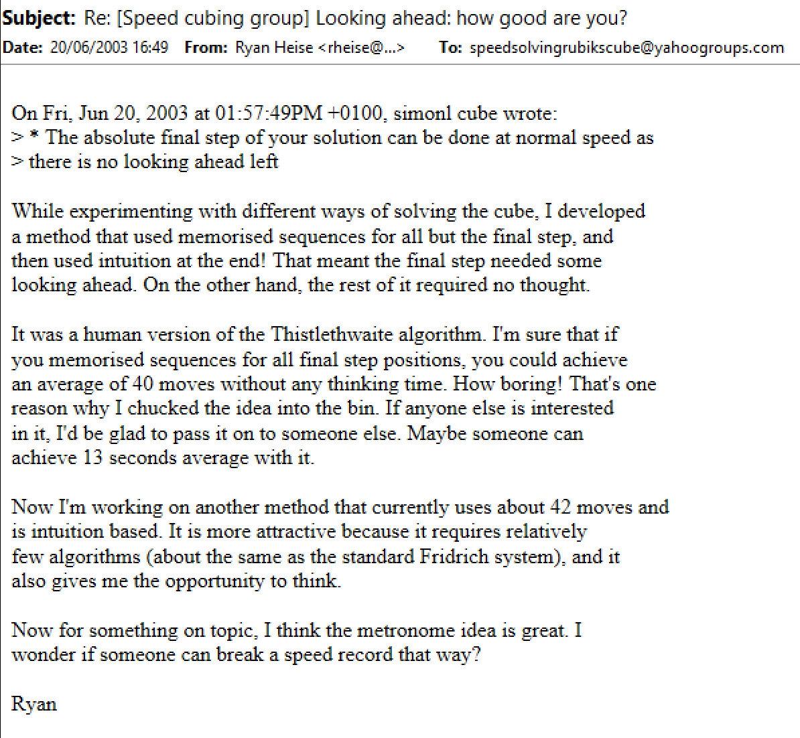
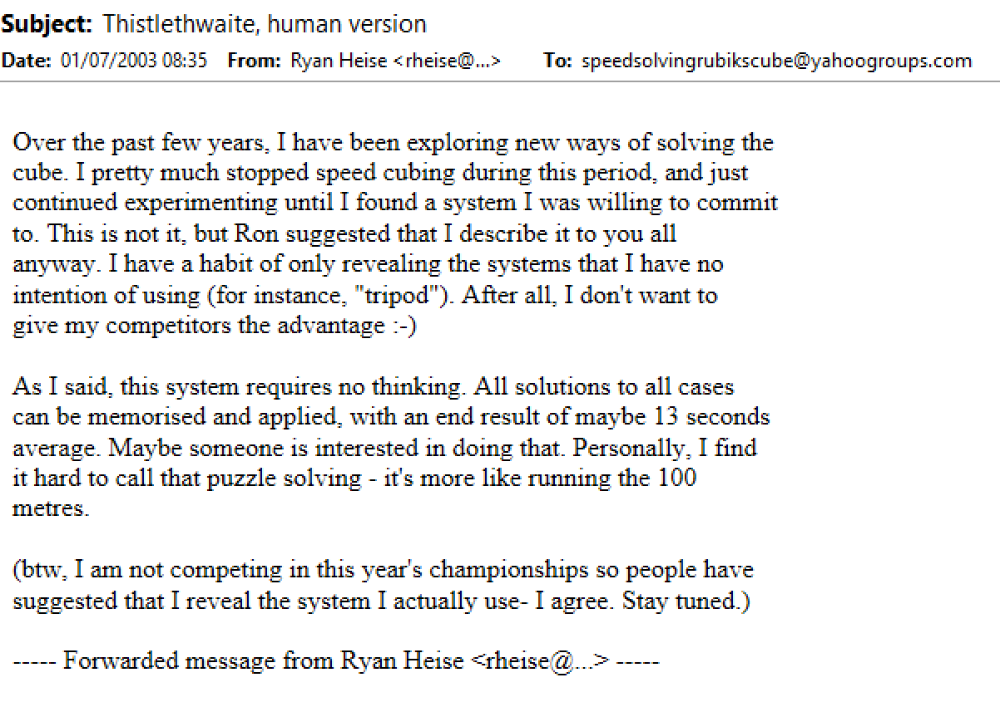
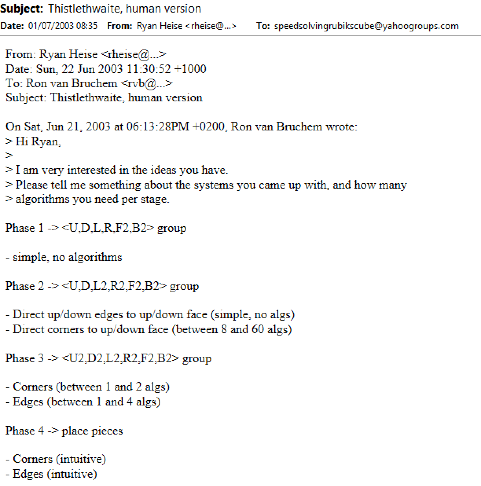
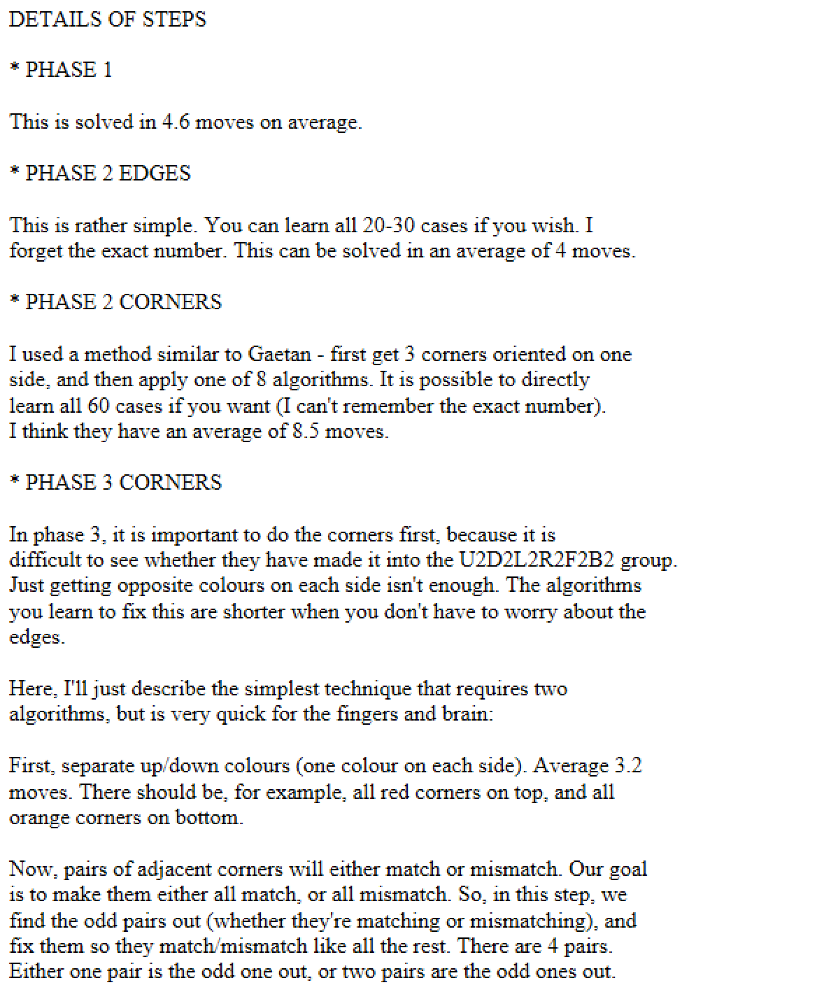
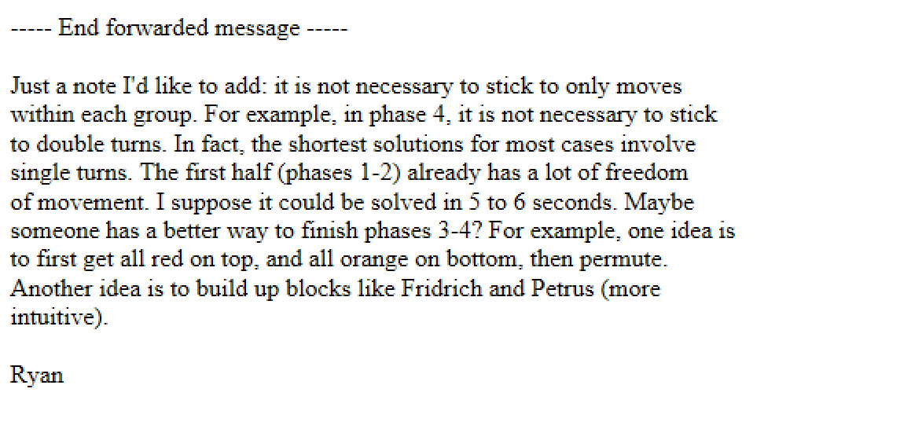
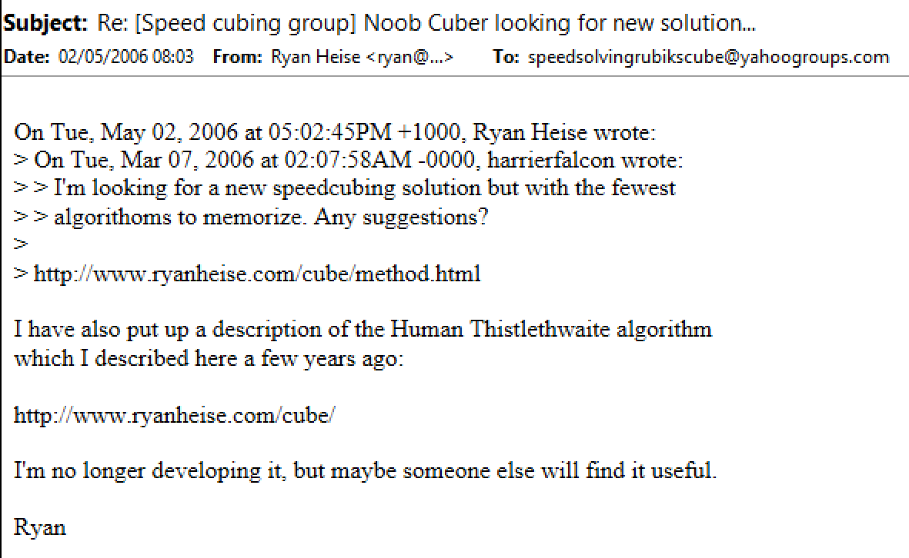

# Human Thistlethwaite

## Description

**Proposer:** [Ryan Heise](CubingContributors/MethodDevelopers.md#heise-ryan)

**Proposed:** 2002

**Steps:**

1. Reduce the cube to the move group \<U, D, L, R, F2, B2>. This means to orient all edges along the z axis.
2. Reduce to the \<U, D, L2, R2, F2, B2> move group. U/D layer edges are moved to U/D and all corners are oriented to U/D.
3. Reduce to the \<U2, D2, L2, R2, F2, B2> move group. The corners are permuted to have opposite stickers on all sides and all edges are moved to their native inner layers.
4. Permute all pieces using the \<U2, D2, L2, R2, F2, B2> move group.

[Click here for more step details on the SpeedSolving wiki](https://www.speedsolving.com/wiki/index.php/Human_Thistlethwaite_Algorithm)

## Origin

### Initial Description

The first mention of the method was in June, 2003. Ryan Heise stated that he had once developed the method [1].

A couple of weeks later, in July, 2003, Heise described the steps and process [2].

### Website Addition

In late April or early May, 2006, Heise added the method to his website [3, 4]. The website states that the method was created in December of 2002.

## References

1.	R. Heise, "Re: [Speed cubing group] Looking ahead: how good are you?," Yahoo! Groups - Speed Solving Rubik's Cube, 20 June 2003. [Online].
2.	R. Heise, "Thistlethwaite, human version," Yahoo! Groups - Speed Solving Rubik's Cube, 1 July 2003. [Online].
3.	R. Heise, "Re: [Speed cubing group] Noob Cuber looking for new solution…," Yahoo! Groups - Speed Solving Rubik's Cube, 2 May 2006. [Online]. 
4.	R. Heise, " Human Thistlethwaite Algorithm," ryanheise.com. [Online]. Available: https://web.archive.org/web/20060703235037/http://www.ryanheise.com/cube/human_thistlethwaite_algorithm.html.