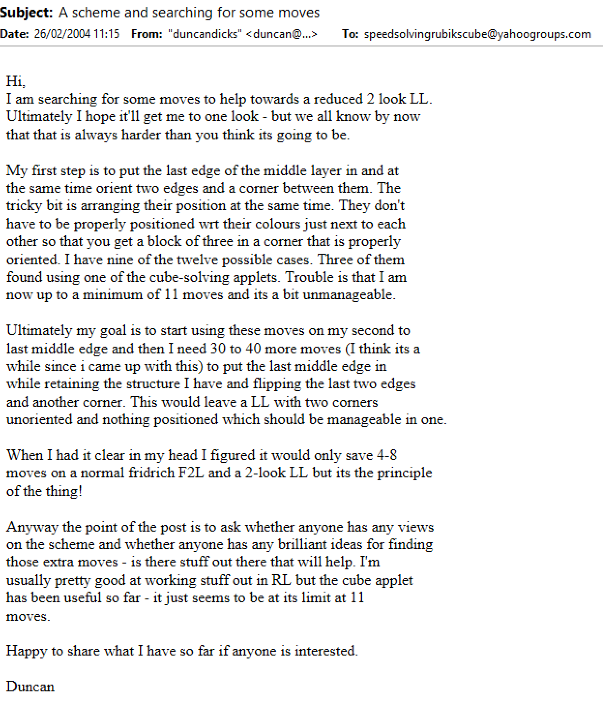
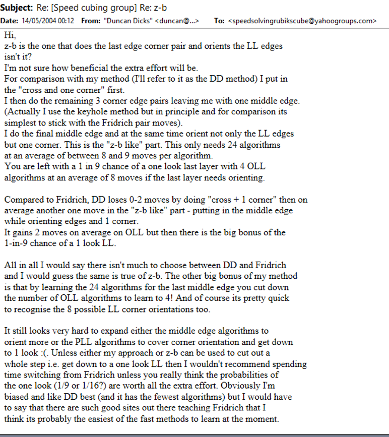
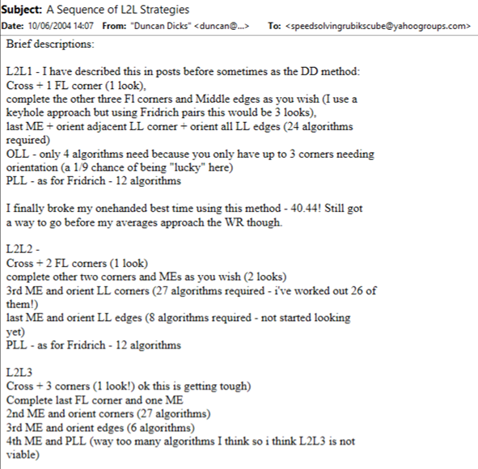
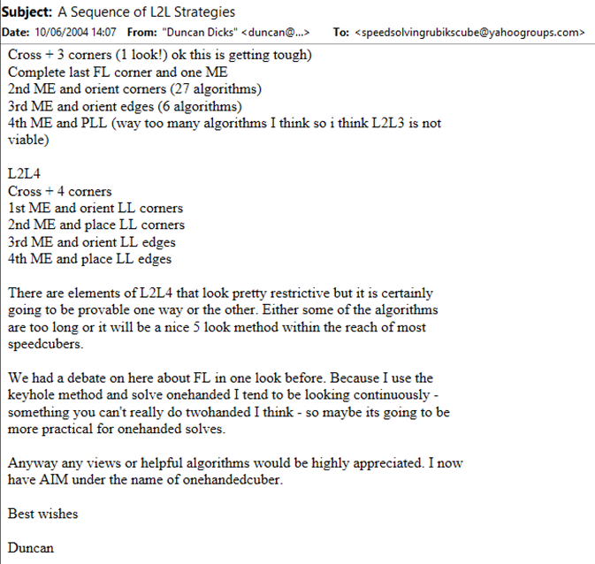
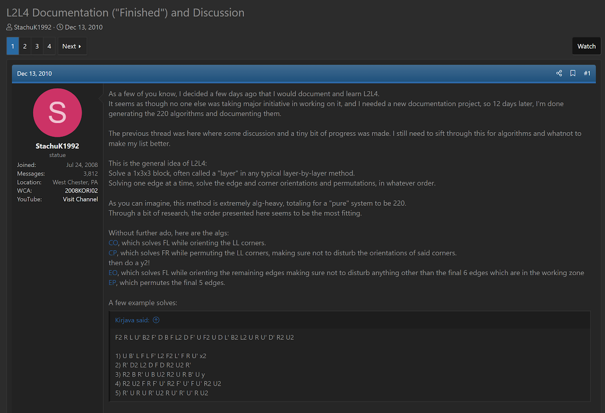
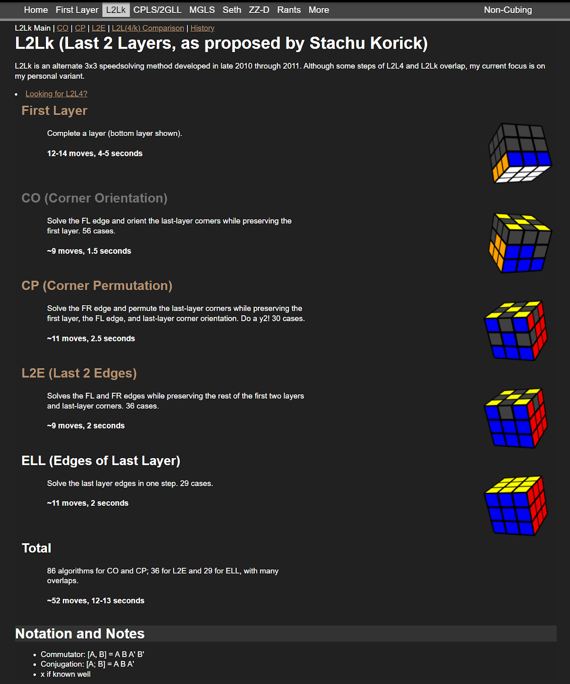
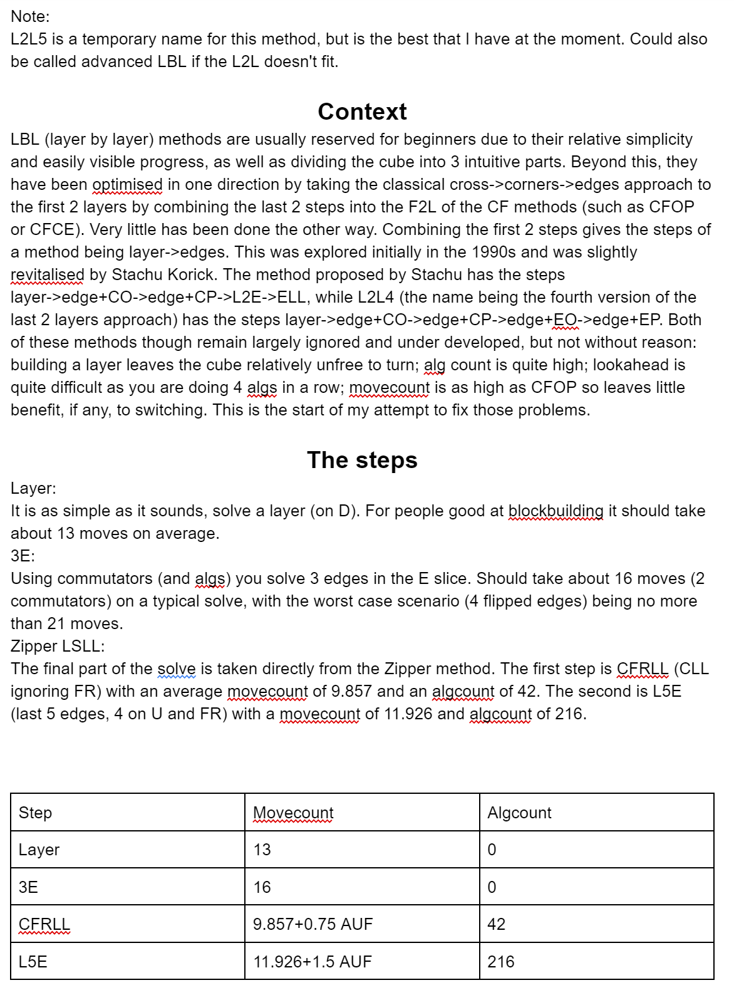

# L2L

## Description

**Proposer:** [Duncan Dicks](CubingContributors/MethodDevelopers.md#dicks-duncan)

**Proposed:** 2004

**Steps:**

1. Solve the cross and one bottom layer corner.
2. Add the three corner edge pairs in the empty slots.
3. Solve the final middle layer edge while orienting all last layer edges and one last layer corner.
4. Orient the last layer.
5. Permute the last layer.

>L2L contains several variants. Typically the method performs simultaneous state changes and solving of the middle layer and upper layer.

[Click here for more step details on the SpeedSolving wiki](https://www.speedsolving.com/wiki/index.php/L2L4)

## Origin

### Initial Ideas

In December, 2003, Duncan Dicks started discussing ideas for a new method. It started with some last layer ideas, each manipulating multiple piece types at once.

In February, 2004, he mentioned the idea of getting to the F2L minus second layer edge state.

### L2L Proposal

In May, 2004, L2L was proposed.

### Variants

In June, 2004, several variants were added.

### Website

A website was created for L2L in September, 2004.

https://web.archive.org/web/20080308133423/cubertscubicle.mysite.wanadoo-members.co.uk/

## Community Interest and Development

### Stachu Korick

Several people in the community have expressed interest in the method. Enough that additional variants have been developed.

Stachu Korick began taking an interest in L2L development possibly in October, 2010.

https://www.speedsolving.com/threads/l2l4-the-lost-methode-help-find-it.24508/

In December, 2010, Korick created a thread on speedsolving.com about development efforts.

https://www.speedsolving.com/threads/l2l4-documentation-finished-and-discussion.26099/#post-499972
https://web.archive.org/web/20101217011022/https://dl.dropbox.com/u/4101778/L2L4%20alpha/CO.txt
https://web.archive.org/web/20101217061515/https://dl.dropbox.com/u/4101778/L2L4%20alpha/CP.txt
https://web.archive.org/web/20101217060921/https://dl.dropbox.com/u/4101778/L2L4%20alpha/EO.txt
https://web.archive.org/web/20101217061522/https://dl.dropbox.com/u/4101778/L2L4%20alpha/EP.txt

In 2011, Stachu Korick completed development on a new variant called L2Lk.

https://web.archive.org/web/20160825153229/http://stachu.cubing.net/l2lk/

### Joseph Tudor

As part of the Method Development Competition held in August, 2020, Joseph Tudor developed an L2L variant named L2L5. The steps of this variant are:

1. Solve the bottom layer.
2. Solve three edges in the E layer
3. Solve the corners of the last layer.
4. Solve the last five edges.

https://docs.google.com/document/d/1rGoKnkEjS2Tfs3JJ2t1zcU7F6b7bati8te5oGhqJuGY/edit