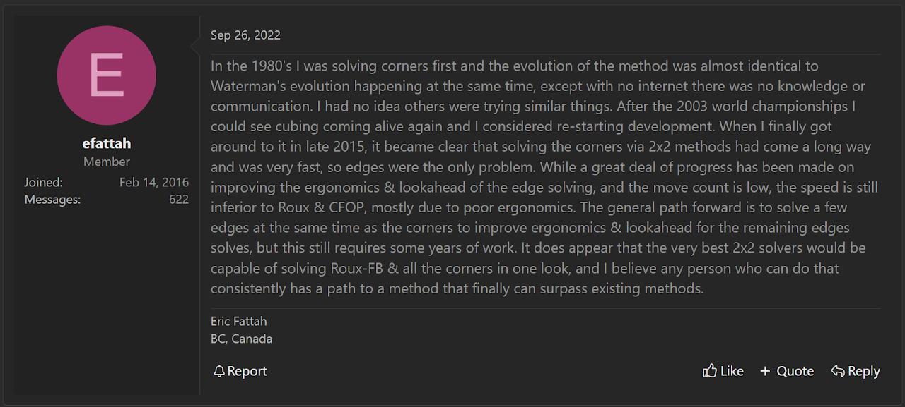
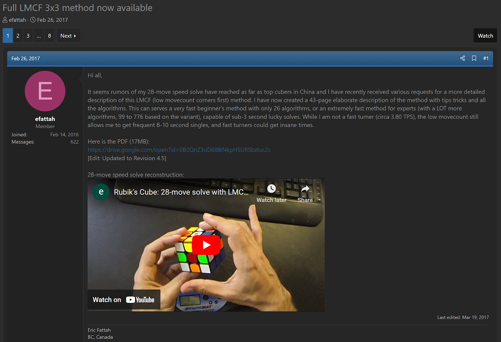

# LMCF

## Description

**Proposer:** [Eric Fattah](CubingContributors/MethodDevelopers.md#fattah-eric)

**Proposed:** 2017

**Steps:**

1. Solve all corners.
2. Solve a couple of edges in the U layer while looking ahead for edges to form pairs.
3. Solve edges until reaching the L7E or LSE state.
4. Solve the remaining edges.

[Click here for more step details on the SpeedSolving wiki](https://www.speedsolving.com/wiki/index.php/LMCF)

## Origin

### Development

In August, 2023, Eric Fattah stated that he had independently invented the Waterman method in 1981 [1]. Fattah would have been around six years old at the time [2].

Eric Fattah described the origin in more detail in a private message on speedsolving.com [3].

>This is a private message between Fattah and I.

### Proposal

The complete LMCF method was proposed in February, 2017 [4].

## References

1. E. Fattah, "Technique pushed in 1981?," SpeedSolving.com, 1 August 2023. [Online]. Available: https://www.speedsolving.com/threads/technique-pushed-in-1981.90636/post-1553358.
2. "Eric Fattah," Vertical Blue, 5 April 2008. [Online]. Available: https://archive.verticalblue.net/assets/archive/news-archive-pdf/Vertical%20Blue%20News%202008-04-05-1406%20(Eric%20Fattah).pdf.
3. E. Fattah, Interviewee, Origin of LMCF - Interview by Michael James Straughan. [Interview]. 26 September 2022.
4. E. Fattah, "Full LMCF 3x3 method now available," SpeedSolving.com, 26 February 2017. [Online]. Available: https://www.speedsolving.com/threads/full-lmcf-3x3-method-now-available.63998/.