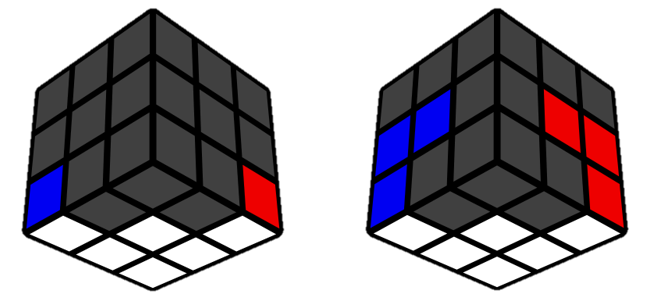
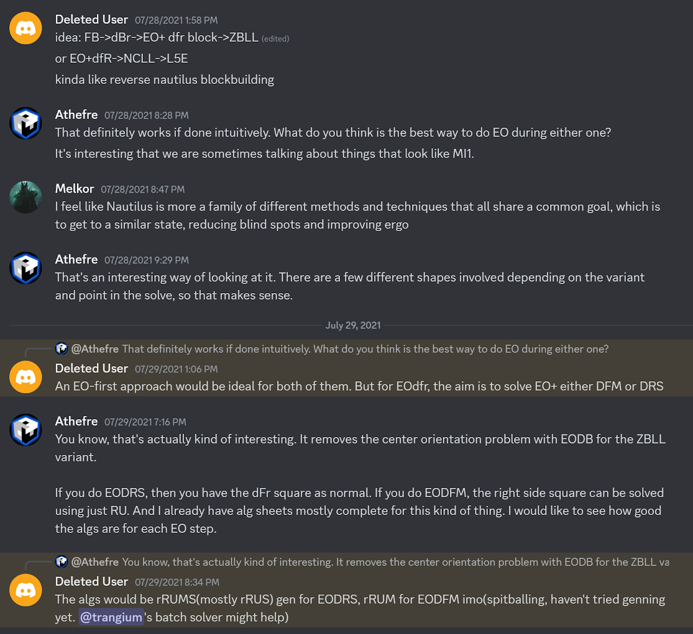

import AnimCube from "@site/src/components/AnimCube";

# MI1

## Description

**Proposer:** [Michael James Straughan](CubingContributors/MethodDevelopers.md#straughan-michael-james-athefre)

**Proposed:** 2006

**Steps:**

1. Build a 1x2x3 block on the left side.
2. Build a 1x2x2 block in the back at dBr.
3. Orient all edges.
4. Solve the front pair while orienting the last layer corners.
5. Permute the last layer corners while solving the DR edge.
6. Permute the last five edges.

>There are several variants of the method, including those that are more advanced. The presented steps are the original from 2006.

[MI1 Website](https://sites.google.com/site/athefre/3x3-methods/mi1?authuser=0)

[Click here for more step details on the SpeedSolving wiki](https://www.speedsolving.com/wiki/index.php/MI1)

## Origin

### Development

In early 2006, Michael James Straughan started using the Roux method [1]. Straughan had been exchanging emails with Gilles Roux to learn tips as to how to become faster [2]. Around the same time, Straughan took an interest in method development and started sharing ideas with Roux. Roux mentioned an idea for a method that started with a step of solving the bottom layer minus the DF and DR edges and the DFR corner. This allowed for interesting move sequences such as R u R' or F' u F. Straughan thought the idea was interesting, but didn't like that there were many blind spots after the first step. Straughan decided to double the shape of the first step to make a wall around the cube, removing blind spots. This resulted in the primary shape of MI1.

<AnimCube params="facelets=LLLLYLLLLWWWLWWLLWLBBLBLLLLLGGLGGLGGLLLOOOOOOLLLLRLLRR&position=lluuu&hint=10&scale=5&buttonbar=0" width="400px" height="300px" />

The method went through several variants before settling on the primary steps. Soon after settling on the primary shape, Straughan discussed the idea with Johannes Laire [3]. Laire helped generate algorithms for the final step.

In 2010, MI1 was placed on Straughan's first website [4]. This website wasn't preserved well on archive.org and only the main page remains archived.

## Variants

In July, 2021 Shrihari Kavale (CubingForever) proposed an advanced version of the method that ends in LXS [5]. The idea is to orient all edges while placing one of the bottom layer edges after the initial 1x2x3 and 1x2x2 blocks. Then solve the remaining square of the first two layers, called LXS. This proposal may have been inspired by Nautilus which has the LXS step in some variants.

## References

1. M. J. Straughan, "Petrus or Roux?," TwistyPuzzles.com, 22 February 2006. [Online]. Available: https://twistypuzzles.com/forum/viewtopic.php?p=28141#p28141.
2. M. J. Straughan and G. Roux, "Method Discussions," Emails between Michael James Straughan and Gilles Roux, February 2006. [Online]. 
3. M. J. Straughan and J. Laire, "Method Discussions," Emails between Michael James Straughan and Johannes Laire, August 2006. [Online]. 
4. M. J. Straughan, 110mb.com, March 2010. [Online]. Available: https://web.archive.org/web/20110224050936/http://athefre.110mb.com/.
5. Shrihari Kavale (CubingForever), Discord, 28 July 2021. [Online].