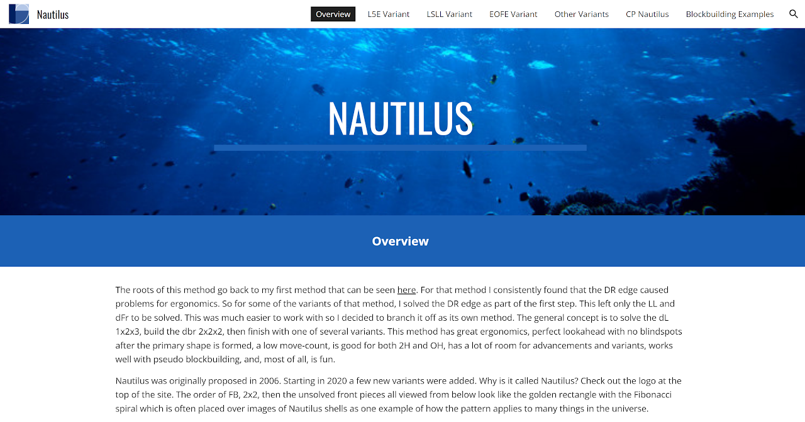

# Nautilus

## Description

**Proposer:** [Michael James Straughan](CubingContributors/MethodDevelopers.md#straughan-michael-james-athefre)

**Proposed:** 2006

**Steps:**

1. Build a 1x2x3 block on the left side.
2. Build a 2x2x2 block at dbr and the front pair.
3. Solve the upper layer corners.
4. Solve the last five edges.

[Nautilus Website](https://sites.google.com/view/nautilus-method)

[Click here for more step details on the SpeedSolving wiki](https://www.speedsolving.com/wiki/index.php/Nautilus)

## Origin

### Development

During development of the MI1 method, Michael James Straughan determined that the empty edge slot at DR for the primary shape caused ergonomics issues [1]. It was decided to solve the edge as part of the primary shape. This led to a new variant of MI1 and was later branched off as its own method called Nautilus.

### Re-Development

In 2020, Straughan again began experimenting with the method [2]. It was then decided to re-develop and present the method to the community with new algorithms [3].

## References

1. M. J. Straughan, 110mb.com, March 2010. [Online]. Available: https://web.archive.org/web/20110224050936/http://athefre.110mb.com/.
2. M. J. Straughan, "The New Method / Substep / Concept Idea Thread," SpeedSolving.com, 5 September 2020. [Online]. Available: https://www.speedsolving.com/threads/the-new-method-substep-concept-idea-thread.40975/post-1391229.
3. M. J. Straughan, Nautilus Website, [Online]. Available: https://sites.google.com/view/nautilus-method.