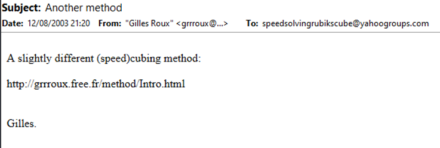
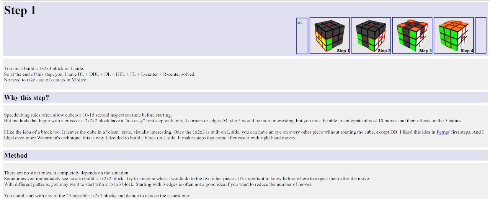
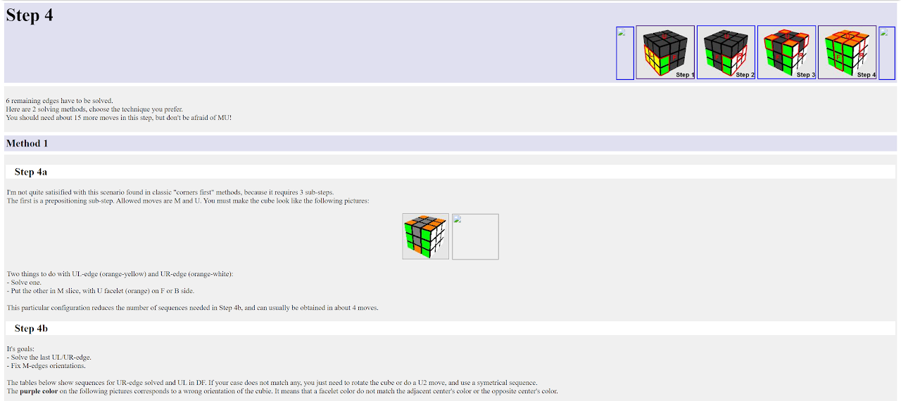
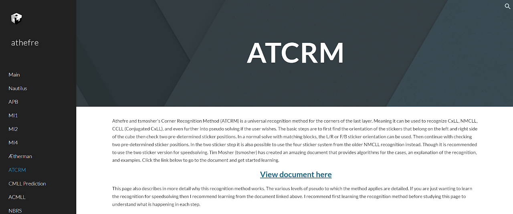
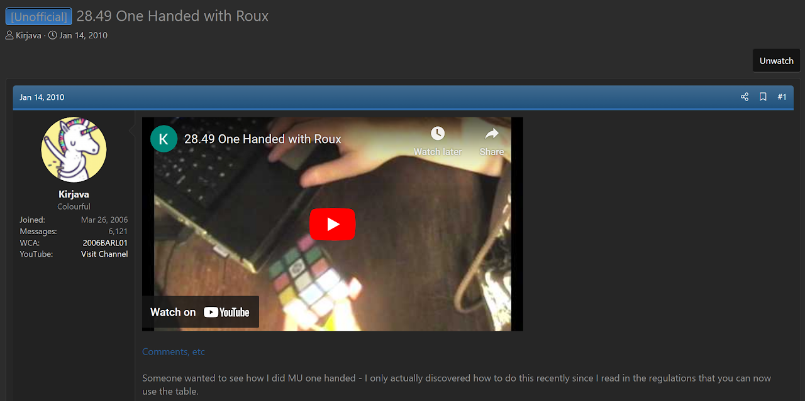
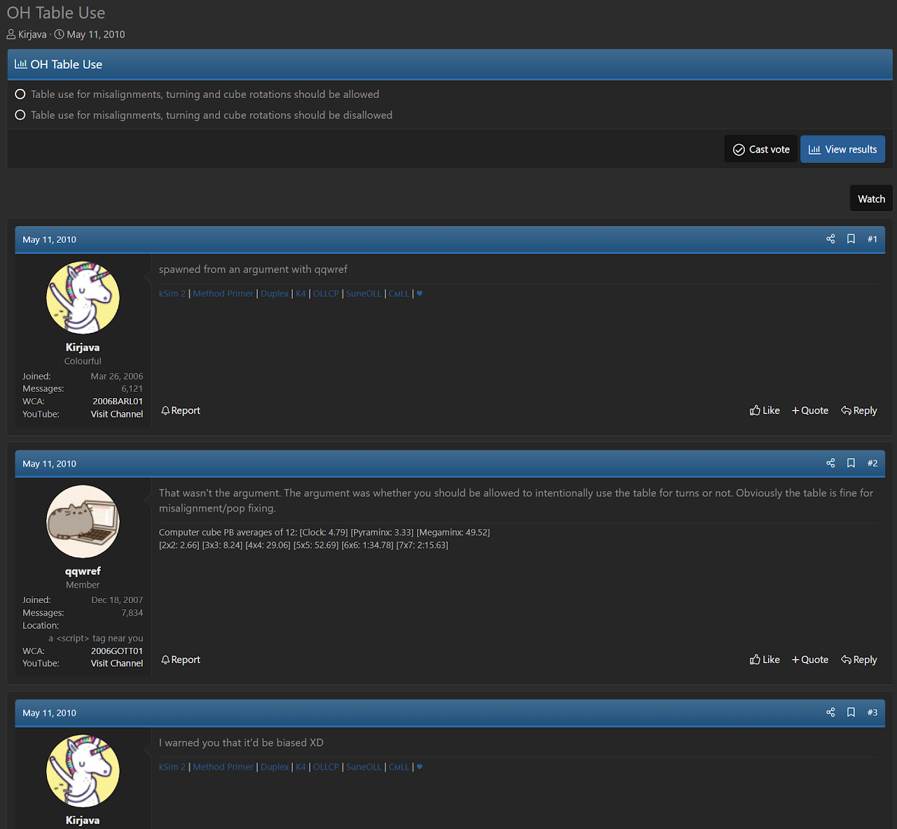
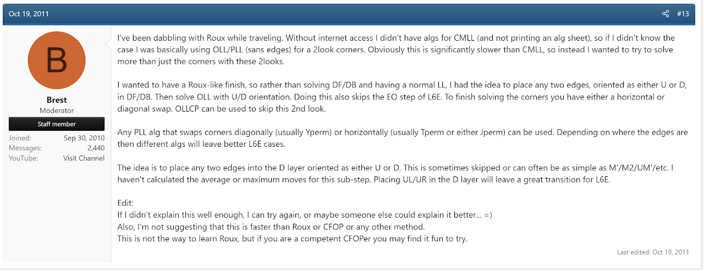
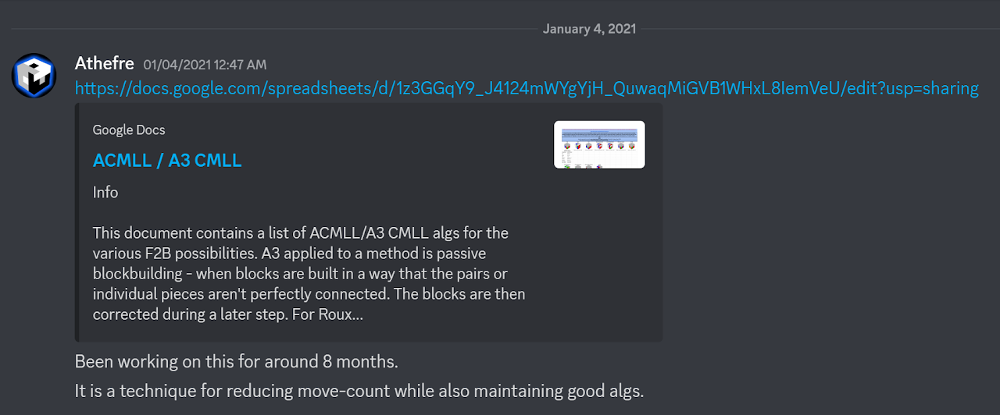
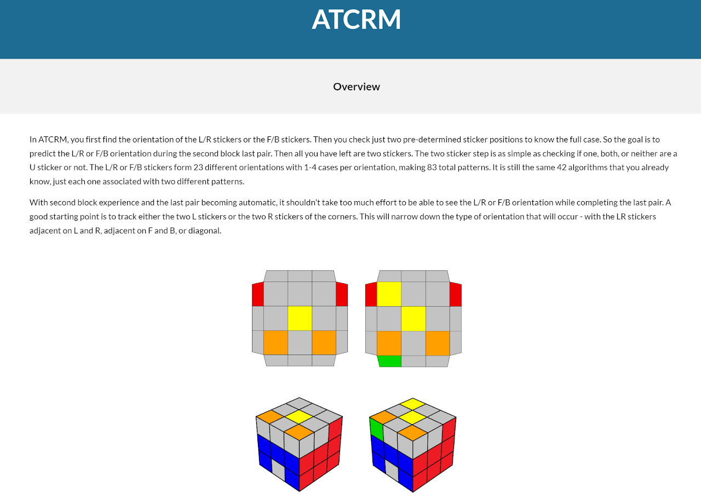
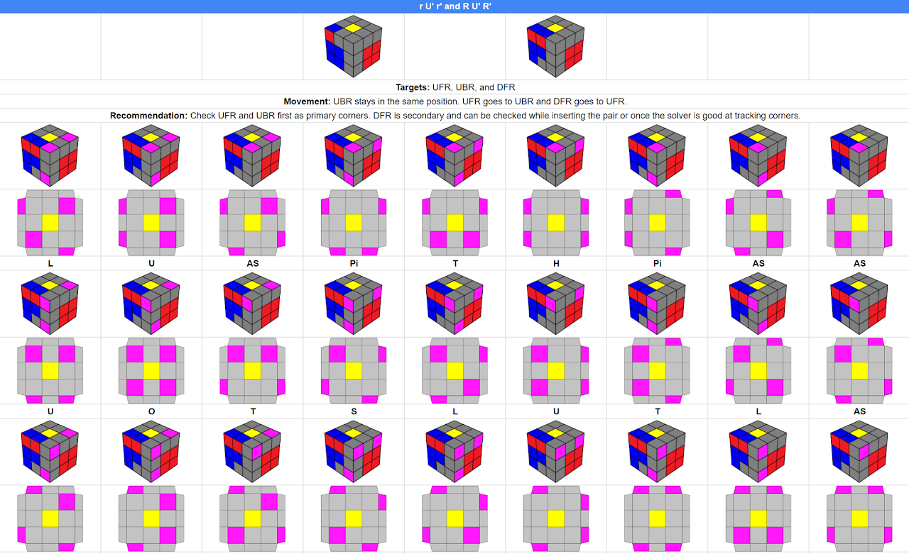

# Roux

## Description

**Proposer:** [Gilles Roux](CubingContributors/MethodDevelopers.md#roux-gilles)

**Proposed:** 2003

**Steps:**

1. Build a 1x2x3 block on the left side.
2. Build a 1x2x3 block on the right side.
3. Solve the upper layer corners.
4. Solve the last six edges.

[Roux Website](http://grrroux.free.fr/method/Intro.html)

[Click here for more step details on the SpeedSolving wiki](https://www.speedsolving.com/wiki/index.php/Roux_method)

## Development and Proposal

### Origin

When Gilles Roux started cubing again in 2001, he had been using a method that solved the edges of the last layer as the final step. Roux used algorithms consisting of M and U moves, which Roux found appealing due to the intuitive nature.

Eventually Roux switched to the Petrus method, again often having the opportunity to use edge permutation algorithms consisting of M and U moves. Roux started thinking that he wanted a method that was mostly intuitive, but allowed for the opportunity to end with M and U moves.

Roux had realized that the first two layer building process of CFOP had some important strengths. So he started considering how he could combine the strengths of F2L with the desired finish of M and U moves. This naturally led to the idea of leaving out the middle slice of the F2L during the building process and solving the upper layer corners.

>This is from a priviate conversation between Roux and I.

### Proposal

In August, 2003, Roux proposed the method to the community.

https://web.archive.org/web/20040227193924/http://grrroux.free.fr/method/Step_1.html

### Last Six Edges Evolution

Originally a couple of LSE methods were provided. Roux eventually realized that his LSE strategy was the best and updated the site to only have his strategy.

https://web.archive.org/web/20040227193509/http://grrroux.free.fr/method/Step_4.html

https://web.archive.org/web/20051218084054/http://grrroux.free.fr:80/method/Step_4.html

### CMLL Acronym

The acronym CMLL was proposed by Roux on the official website. However, it was later removed.

https://web.archive.org/web/20071211051539/http://grrroux.free.fr/method/Step_3.html

### Gilles Roux's Speed Progression

An interesting fact is that Gilles Roux was once second in the world unofficially using his method. In the early days of the online community, an unofficial leaderboard on speedcubing.com had a high level of popularity.

https://speedcubing.com/news_archive_2005.html

## Advancements and Techniques

### Misoriented Centers

The misoriented centers technique first appeared on Roux's site in 2004.

https://web.archive.org/web/20040906064311/http://grrroux.free.fr:80/method/Step_4.html

### Non-Matching Blocks and NMCMLL

#### First Recognition Method

Non-matching blocks and a recognition method for CMLL when the technique is used was first discussed publicly by Roux in June, 2004. A partial table of cases was created.

https://web.archive.org/web/20041214140729/http://grrroux.free.fr:80/method/Step_3.html

In October, 2006, Michael James Straughan completed the recognition method.

http://grrroux.free.fr/method/Step_3.html

The steps of this recognition method are:

1. Find the orientation of the left and right side stickers.
2. Find the stickers that should be on the upper layer.

#### Second Recognition Method

In April, 2010, Straughan developed a new recognition method. This recognition method fixed the problem of the previous one, which was that finding the upper layer stickers is difficult when the non-matching block is one from a 90 degree turn away. Instead of searching for the upper layer stickers, four pre-determined positions are checked for a pattern.

https://web.archive.org/web/20111204185452/http://grrroux.free.fr/method/Step_3.html

#### Third Recognition Method

Another recognition method for NMCMLL was developed by Straughan and Tim Mosher in December, 2021. This recognition method is a refinement of the previous one. Instead of checking four pre-determined positions for a pattern, only two positions need to be checked.

https://sites.google.com/site/athefre/atcrm?authuser=0

### Step 4c Recognition Methods

#### FUBU

The first 4c recognition method (FUBU) was developed by Straughan in April, 2010. While permuting the UL and UR edges, the stickers that will go to FU and BU after aligning the U layer are checked. Their relationship determines the 4c case. After the idea was sent to the community, Michał Ciebiada created a video describing the technique.

https://www.speedsolving.com/threads/waffles-roux-tutorial.11506/post-357273

https://www.speedsolving.com/threads/waffles-roux-tutorial.11506/post-357312

https://www.speedsolving.com/threads/waffles-roux-tutorial.11506/post-357479

https://www.speedsolving.com/threads/waffles-roux-tutorial.11506/post-364254

https://www.youtube.com/watch?v=iW4NYqeZKWU

#### BU

The second 4c recognition method to be developed is called BU. While permuting the UL and UR edges, the sticker that should go to BU when the corners are aligned is checked against the centers. Various people had been using this around the same time that FUBU was described. The recognition became more well known with Alex Lau's use of it.

https://www.speedsolving.com/threads/waffles-roux-tutorial.11506/post-357273

https://www.speedsolving.com/threads/waffles-roux-tutorial.11506/post-357896

https://www.speedsolving.com/threads/roux-4b-to-4c-transition.35350/post-711618

#### DFDB

In 2012, Straughan proposed a new 4c recognition method with a focus on providing easier look ahead. A pair of stickers from the upper or bottom layer are tracked. This, combined with a center or two provides the information necessary to determine the 4c case. After the proposal, the community named the system "DFDB" and added on a way to improve recognition for 4c 3-cycle cases that start with an M2 move.

https://www.speedsolving.com/threads/roux-4b-to-4c-transition.35350/

### CMLLEO

The idea of orienting the last six edges during CMLL had been discussed many times since the Roux method's inception. However, Thom Barlow was the first to heavily explore CMLLEO, starting around 2010. Originally, Barlow called the algorithm set KCLL, but later decided that it should be called CMLLEO.

https://www.speedsolving.com/threads/kcll.21210/#post-381107

https://www.speedsolving.com/threads/proposition-lets-fix-some-cubing-terms.32617/post-648278

### Table Abuse

The community had long doubted the viability of the Roux method for use in one-handed solving due to the abundance of slice turns. Around 2010, Barlow discovered a one-handed slice turning technique that could be considered technically legal for competition use. The edge of the cube is rested on the table while the user turns the inner slice. This technique came to be known as "table abuse".

https://www.speedsolving.com/threads/28-49-one-handed-with-roux.18549/

https://www.speedsolving.com/threads/oh-table-use.21118/

https://www.youtube.com/watch?v=UK64XYyUfhg

### EOLR

#### First Proposal and Development

EOLR was first proposed and developed by Straughan in August, 2012. EOLR is now split into two types. EOLR orients all edges and places the UL and UR edges on the bottom layer. EOLRb orients all edges and directly solves the UL and UR edges. Straughan's initial proposal was for both types. All of EOLR was developed, including all possible edge orientation angles. Straughan's version of EOLR intentionally left out the final M or M' move. This allowed the user to determine if the UL and UR edges do need to be placed on the bottom layer or if there is the opportunity to directly solve the two edges with a final M or M' turn. Half of EOLRb was developed, with the expressed plan being to complete the other half.

https://web.archive.org/web/20200924235711/https://www.speedsolving.com/threads/roux-misoriented-centers-table.38176/

https://www.speedsolving.com/threads/roux-misoriented-centers-table.38176/post-873153

#### Re-Development

EOLR, the edge orientation and placing the LR edges on the bottom layer version, was re-developed by Iuri Grangeiro with some assistance from Kian Mansour in August 2016. Kian Mansour's use of EOLR helped popularize the technique.

https://www.speedsolving.com/threads/accomplishment-thread.1688/post-1189069

https://docs.google.com/document/d/1ViMrgrlEpY2E7fhaRdw_Zfj04qwdwm2R8GaXB66YZRo/edit

https://discord.com/channels/416929203607568404/416929203607568406/797470923153735710

### Pinkie Pie

The first known suggestion of the idea behind Pinkie Pie is by Rob Stuart in October, 2011. In 2010, Alexander Lau suggested the same idea and gave it the name Pinkie Pie.

https://www.speedsolving.com/threads/roux-cfop-mix.33018/post-657165

https://www.speedsolving.com/threads/university-of-leicester-open-2013.39237/post-798616

### ACMLL

ACMLL was proposed by James Straughan in April, 2020 then developed and presented in January, 2021. The concept is to solve the two 1x2x3 blocks in pseudo configurations then correct the blocks during the CMLL algorithm.

https://www.speedsolving.com/threads/the-new-method-substep-concept-idea-thread.40975/post-1363270

https://discord.com/channels/416929203607568404/416933073893195779/795317325355155497

https://www.speedsolving.com/threads/acmll-a-new-algorithm-set-for-roux.79962/

### CMLL Prediction

#### NMCMLL Recognition

In November, 2020, Zhouheng Sun suggested the idea that NMCMLL recognition may be well suited for predicting the CMLL case. The thought process is that because NMCMLL recognition has an easier second step when compared to U sticker first recognition, the more difficult first step of NMCMLL recognition can be recognized early during the final moves of the second block.

https://discord.com/channels/416929203607568404/416932528059056140/776534845492559922

#### ATCRM

With ATCRM having a second step involving checking just two stickers, compared to NMCMLL's four, Sun's thought process may apply even more.

https://sites.google.com/site/athefre/roux/cmll-prediction?authuser=0

#### Corner Orientation Prediction

In July, 2022, Straughan developed a corner orientation prediction system. The stickers of the corners are tracked during the final pair of the second block.

https://docs.google.com/spreadsheets/d/146FzKPkKbtBILeU4jSt5sFPYXj8U5ovNDzT8iGR3yK4/edit#gid=0

https://sites.google.com/site/athefre/roux/cmll-prediction?authuser=0

https://discord.com/channels/416929203607568404/416929203607568406/1000747989733752852