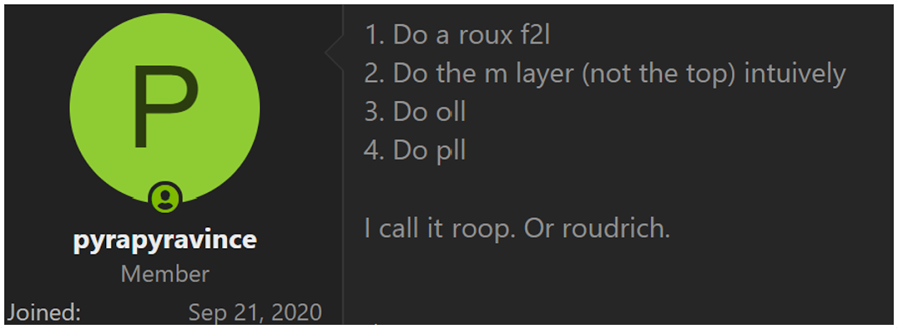
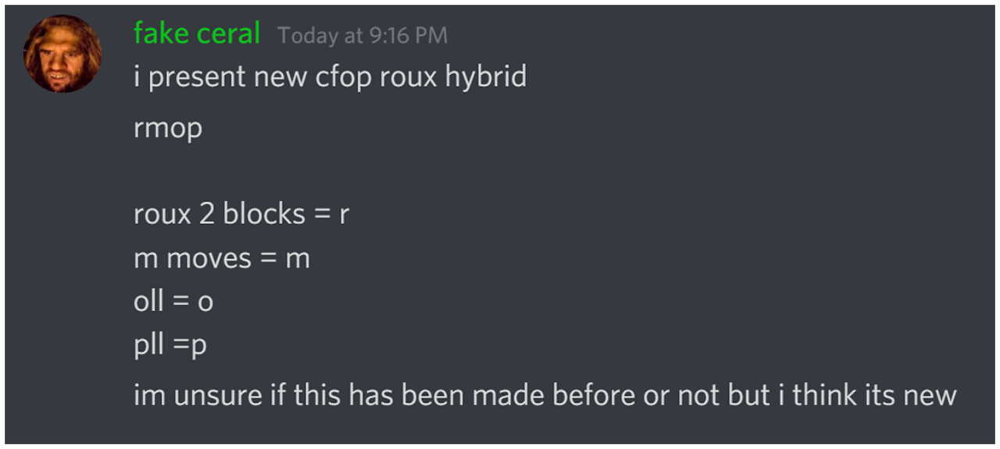

import AnimCube from "@site/src/components/AnimCube";

# RouxFOP

<AnimCube params="buttonbar=0&position=lluuu&scale=6&hint=10&hintborder=1&borderwidth=10&facelets=ddddlddddwwwlllwwwdbbdlldbbdggdlldggdddoooooodrrdrrdrr" width="400px" height="400px" />

## Description

**Proposer:** Various

**Proposed:** Numerous

**Steps:**

1. Solve the two 1x2x3 blocks as in the Roux method.
2. Solving the DF and DB edges and the M slice centers.
3. OLL.
4. PLL.

## Origin

The first known written proposal of RouxFOP is by a user named Systemdertoten on the speedsolving.com forum in June 2010 [1]. This is likely the most commonly proposed hybrid method. The idea is that you can take the efficiency of the two blocks of the Roux method then not rely upon intuition and instead end the solve with algorithms from the CFOP method. Because this is such a commonly proposed method, it is likely that earlier proposals may be found.

A variant that is sometimes proposed instead is to solve the corners before placing the DF and DB edges. This leaves ELL as the final step.

## References

[1] Systemdertoten, "Does this (sub) method have a name?," SpeedSolving.com, 29 June 2010. [Online]. Available: https://www.speedsolving.com/threads/does-this-sub-method-have-a-name.22232/.