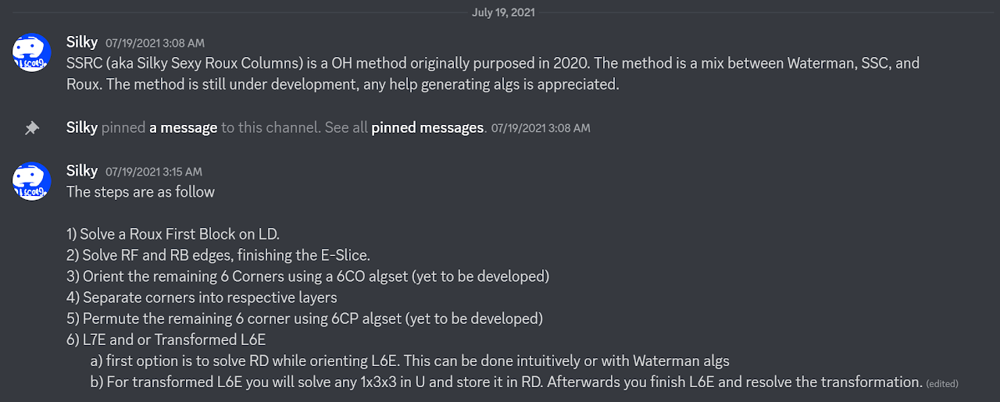
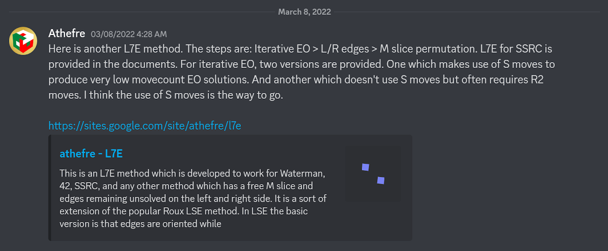
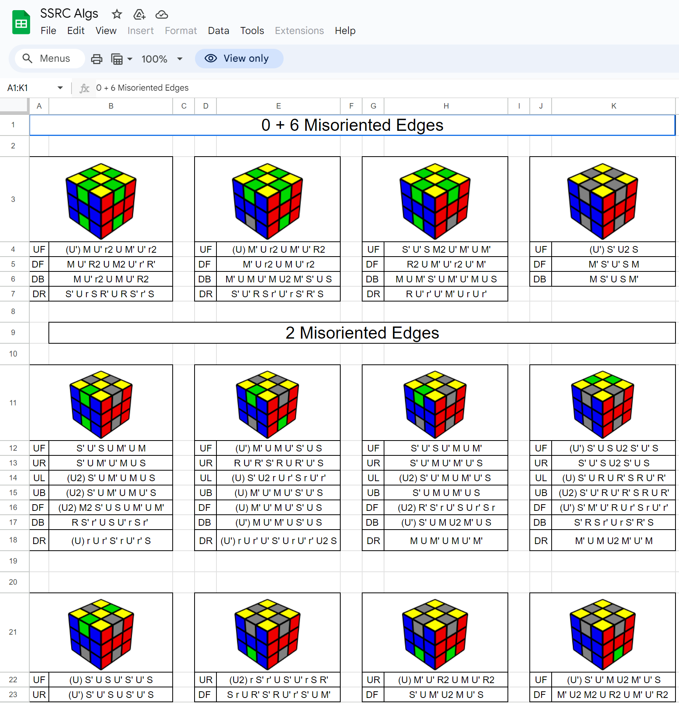

# SSRC

## Description

**Proposer:** [Silky](CubingContributors/MethodDevelopers.md#silky)

**Proposed:** 2020

**Steps:**

1. Solve a 1x2x3 block on the left side.
2. Solve the front and back pairs on the right side.
3. Solve the upper layer corners.
4. Solve the last seven edges.

[SSRC Algorithm PDF](/Archive/SSRC/SSRC%20Algs%20v1.pdf)

## Origin

### Development

In June, 2020, Silky posted a method idea that was a combination of Roux and the SOAP method for the 2x2 puzzle. The steps were similar to the current form of SSRC, except the E slice edges were solved before solving the last six corners.

https://www.speedsolving.com/threads/the-new-method-substep-concept-idea-thread.40975/page-319#post-1378722

Over time the method evolved to include blockbuilding before solving the last layer corners.

https://discord.com/channels/866379683108749343/866379796618412032/866380854238642196

>The final two images come from a private conversation between Silky and I.

### Proposal

In March, 2024, Silky proposed the finalized version of the method. Complete algorithm sheets and variants were provided.

https://www.speedsolving.com/threads/et-tu-brutus-ssrc-method-proposal.92060/

## L7E

### Iterative EO and LRP

In March, 2022, Michael James Straughan developed iterative EO for L7E. A complete L7E method was also developed that follows similar steps to the standard Roux LSE method. The steps are edge orientation, permute the left and right side edges, then permute the M slice.

https://discord.com/channels/866379683108749343/879086421003096094/950475008197677126

https://docs.google.com/spreadsheets/d/1iosJgoJutJapVt5BGSmaGDqPOHWvxFBWHRDlDomTGNY/edit#gid=1260826725

https://docs.google.com/spreadsheets/d/1kgOYB_i9Q7u1mV_cmYGTU6jdEC8pxtoDsrfcH9Vo7sM/edit#gid=96782145

### EODR

As part of the official proposal in March, 2024, Silky included the algorithm sheets for an L7E method. The steps are to orient all edges while solving the DR edge. Then the final six edges are permuted.

https://docs.google.com/spreadsheets/d/1EtFxTViQuqcxch7YOIhZSOsMcrnJA5YMUuiaVJoKjPQ/edit?usp=sharing