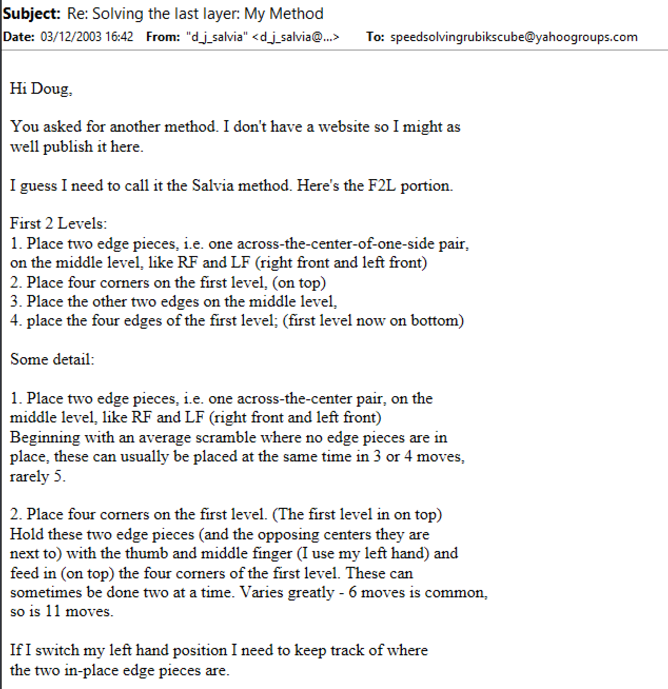
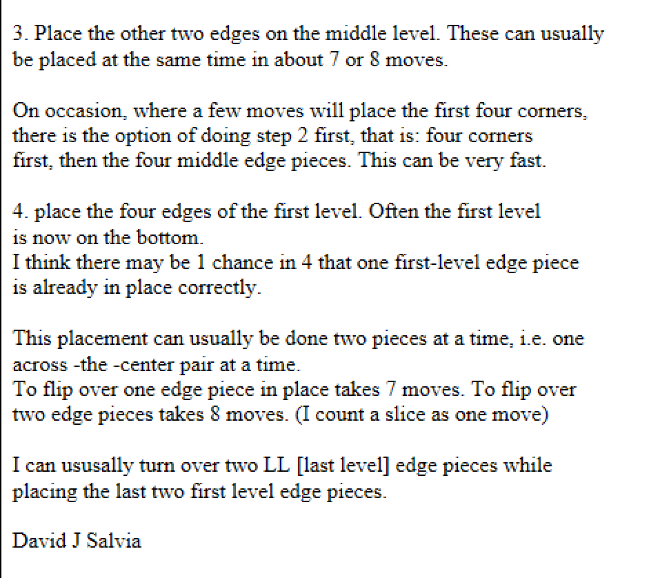

import Exhibit from "@site/src/components/Exhibit";
import YouTube from "@site/src/components/YouTube";
import ImageCollage from '@site/src/components/ImageCollage';

# Salvia

<Exhibit
stickering={{
    solved: "U D F B L R DFR DFL DBL DBR FL BL"}}
/>

## Description

**Proposer:** [David Salvia](CubingContributors/MethodDevelopers.md#salvia-david)

**Proposed:** ~1981

**Steps:**

1. Solve the two edges at FL and FR.
2. Solve the bottom layer corners.
3. Add the BL and BR edges.
4. Solve the bottom layer edges.
5. Solve the corners of the last layer.
6. Solve the edges of the last layer.

[Salvia Website](http://www.speedcubing.com/DavidJSalvia.html)

[Click here for more step details on the SpeedSolving wiki](https://www.speedsolving.com/wiki/index.php/Salvia_Method)

## Origin

On the webpage for the Salvia method, Salvia states that he first got a cube in 1981 [^1]. It is possible that the method was developed in that same year.

Salvia first described the method in December, 2003 [^2]. This description led to the method getting its own dedicated page on speedcubing.com

[^1]: D. J. Salvia, "The Salvia method," SpeedCubing.com, [Online]. Available: http://www.speedcubing.com/DavidJSalvia.html.

[^2]: D. J. Salvia, "Re: Solving the last layer: My Method," Yahoo! Groups - Speed Solving Rubik's Cube, 3 December 2003. [Online].