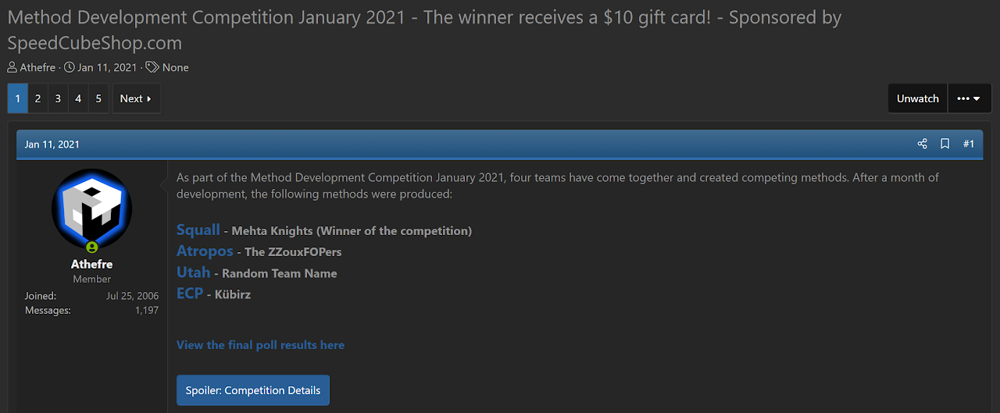

import Exhibit from "@site/src/components/Exhibit";
import YouTube from "@site/src/components/YouTube";
import ImageCollage from '@site/src/components/ImageCollage';

# Squall

<Exhibit
stickering={{
    solved: "L R DL BL DBL",
    orientedWithoutPermutation: "DF DB DR FR FL BR UF UL UB UR"
  }}
cameraLatitude={30}
cameraLongitude={-20}
/>

## Description

**Proposer:** [Vincent Trang](CubingContributors/MethodDevelopers.md#trang-vincent-trangium)

**Proposed:** 2021

**Steps:**

1. Build a 1x2x2 block on the left side while orienting all edges.
2. Extend the 1x2x2 block to a 1x2x3 block.
3. Solve the DF and DB edges and the M layer centers.
4. Solve the dFR and dBR corner and edge pairs.
5. Solve the corners of the upper layer.
6. Solve the last five edges.

[Squall Document](https://docs.google.com/document/d/1rO-Dm8XuzQnczST27E9XNHqDCVAB-9kl3IS_C2NIgtk/edit)

[Click here for more step details on the SpeedSolving wiki](https://www.speedsolving.com/wiki/index.php?title=Squall)

## Origin

### Development

In January, 2021, Vincent Trang joined the 2021 Method Development Competition. Trang developed Squall as the submission. At the end of the competition, Squall was chosen by a community vote as the best method, making it the winner of the competition [^1].

### Thought Process

In 2022, Trang was interviewed as part of the Methodical Cubing Podcast. Trang described in detail the thought process behind the method.

Squall was developed backwards, with a focus on ending with a quality 2-gen step. Eventually, Trang settled on L5EP as the final step because it has few cases and a good move count. The natural idea for the two steps to come before L5EP was to solve two pairs then the upper layer corners. This left a 2x2x3 block with all edges oriented. To achieve this state, Trang decided to solve the DF and DB edges while preserving an edge orientation step that would come earlier in the solve. This leaves a first step that is commonly called EOFB, or edge orientation and a 1x2x3 block. Trang felt that this is too much to plan in inspection, so it was decided to split the step into two. The first part being to orient all edges while building a 1x2x2 block, called EOSquare, then add a corner and edge pair to the 1x2x2 block to complete the 1x2x3 block.

<YouTube embedId="IGOAQc3l_jg?start=262" />

[^1]: M. J. Straughan, "Method Development Competition January 2021 - The winner receives a $10 gift card! - Sponsored by SpeedCubeShop.com," SpeedSolving.com, 27 February 2021. [Online]. Available: https://www.speedsolving.com/threads/method-development-competition-january-2021-the-winner-receives-a-10-gift-card-sponsored-by-speedcubeshop-com.79437/post-1421151.