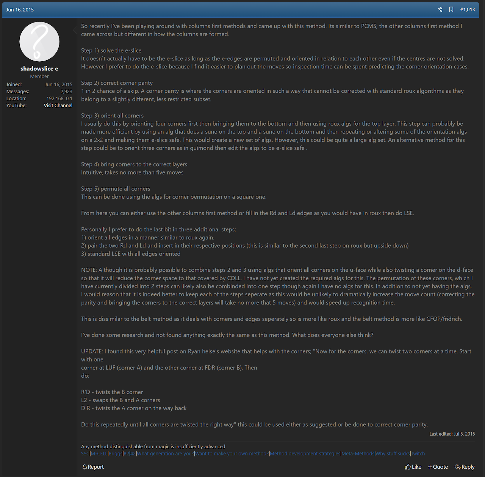

import AnimCube from "@site/src/components/AnimCube";

# SSC

<AnimCube params="buttonbar=0&position=lluuu&scale=6&hint=10&hintborder=1&borderwidth=10&facelets=dldyyldbddgdywwdldddwdbddlddldrgdddyddwdoddrdddddrdddd" width="400px" height="400px" />

## Description

**Proposer:** [Joseph Briggs](CubingContributors/MethodDevelopers.md#briggs-joseph-shadowslice)

**Proposed:** 2015

**Steps:**

1. Orient all edges while solving the FL and BL edges.
2. Create a 1x1x3 block on the bottom layer at DL that consists of an E layer edge and the U/D sticker of the corners facing the front and back layers.
3. Use the final E layer edge to create a corner and edge pair with the U/D sticker of the corner facing the left layer.
4. Orient the remaining corners and move the 1x1x3 block and other pair to the right side and with the E layer edges placed.
5. Solve the corners.
6. Solve the remaining edges.

[Click here for more step details on the SpeedSolving wiki](https://www.speedsolving.com/wiki/index.php/SSC)

## Origin

### Original Idea

In June, 2015, Joseph Briggs posted a belt method related idea that solved the corners then the edges after solving the E layer [1]. Early edge orientation wasn't involved in this original method.

### SSC

In July, 2015, Briggs posted an updated form of the method that oriented the edges while solving three of the E slice edges [2]. The method was given the name SSC, standing for Shadowslice Snow Columns.

Briggs stated that the thought process behind SSC was to create a method with ergonomics similar to those of the Square-1 puzzle [3].

>This is from a private conversation between Briggs and I.

## Upgrades

### L8E

In November, 2015, Julien Adam (Crafto22) proposed a method called ECE [4]. Some steps from that method were eventually used in SSC as variants.

### EOLine

In April, 2016, Konstantin Jaehne (sqAree) proposeed using EOLine on left for SSC instead of solving three edges in the E layer [5]. This also eventually inspired the pseudo pair steps [6].

## SSC Name

Officially, the SSC name stands for Shadowslice Snow Columns. However, Briggs has stated that he has considered having it instead stand for Shadowslice sqAree Crafto to credit Jaehne and Adam for their contributions [7].

## References

[1] J. Briggs, "The New Method / Substep / Concept Idea Thread," SpeedSolving.com, 16 June 2015. [Online]. Available: https://www.speedsolving.com/threads/the-new-method-substep-concept-idea-thread.40975/post-1091705.

[2] J. Briggs, "SSC (Shadowslice Snow Columns) 3x3x3 Method," SpeedSolving.com, 11 July 2015. [Online]. Available: https://www.speedsolving.com/threads/ssc-shadowslice-snow-columns-3x3x3-method.54056/.

[3] M. J. Straughan and J. Briggs, Personal communication, 17 September 2022. [Online]. 

[4] J. Adam, "ECE - New 3x3 Solving Method," SpeedSolving.com, 17 November 2015. [Online]. Available: https://www.speedsolving.com/threads/ece-new-3x3-solving-method.55898/.

[5] K. Jaehne, "SSC (Shadowslice Snow Columns) 3x3x3 Method," SpeedSolving.com, 10 April 2016. [Online]. Available: https://www.speedsolving.com/threads/ssc-shadowslice-snow-columns-3x3x3-method.54056/post-1165524.

[6] J. Briggs, "SSC (Shadowslice Snow Columns) 3x3x3 Method," SpeedSolving.com, 14 April 2016. [Online]. Available: https://www.speedsolving.com/threads/ssc-shadowslice-snow-columns-3x3x3-method.54056/post-1166364.

[7] J. Briggs, Discord, 16 June 2020. [Online]. Available: https://discord.com/channels/416929203607568404/416933092620500992/722174765414088725.