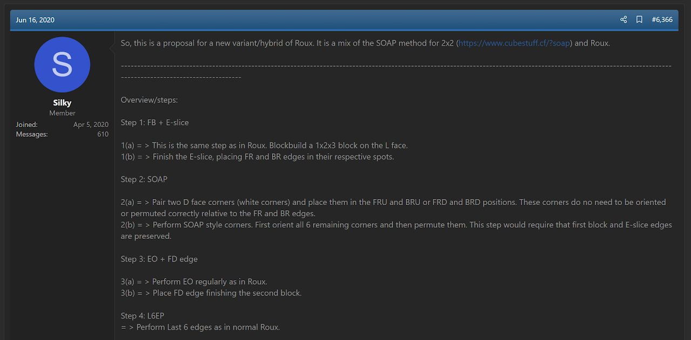
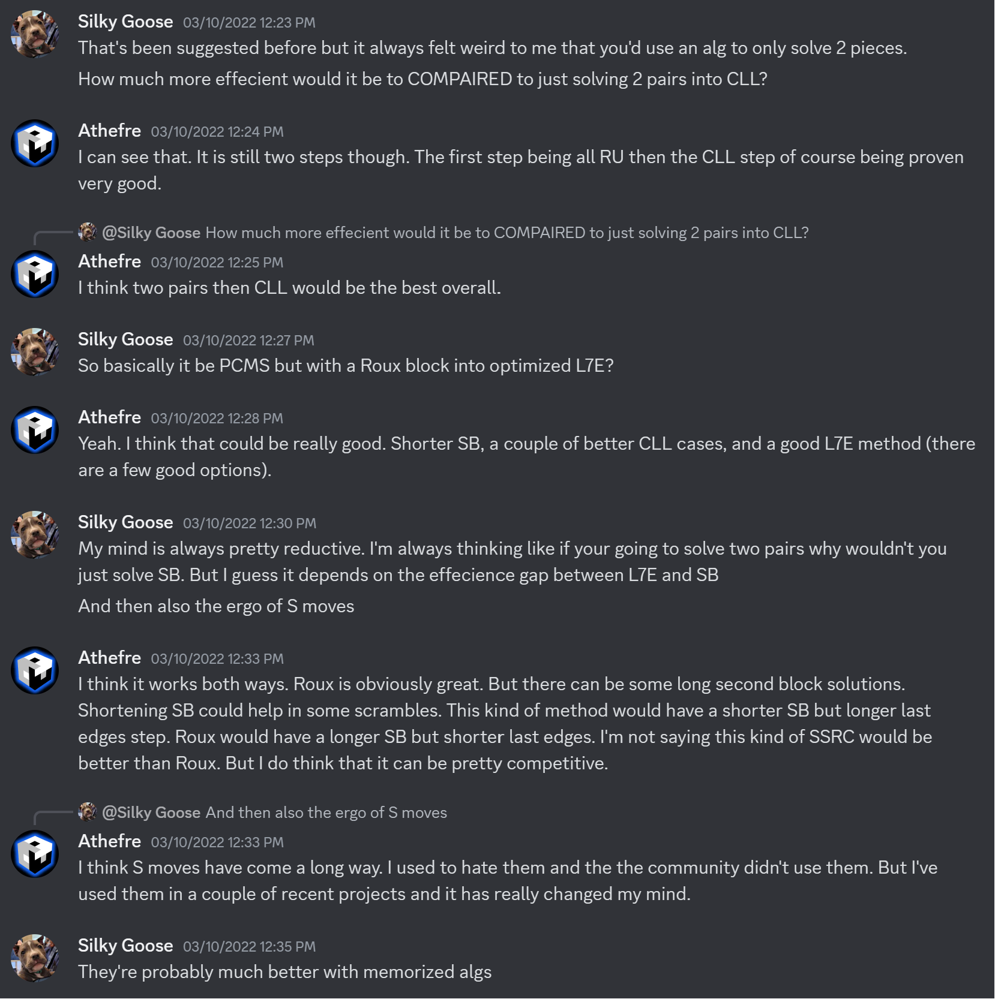

import Exhibit from "@site/src/components/Exhibit";
import YouTube from "@site/src/components/YouTube";
import ImageCollage from '@site/src/components/ImageCollage';

# SSRC

<Exhibit
stickering={{
    solved: "L R FL DFL DL DBL BL FR DFR DBR BR UFR UFL UBL UBR"}}
/>

## Description

**Proposer:** [Silky](CubingContributors/MethodDevelopers.md#silky)

**Proposed:** 2020

**Steps:**

1. Solve a 1x2x3 block on the left side.
2. Solve the front and back pairs on the right side.
3. Solve the upper layer corners.
4. Solve the last seven edges.

## Origin

### Development

In June, 2020, Silky posted a method idea that was a combination of Roux and the SOAP method for the 2x2 puzzle [^1]. The steps were similar to the current form of SSRC, except the E slice edges were solved before solving the last six corners.

Over time the method evolved to include blockbuilding before solving the last layer corners [^2] [^3].

> The final two images come from a private conversation between Silky and I.

### Proposal

In March, 2024, Silky proposed the finalized version of the method [^4]. Complete algorithm sheets and variants were provided.

## L7E

### Iterative EO and LRP

In March, 2022, Michael James Straughan developed iterative EO for L7E. A complete L7E method was also developed that follows similar steps to the standard Roux LSE method [^5] [^6] [^7]. The steps are edge orientation, permute the left and right side edges, then permute the M slice.

### EODR

As part of the official proposal in March, 2024, Silky included the development of an L7E method [^8]. The steps are to orient all edges while solving the DR edge. Then the final six edges are permuted.

[^1]: Silky, "The New Method / Substep / Concept Idea Thread," SpeedSolving.com, 16 June 2020. [Online]. Available: https://www.speedsolving.com/threads/the-new-method-substep-concept-idea-thread.40975/page-319#post-1378722.

[^2]: Silky, Discord, 19 July 2021. [Online]. Available: https://discord.com/channels/866379683108749343/866379796618412032/866380854238642196.

[^3]: M. J. Straughan and Silky, Personal communication, 10 March 2022. [Online].

[^4]: Silky, "Et tu Brutus? - SSRC Method Proposal," SpeedSolving.com, 15 March 2024. [Online]. Available: https://www.speedsolving.com/threads/et-tu-brutus-ssrc-method-proposal.92060/.

[^5]: M. J. Straughan, Discord, 8 March 2022. [Online]. Available: https://discord.com/channels/866379683108749343/879086421003096094/950475008197677126.

[^6]: M. J. Straughan, "L7E Iterative EO," Google Sheets, 8 March 2022. [Online]. Available: https://docs.google.com/spreadsheets/d/1iosJgoJutJapVt5BGSmaGDqPOHWvxFBWHRDlDomTGNY/edit#gid=1260826725.

[^7]: M. J. Straughan, "L7E LR Permutation," Google Sheets, 8 March 2022. [Online]. Available: https://docs.google.com/spreadsheets/d/1kgOYB_i9Q7u1mV_cmYGTU6jdEC8pxtoDsrfcH9Vo7sM/edit#gid=96782145.

[^8]: Silky, "SSRC Algs," Google Sheets, 15 March 2024. [Online]. Available: https://docs.google.com/spreadsheets/d/1EtFxTViQuqcxch7YOIhZSOsMcrnJA5YMUuiaVJoKjPQ/edit?usp=sharing.