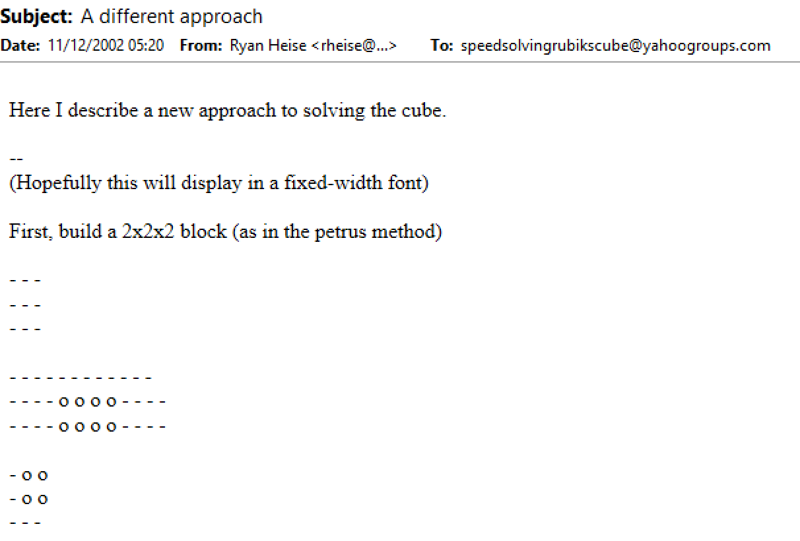
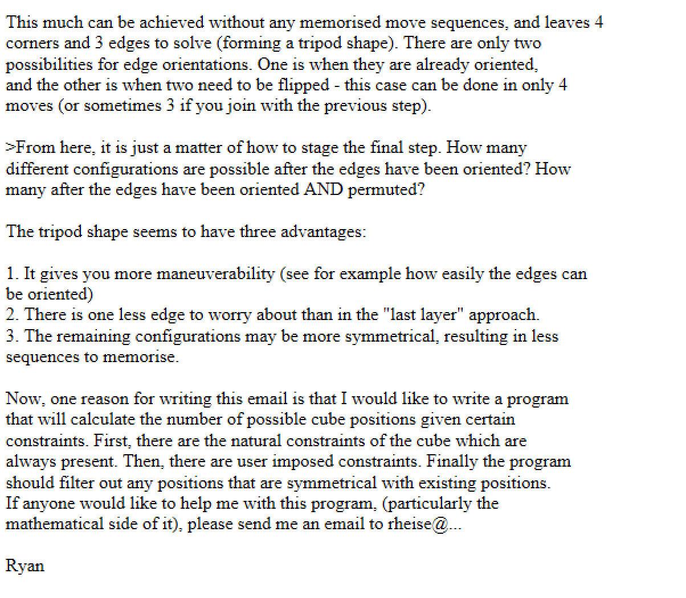

# Tripod

## Description

**Proposer:** [Ryan Heise](CubingContributors/MethodDevelopers.md#heise-ryan), [Michael Gottlieb](CubingContributors/MethodDevelopers.md#gottlieb-michael)

**Proposed:** 2002

**Steps:**

1. Build a 2x2x2 block.
2. Add three 1x2x2 blocks on the three free layers on the outside of the 2x2x2 block.
3. Solve the remaining four corners and three edges.

[Click here for more step details on the SpeedSolving wiki](https://www.speedsolving.com/wiki/index.php/Tripod_Method)

## Origin

### Ryan Heise

Tripod has been a relatively commonly proposed method idea. However, the first known suggestion of the complete structure of the Tripod method comes from Ryan Heise. In December, 2022, Heise posted a message to the Speed Solving Rubik's Cube Yahoo group describing the method and describing it as having a "tripod" shape.

### Michael Gottlieb

In 2008, Michael Gottlib suggested the method idea. Interestingly, Gottlieb also used the word "tripod" to describe the method. Following the initial promotion of the idea, Gottliebe placed the method on a website.

https://www.speedsolving.com/threads/supercritical-method.8065/post-114169

https://mzrg.com/rubik/methods/tripod/

A website had also been created before by Jack Eisenmann:
https://web.archive.org/web/20100616003611/http://web.mac.com/teisenmann/Tripod/main.html

It may be questioned whether Gottlieb had been inspired by Heise's post of the idea. However, Gottlieb once stated "This method very strongly resembles the "Tripod" method that I came up with" in reply to someone who had proposed the idea of a form of the method. 

### Mirek Goljan

On Jessica Fridrich's website there exists a set of algorithms for solving the last layer when a 1x2x2 block is built. This includes cases when the edges are in any orientation. It is unknown whether Goljan developed this for a method resembling Tripod or if the algorithms were generated for use in case a CFOP user noticed a pre-built 1x2x2 block when arriving at the last layer.

http://www.ws.binghamton.edu/fridrich/L1/ece.htm