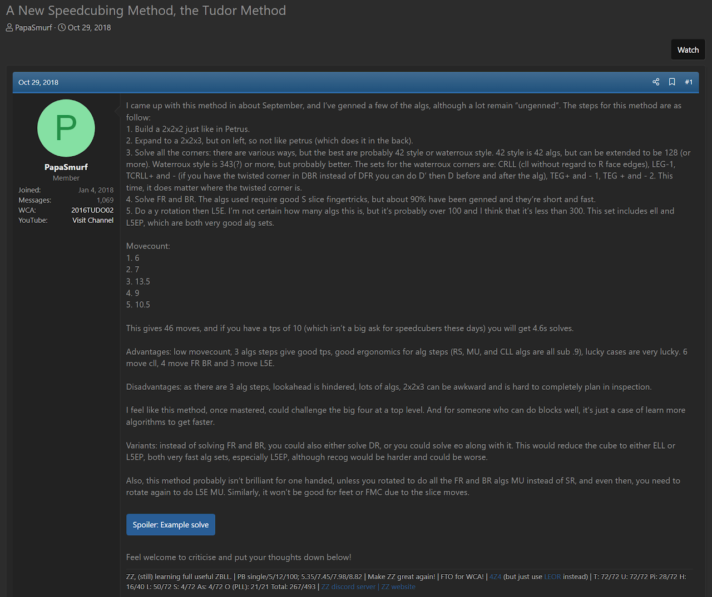
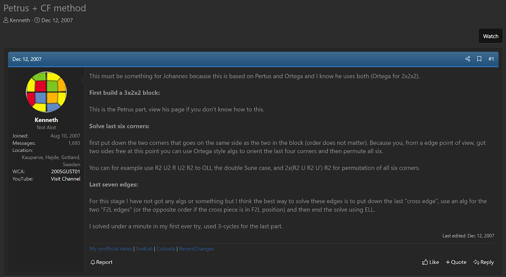

import AnimCube from "@site/src/components/AnimCube";

# Tudor

<AnimCube params="buttonbar=0&position=lluuu&scale=6&hint=10&hintborder=1&borderwidth=10&facelets=ydydydydywwwwwwwdwbbbdbbbdbgdgdgggggodooooooordrdrdrdr" width="400px" height="400px" />

## Description

**Proposer:** [Joseph Tudor](CubingContributors/MethodDevelopers.md#tudor-joseph)

**Proposed:** 2018

**Steps:**

1. Build a 2x2x3 block.
2. Solve the remaining six corners.
3. Solve the remaining edges.

[Click here for more step details on the SpeedSolving wiki](https://www.speedsolving.com/wiki/index.php?title=Tudor)

## Origin

### Proposal

In October, 2018, Joseph Tudor presented the idea of the method [1]. An analysis was included and some algorithms were generated.

### Other Proposals

The steps of the Tudor method have been proposed. The first known proposal is by Kenneth Gustavsson [2]. Another mention of the idea appeared in 2016 by Brayden Mossey [3]. Because the method had been proposed by others before Joseph Tudor, attribution is difficult in this case. The difference in Tudor's suggestion of the method lies in the analysis, effort, and promotion. Tudor independently had the idea, generated algorithms, and has promoted the idea the most. So it may be best known by the name Tudor.

## References

1. J. Tudor, "A New Speedcubing Method, the Tudor Method," SpeedSolvng.com, 29 October 2018. [Online]. Available: https://www.speedsolving.com/threads/a-new-speedcubing-method-the-tudor-method.71463/.
2. K. Gustavsson, "Petrus + CF method," SpeedSolving.com, 12 December 2007. [Online]. Available: https://www.speedsolving.com/threads/petrus-cf-method.2177/.
3. B. Mossey, "The New Method / Substep / Concept Idea Thread," SpeedSolving.com, 20 April 2016. [Online]. Available: https://www.speedsolving.com/threads/the-new-method-substep-concept-idea-thread.40975/post-1167804.