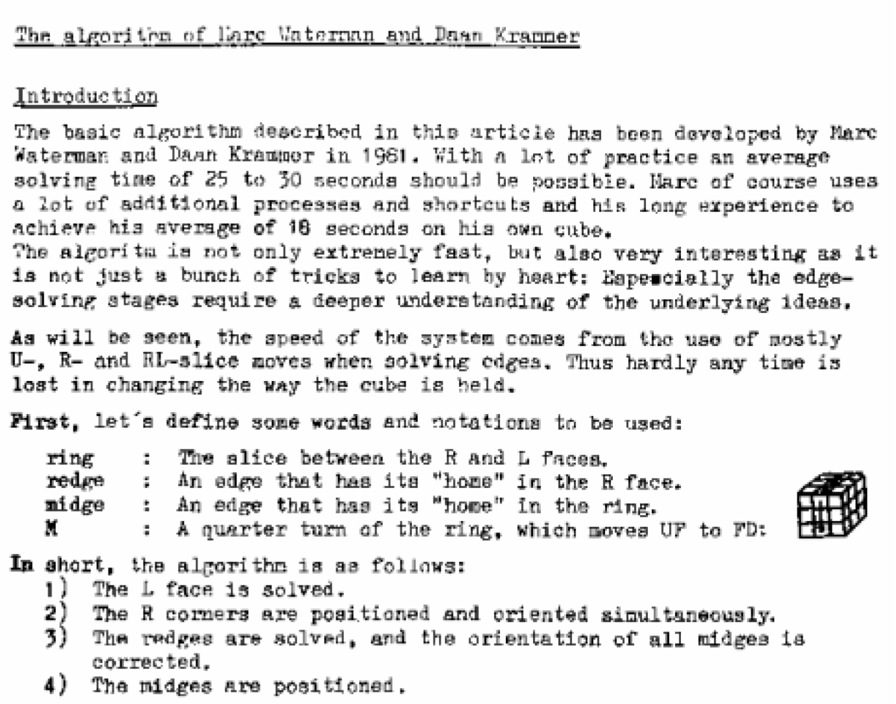

import AnimCube from "@site/src/components/AnimCube";

# Waterman

<AnimCube params="buttonbar=0&position=lluuu&scale=6&hint=10&hintborder=1&borderwidth=10&facelets=ydyyydydywwwdwdwwwbbbdbdbdbgggdgdgggooooooooordrdrrrrr" width="400px" height="400px" />

## Description

**Proposer:** [Marc Waterman](CubingContributors/MethodDevelopers.md#waterman-marc), [Daan Krammer](CubingContributors/MethodDevelopers.md#krammer-daan)

**Proposed:** 1981

**Steps:**

1. Solve the left side layer minus one edge.
2. Solve the right side corners.
3. Solve three of the right side edges and fine final left side edge.
4. Solve the final right side edge and orient the edges of the M layer.
5. Permute the M layer.

>The Waterman method contains many variants. The one described on this page is known as "Simplified Waterman".

[Click here for more step details on the SpeedSolving wiki](https://www.speedsolving.com/wiki/index.php/Waterman_method)

## Origin

### Waterman

The Waterman method was developed in 1981. As booklet was produced describing the method and published as part of Cubing For Fun [1].

### Other Similar Methods

Other Waterman-like methods had been published in 1981 or prior.

- Johnson, K.C. - The Magic Cube Puzzle - 1979
  - First layer
  - Solve last layer corners
  - Solve the last eight edges.

- Truran, Trevor - Solving That Eastern Bloc(k) - 1979
  - First layer
  - Permute last layer corners
  - Orient last layer corners
  - Solve the last eight edges.

- Cairns, Colin & Dave Griffiths - Teach Yourself Cube-Bashing - 1979
  - An extended version of Truran's publication

- Angevine, James - Solution for the Magic Cube Puzzle - 1979
  - The same as Carins and Griffiths, which is the same as Truran

- Ollerenshaw, Dame Kathleen - The Hungarian Magic Cube - 1980
  - First layer
  - Last layer corners
  - Middle layer edges
  - Last layer edges.

- Bossert, Patrick - You Can Do The Cube - 1981
  - First layer corners
  - First layer edges
  - Bottom layer corners
  - Remaining edges.

>Much of this information is found in David Singmaster's *Notes on Rubik's 'Magic Cube'*. I reached out to Georges Helm, who owns copies of these books. He kindly wrote out the steps of the methods in each book. Waterman and Kraamer's development of the Waterman method is likely the most thorough of them all with hundreds of edge solving algorithms developed, full CLL, and a recognition method for CLL.

## References

[1]	M. Waterman and A. Treep, "Waterman Method," Cubsim For Fun, 1987. [Online]. Available: https://web.archive.org/web/20071029152943/http://rubikscube.info/waterman/booklet.php.