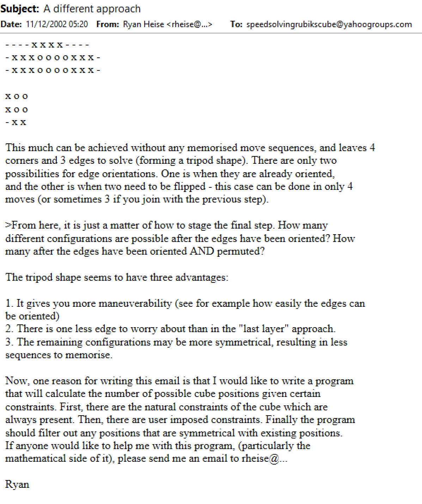
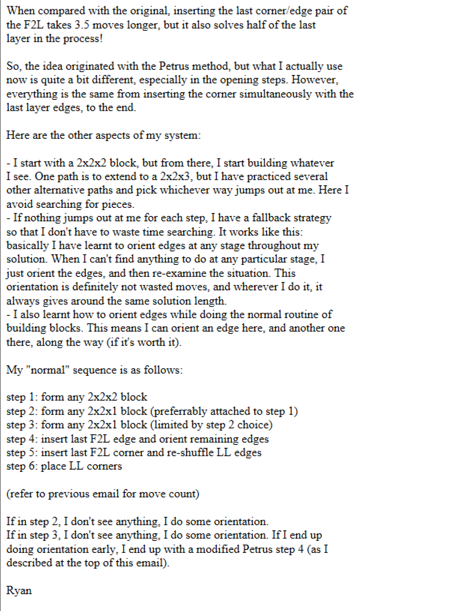
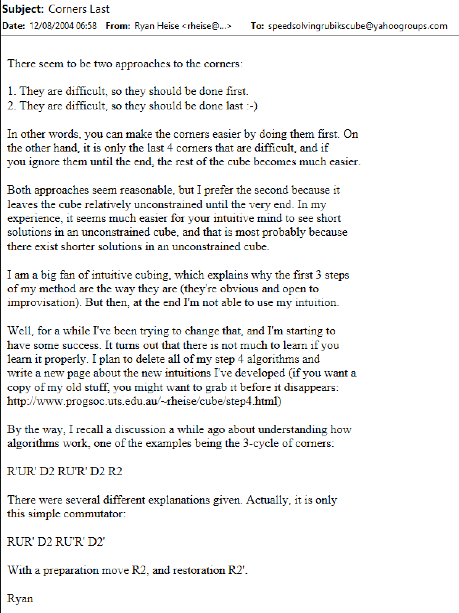
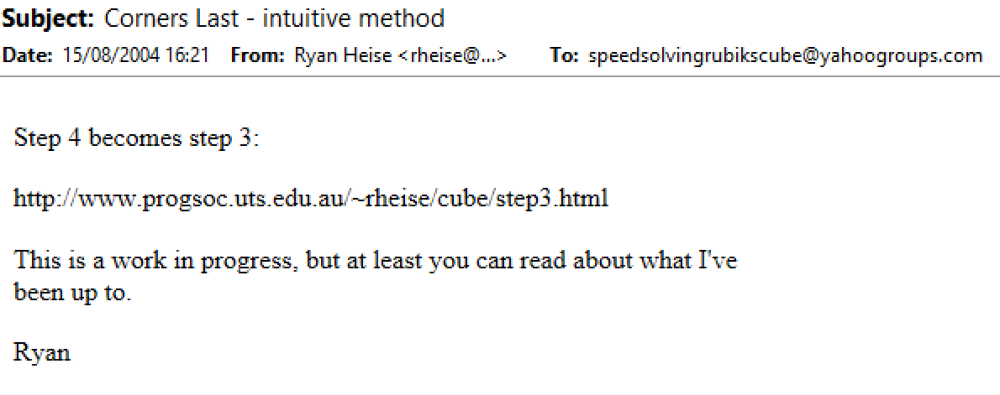
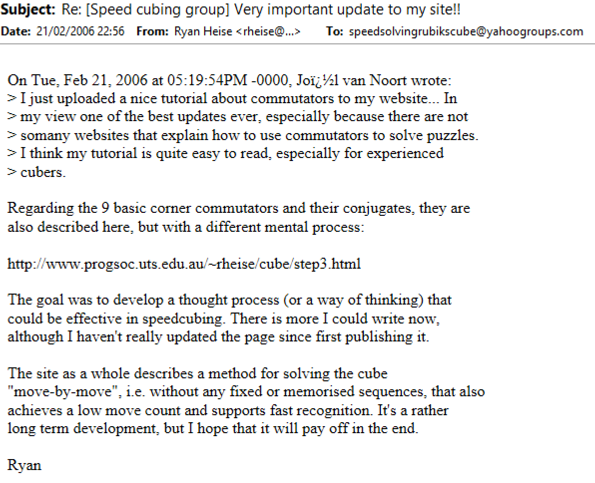

import AnimCube from "@site/src/components/AnimCube";

# Heise

<AnimCube params="buttonbar=0&position=lluuu&scale=6&hint=10&hintborder=1&borderwidth=10&facelets=dlyyyyyldwwwwwwdwwdbblbbrlddgglgggggdoooooooogldgrrdrr" width="400px" height="400px" />

## Description

**Proposer:** [Ryan Heise](CubingContributors/MethodDevelopers.md#heise-ryan)

**Proposed:** 2016

**Steps:**

1. Solve F2L-1 by building and adding four 1x2x2 blocks. This includes one inner 1x2x2 that consists of an edge between two centers. The 1x2x2 blocks can be pseudo aligned.
2. Orient the LSLL edges while alignining any pseudo blocks.
3. Build two corner and edge pairs. The pairs don't yet need to be solved.
4. Permute the pairs and all remaining edges.
5. Solve the last three corners.

[Heise Website](https://www.ryanheise.com/cube/heise_method.html)

[Click here for more step details on the SpeedSolving wiki](https://www.speedsolving.com/wiki/index.php/Heise_method)

## Origin

### 1x2x2 Concept

The 1x2x2 squares concept of the Heise method may be traced back to an earlier proposal by Ryan Heise. In 2002, Ryan Heise proposed a method called Tripod [1]. In the Tripod method, a 2x2x2 block is built, then three 1x2x2 blocks are attached to the three unsolved layers.

### Non-Matching Blocks

The Heise method also makes use of non-matching blocks. In 2002, just a few minutes after the Tripod proposal, Ryan Heise demonstrated experimentation with non-matching blocks (pseudo blockbuilding) [2].

### Proposal

The non-matching blocks experimentation and the 1x2x2 square concept may have formed the basis for the Heise method. Ryan Heise presented the method less than a month later [3].

Original website for the method:

https://web.archive.org/web/20030814033310/http://www.progsoc.uts.edu.au/~rheise/cube/

The site was moved to its current domain in May, 2006 [4].

## Updates

In August, 2004, Heise updated the method to have the final step be L3C [5, 6].

In early 2006, updates were started toward an alternate way to get the method to the L3C state. The first idea was to solve the five edges of the last slot and last layer then solve two corners [7]. Or to solve two corners at a good opportunity while solving the edges. Then the method was updated to its current form of creating two pairs, permuting the pairs and all remaining edges, then solving the final three corners [8].

## Goal

In February, 2006, Heise described the goal of the method [9]. The intent was to create a speedsolving method that is completely intuitive.

## References

[1]	R. Heise, "A different approach," Yahoo! Groups - Speed Solving Rubik's Cube, 26 August 2002. [Online].

[2]	R. Heise, "Possible improvement," Yahoo! Groups - Speed Solving Rubik's Cube, 11 December 2002. [Online].

[3]	R. Heise, "Details of my system," Yahoo! Groups - Speed Solving Rubik's Cube, 1 July 2003. [Online].

[4]	R. Heise, "link change," Yahoo! Groups - Speed Solving Rubik's Cube, 20 May 2006. [Online].

[5]	R. Heise, "Corners Last," Yahoo! Groups - Speed Solving Rubik's Cube, 12 August 2004. [Online].

[6]	R. Heise, "Corners Last – intuitive method," Yahoo! Groups - Speed Solving Rubik's Cube, 15 August 2004. [Online].

[7]	R. Heise, "Step 2," ryanheise.com, 2006. [Online]. Available: https://web.archive.org/web/20060417173202/http://www.ryanheise.com/cube/step2.html.

[8]	R. Heise, "Solving the edges plus 2 corners," ryanheise.com, 2006. [Online]. Available: https://web.archive.org/web/20060705001356/http://www.ryanheise.com/cube/method.html.

[9]	R. Heise, "Re: [Speed cubing group] Very important update to my site!!," Yahoo! Groups - Speed Solving Rubik's Cube, 21 February 2006. [Online].
