import AnimCube from "@site/src/components/AnimCube";

# ZZ

<AnimCube params="buttonbar=0&position=lluuu&scale=6&hint=10&hintborder=1&borderwidth=10&facelets=dldlyldlddwdwwwdwddlddbbdlddlddggdldddddoddodddddrrddd" width="400px" height="400px" />

## Description

**Proposer:** [Zbigniew Zborowski](CubingContributors/MethodDevelopers.md#zborowski-zbigniew)

**Proposed:** 2006

**Steps:**

1. Solve the four bottom layer edges while orienting all other edges. This is commonly called EOCross.
2. Solve the four corner and edge pairs of the first two layers.
3. Solve the last layer.

[ZZ Website](https://www.zzmethod.com/)

[Click here for more step details on the SpeedSolving wiki](https://www.speedsolving.com/wiki/index.php/ZZ_method)

## Origin

### EOCross and EOLine

Around 2003, or even earlier, Gilles Roux and Adam Géhin began experimenting with solving the DF and DB edges while orienting all other edges (commonly called EOLine) [1]. The steps afterward were to complete the first two layers then solve the last layer. Eventually, Géhin placed a video on his website of himself using the method [2].

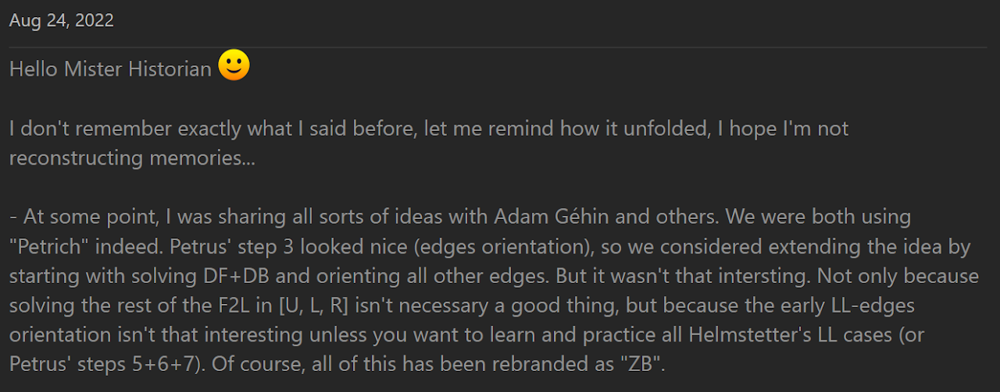
>This is from a private conversation between Roux and I.

In January, 2003 Ryan Heise came across the video. Heise noticed that Géhin used only L, U, and R turns to solve the first two layers. Not knowing that it was the exact method already being used in the video, Heise proposed it as a new method. In a message to the Speed Solving Rubik's Cube Yahoo group, Heise suggested both EOLine and EOCross [3].

The link to the video by Géhin no longer works. However, Roux himself confirmed the contents of the video [4].

In June, 2004, Ron van Bruchem began submitting to the Speed Solving Rubik's Cube Yahoo group method ideas that started with EOLine [5, 6].

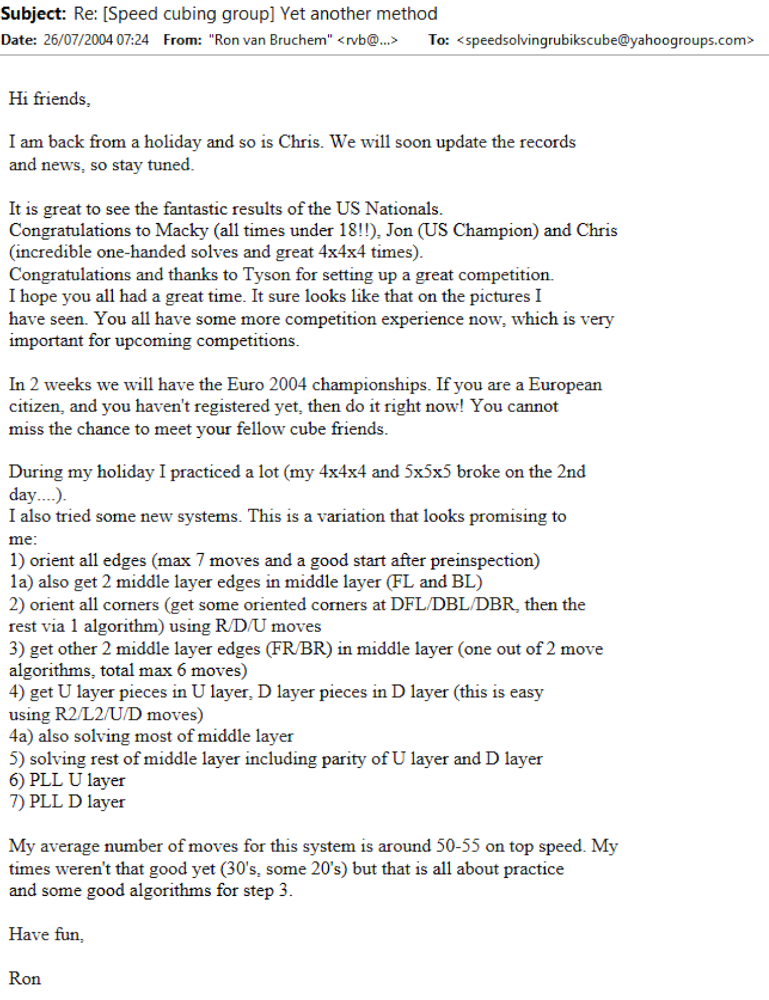

Bruchem credited Heise for the edge orientation idea [7].

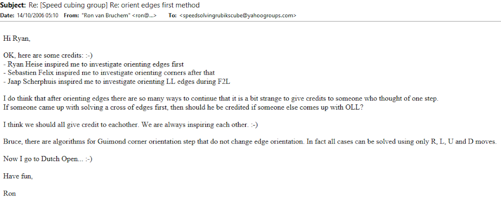

Eventually, Bruchem began experimenting with solving the first two layers after EOLine and EOCross [8].

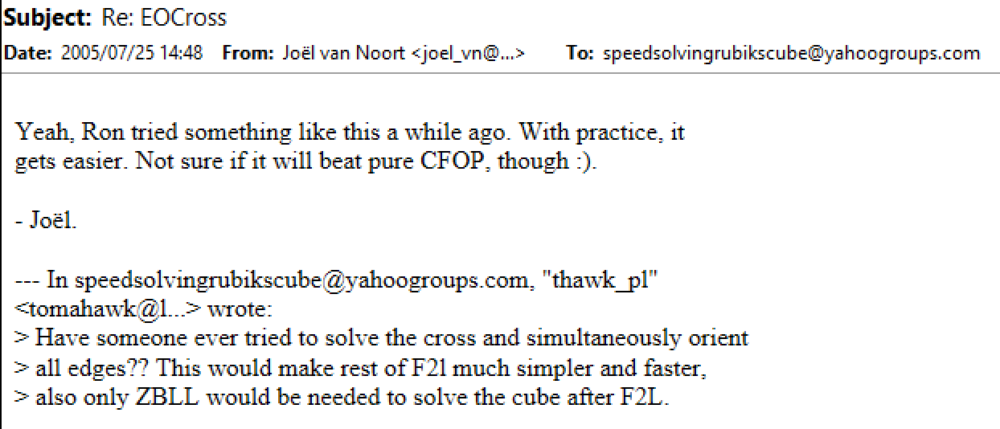

>This message is from July, 2005, which is over a year before the creation of the ZZ website.

At the European Rubik's Games Championship 2004 (August 7-8, 2004) [9], Zbigniew Zborowski observed Bruchem demonstrating the methods involving EOLine and or EOCross [10].

### Website

Zborowski thought the concept demonstrated by Bruchem was the future of speedcubing, so Zborowski created a website describing the steps of EOLine, first two layers, then last layer and named the method ZZ [11]. Searching the website for "2006" indicates that the website was published in December, 2006.

Before publishing the website, Zborowski had been discussing the method within the Polish community. The speedcubing.com.pl website in particular included some of these discussions [12]. However, speedcubing.com.pl wasn't well preserved on archive.org, so reading all discussions isn't possible.

**Polish Version**

**English Translation**
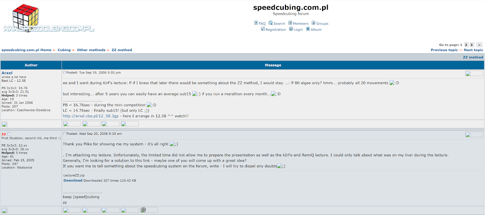

## Variants

### ZZ-A (α)

The modern classification of ZZ-A is that it is when the first two layers are solved without any intentional influencing of the last layer. So the steps would be EOCross or EOLine > F2L > ZBLL / OCLL+PLL / COLL+EPLL / Any last layer method. Zborowski's original description of ZZ-A focuses on ZBLL as the last layer method [13].

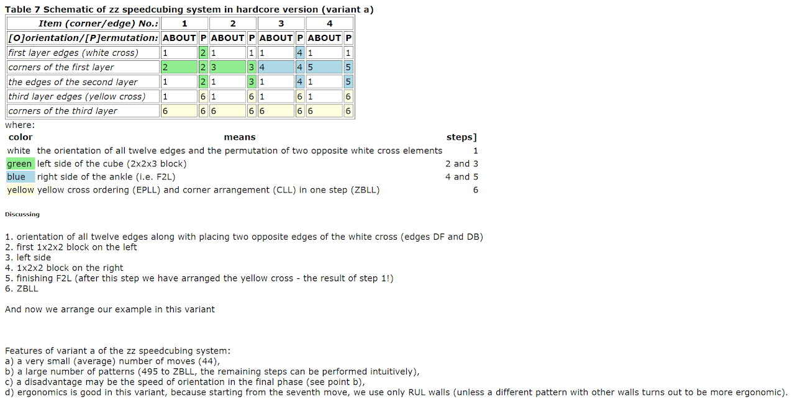

### ZZ-B (β)

ZZ-B covers any partial last layer influencing during the first two layers. Phasing then ZZLL (Zborowski's original version of ZZ-B) [14] and ZZ-R are examples of ZZ-B.

### ZZ-C (γ)

ZZ-C includes sub-variants which completely orient all corners before getting to the last layer. Winter Variation and OLS are a couple of examples. The original version of ZZ-C as proposed by Mitchell Stern was to orient all last layer corners while solving the final F2L pair [15].

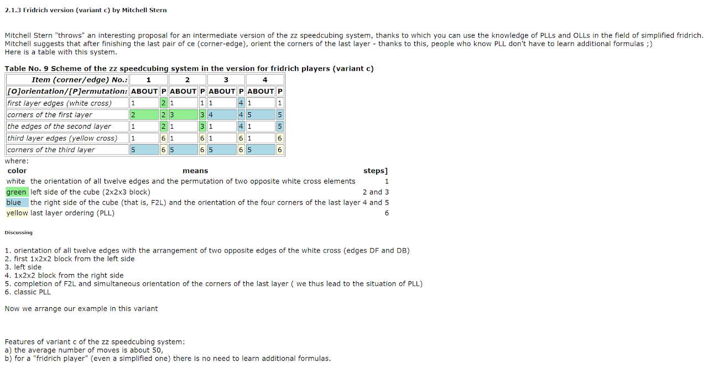

### ZZ-D (δ)

ZZ-D is any variant that permutes all corners before getting to the last layer. The original version of ZZ-D was to permute all corners while solving the final pair on the left side of the first two layers then complete the right side of the first two layers and end the solve with 2GLL [16]. Zborowski's website included a couple of other corner permutation variants, E and F. The E variant permutes all corners while solving the final F2L pair [17]. The ZZ-F variant, as proposed by Grzegorz Łuczyna, has the steps of EOLine > 1x2x2 on the left and 1x2x2 on the right > permute all corners while solving the last pair of the left side > last pair and last layer [18]. Zbigniew Zborowski included the idea of early corner permutation on the website, but stated that he hasn't yet found a way to do it [16]. The E and F variants have since been grouped under the ZZ-D variant to have a single variant focused on corner permutation with several sub-variants.

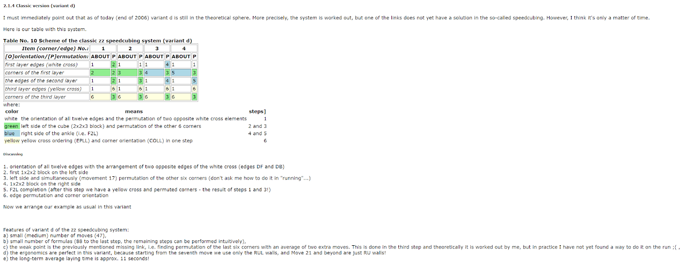

In January, 2012, Kim Orbit developed a recognition method for ZZ-D and the algorithms in 2012 [19].

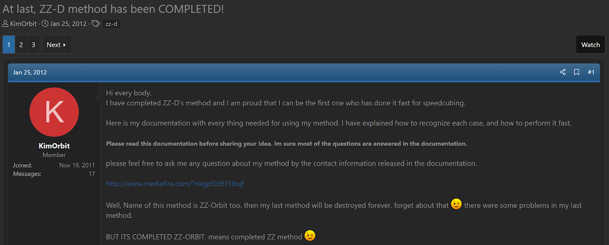

In 2018, Joseph Tudor developed a new variant of ZZ related to the ZZ-D variant [20]. The DBL corner is solved along with EOLine. Corner permutation is then solved while ensuring that the left side block pieces are within the U ald L layers, then the left side block is built first to preserve the corner permutation state. The remainder of the solve can be solved using just turns of the upper and right side layers.

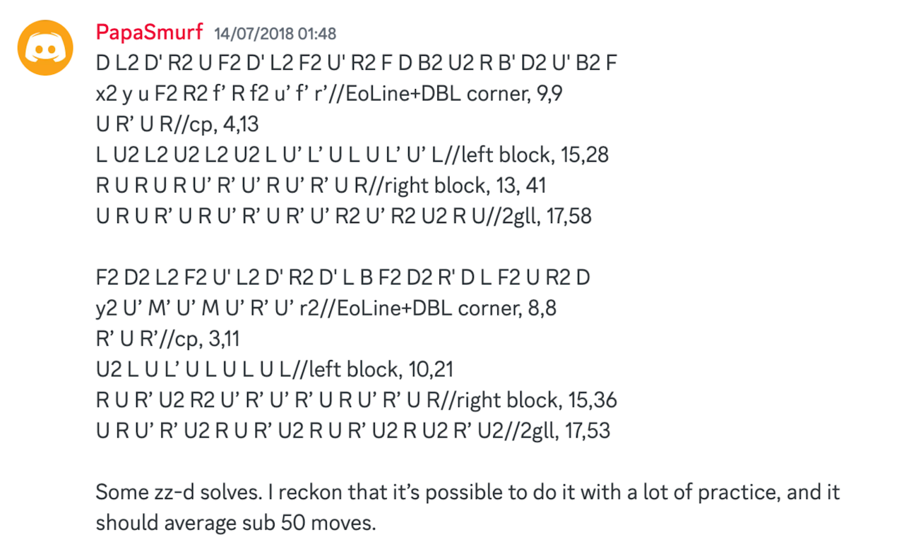

In 2020, Dylan Nyein decided to develop the complete version for any last pair corner and edge situation [21]. Nyein and Tudor together completed the development [22, 23].

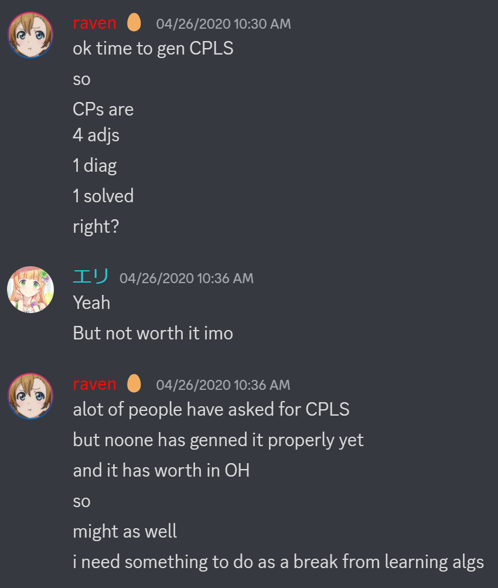
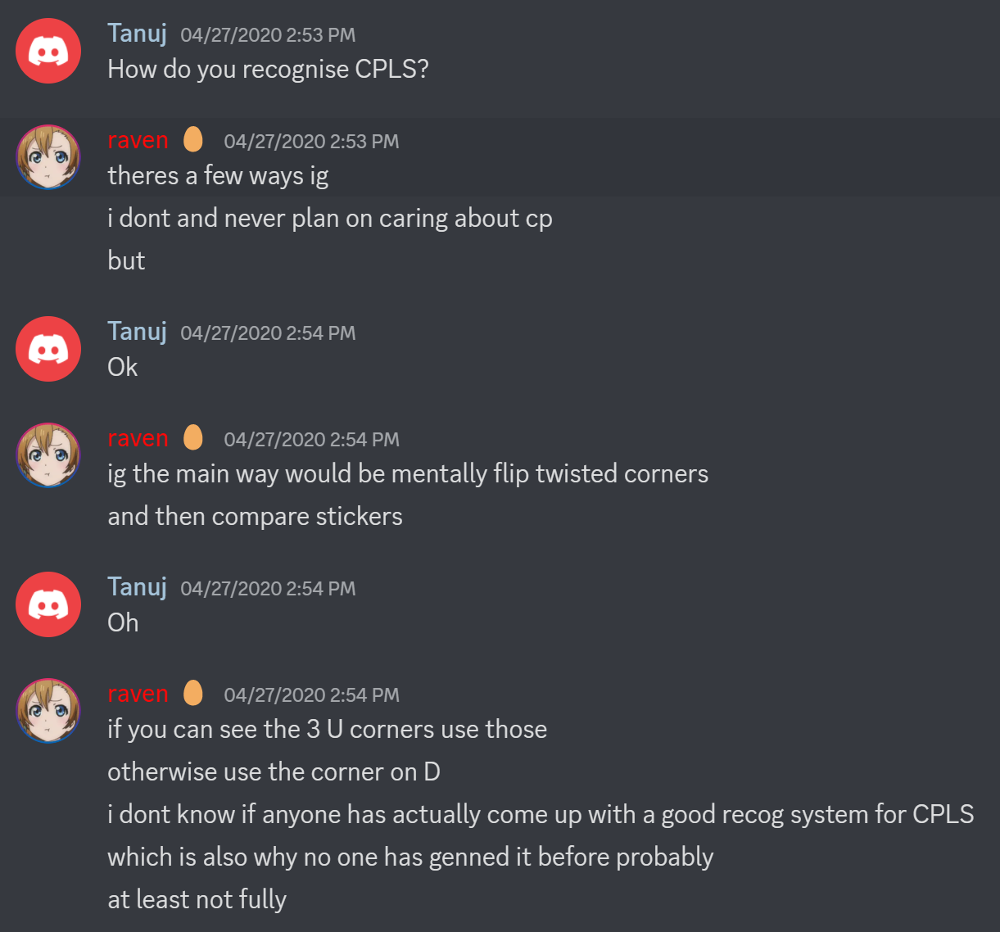
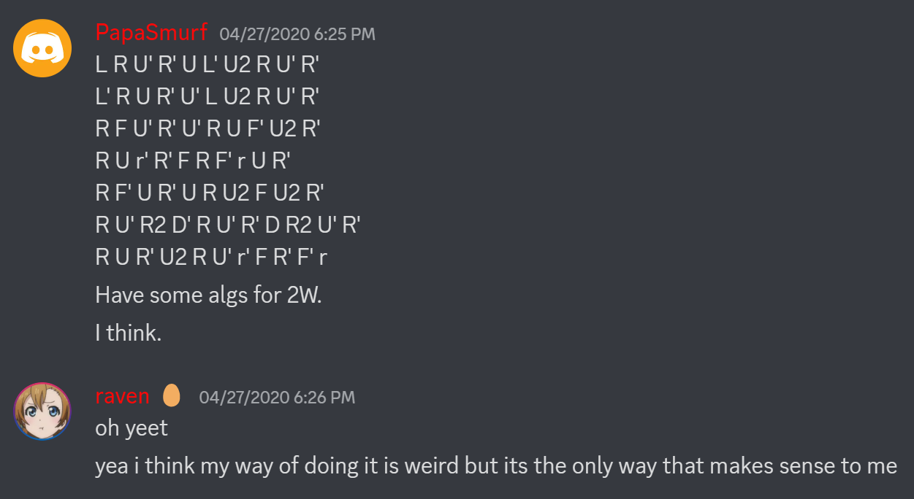

### ZZ-CT

On March 31, 2016, Chris Tran posted a ZZ variant called HW to speedsolving.com [24]. This variant solved the final last slot corner while orienting the last layer corners. Then everything is solved in a single step.

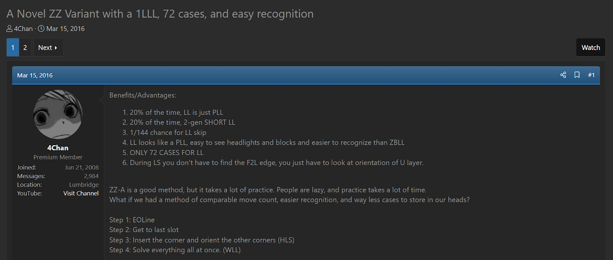

In May, 2014, speedsolving.com user elrog proposed a method called Navi [25]. One of the steps of this method permutes the last layer and the DFR corner. In March, 2016, Tran took notice of this step after the thread had received replies, moving the thread to the top of the visible threads. Tran replied to the thread, stating that the step solves every issue with the HW variant that Tran had recently proposed [26].

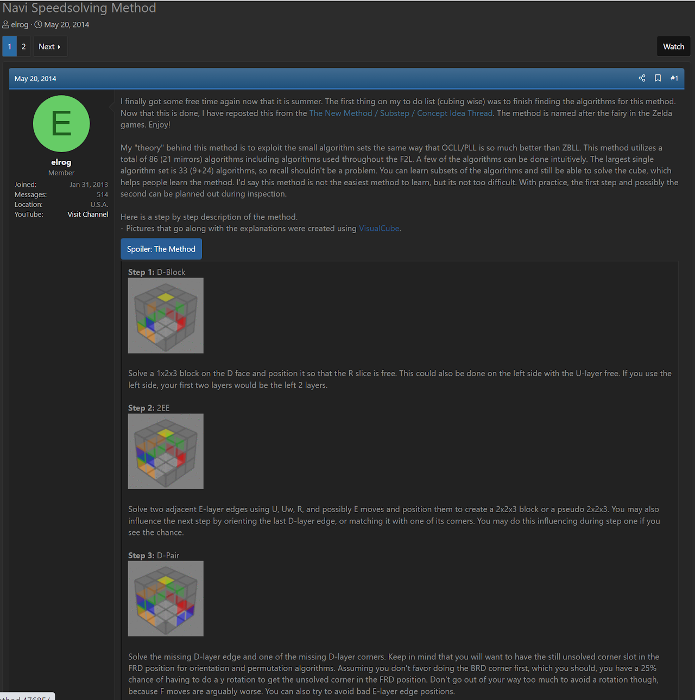
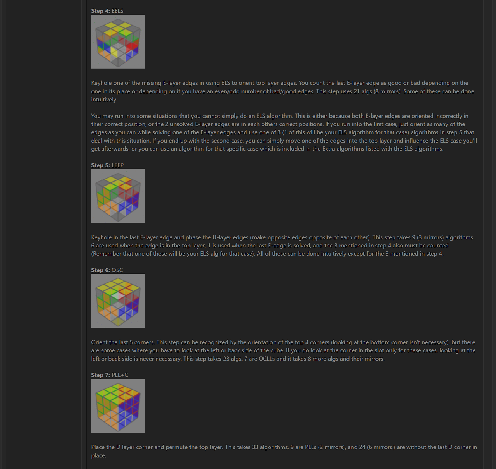
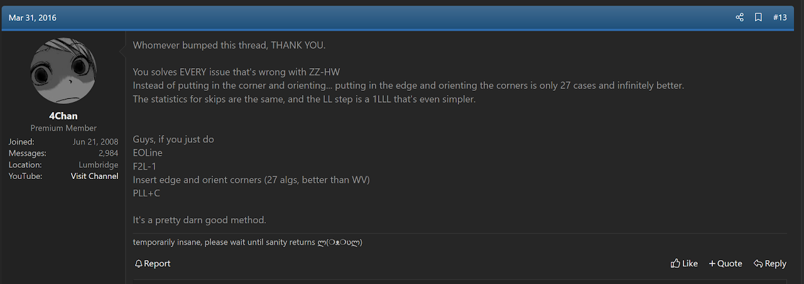

In May, 2016, Tran incorporated elrog's step from the Navi method into a ZZ variant called CT [27]. The step came to be named TTLL, after Tran and Blake Thompson because it was now part of Tran’s ZZ variant proposal and Thompson generated most of the algorithms. The step before TTLL solves the edge of the last slot while orienting all corners.

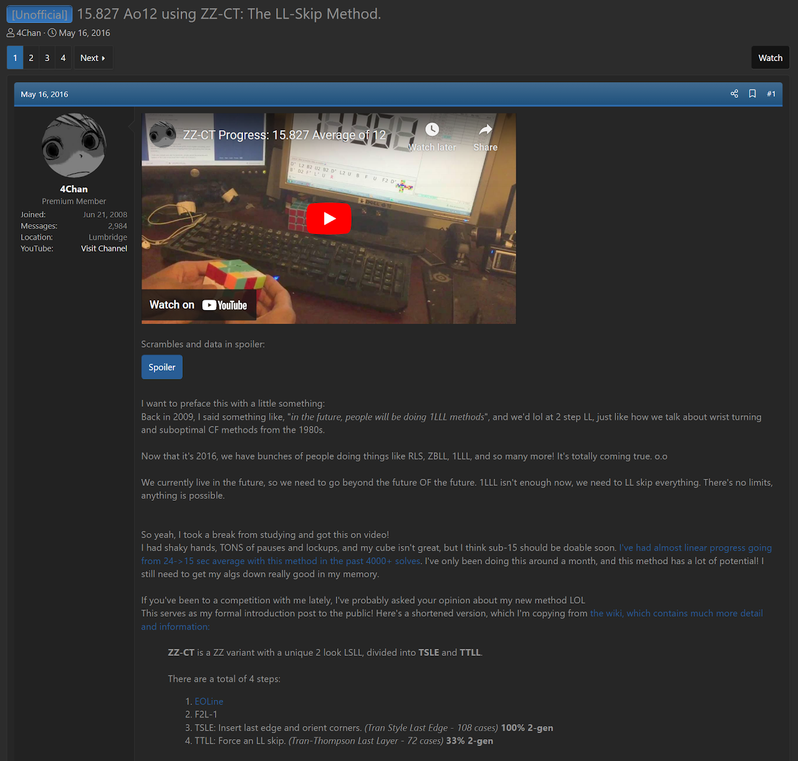

### ZZ-EF

On December 30, 2014 SpeedSolving.com user MrMan proposed a ZZ variant that solves all edges and ends with two COLL algorithms [28]. On that same day, Matt DiPalma refined MrMan's idea into a usable variant with no parity issues [29]. The next day, DiPalma posted an official proposal for the variant [30].

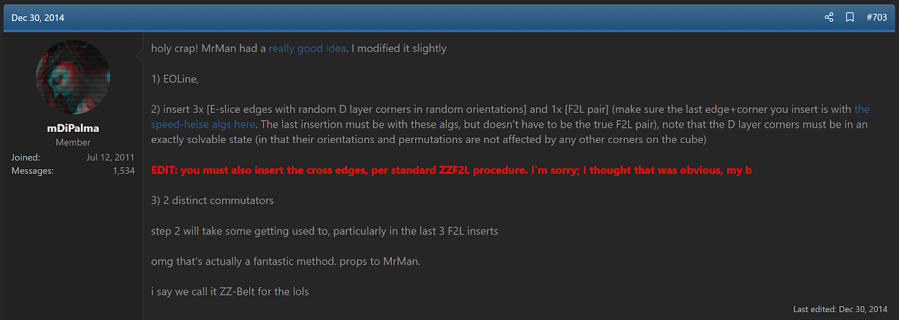
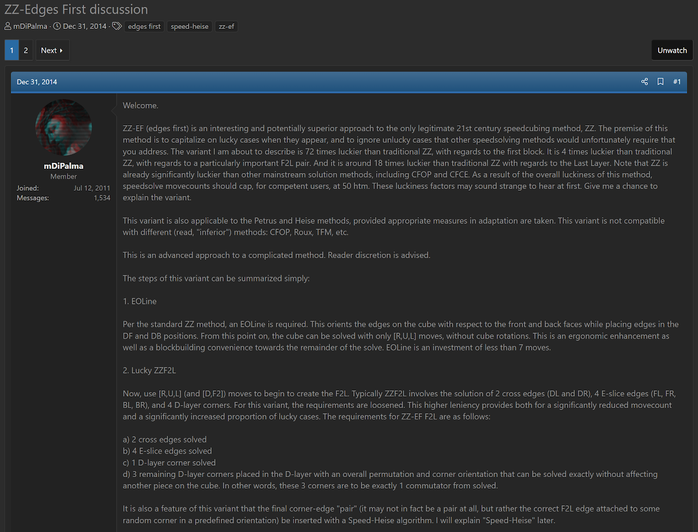

### ZZ-Portico

In May, 2012, DiPalma proposed a new variant [31]. Only the DB edge is solved along with the edge orientation step. Then the rest of the first two layers is completed minus the DF edge, the last layer corners are solved, then the last five edges are permuted.

### WaterZZ

In June, 2018, Tudor suggested a variant that leaves out two edges of the first two layers on the right side [32, 33]. The solve ends with permuting the last layer edges and the two missing edges of the first two layers.

### Tripod

#### NLS

The idea for adapting the Tripod method to ZZ has been a commonly suggested one. In August, 2017 Max Garza developed an algorithm set to solve the final first two layers slot while preserving a 1x2x2 block on the U layer [34]. The step is called NLS, or Neuro's Last Slot, after Garza's speedsolving.com profile name Neuro.

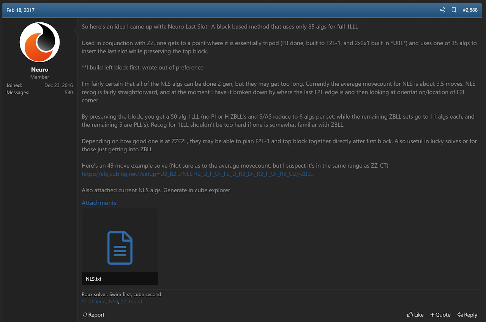

#### TLS

In September, 2023, Ryan Hudgens developed an alternate way of solving the last slot and a 1x2x2 block on the U layer [35, 36]. The user intuitively builds a U layer pair into the last slot of the first two layers, then an algorithm is used to simultaneously solve the correct last slot of the first two layers and add the other edge to the U layer pair to form a 1x2x2 block.

## Credit

Others have provided some information on the variants of ZZ:

Joseph Tudor: Provided many details on the modern variant classification system.

Dylan Nyein: Provided information on the ZZ-D variant.

## References

[1] M. J. Straughan and G. Roux, Personal communication, 24 August 2022. [Online]. 

[2] A. Géhin, "The Mythical Rubik's Cube," June 2003. [Online]. Available: https://web.archive.org/web/20030620092845/http://borntodie.free.fr/.

[3] R. Heise, ""line"," Yahoo! Groups - Speed Solving Rubik's Cube, 1 July 2003. [Online]. 

[4] G. Roux, "The New Method / Substep / Concept Idea Thread," SpeedSolving.com, 5 May 2020. [Online]. Available: https://www.speedsolving.com/threads/the-new-method-substep-concept-idea-thread.40975/post-1368143.

[5] R. v. Bruchem, "Yet another method," Yahoo! Groups - Speed Solving Rubik's Cube, 13 June 2004. [Online]. 

[6] R. v. Bruchem, "Re: [Speed cubing group] Yet another method," Yahoo! Groups - Speed Solving Rubik's Cube, 26 July 2004. [Online]. 

[7] R. v. Bruchem, "Re: [Speed cubing group] Re: orient edges first method," Yahoo! Groups - Speed Solving Rubik's Cube, 14 October 2006. [Online]. 

[8] J. v. Noort, "Re: EOCross," Yahoo! Groups - Speed Solving Rubik's Cube, 25 July 2005. [Online]. 

[9] WCA, "European Rubik's Games Championship 2004," World Cube Association, 2004. [Online]. Available: https://www.worldcubeassociation.org/competitions/Euro2004/results/by_person.

[10] Z. Zborowski, "zz speedcubing system," Zborowski's Website, 2006. [Online]. Available: https://web.archive.org/web/20070428175325/http://www.speedcubing.com.pl/nooks_zz.htm#zzspeed.

[11] Z. Zborowski, "zz speedcubing system," Zborowski's Website, 2006. [Online]. Available: https://web.archive.org/web/20070428175325/http://www.speedcubing.com.pl/nooks_zz.htm.

[12] "Metoda ZZ," speedcubing.com.pl, September 2006. [Online]. Available: https://web.archive.org/web/20080731021124/http://forum.speedcubing.com.pl/viewtopic.php?t=491.

[13] Z. Zborowski, "Wersja hardcore (wariant a)," Zborowski's Website, [Online]. Available: https://web.archive.org/web/20090302093157/http://speedcubing.com.pl/nooks_zz.htm#zzspeed_warianty_a.

[14] Z. Zborowski, "Wersja rekomendowana (wariant b)," Zborowski's Website, [Online]. Available: https://web.archive.org/web/20090302093157/http://speedcubing.com.pl/nooks_zz.htm#zzspeed_warianty_b.

[15] Z. Zborowski, "Wersja dla fridrich'owców (wariant c) by Mitchell Stern," Zborowski's Website, [Online]. Available: https://web.archive.org/web/20090302093157/http://speedcubing.com.pl/nooks_zz.htm#zzspeed_warianty_c.

[16] Z. Zborowski, "Wersja klasyczna (wariant d)," Zborowski's Website, [Online]. Available: https://web.archive.org/web/20090302093157/http://speedcubing.com.pl/nooks_zz.htm#zzspeed_warianty_d.

[17] Z. Zborowski, "Wersja pośrednia do klasyka (wariant e)," Zborowski's Website, [Online]. Available: https://web.archive.org/web/20090302093157/http://speedcubing.com.pl/nooks_zz.htm#zzspeed_warianty_e.

[18] Z. Zborowski, "Wersja pośrednia do klasyka (wariant f) by Grzegorz Łuczyna," Zborowski's Website, [Online]. Available: https://web.archive.org/web/20090302093157/http://speedcubing.com.pl/nooks_zz.htm#zzspeed_warianty_f.

[19] K. Orbit, "At last, ZZ-D method has been COMPLETED!," SpeedSolving.com, 25 January 2012. [Online]. Available: https://www.speedsolving.com/threads/at-last-zz-d-method-has-been-completed.34994/.

[20] J. Tudor, Discord, 13 July 2018. [Online]. Available: https://discord.com/channels/455707295205294081/462589831051214858/467419861266464780.

[21] D. Nyein, Discord, 26 April 2020. [Online]. Available: https://discord.com/channels/455707295205294081/455708462870167556/703780071319666718.

[22] J. Tudor, Discord, 27 April 2020. [Online]. Available: https://discord.com/channels/455707295205294081/455708462870167556/704262054554632264.

[23] D. Nyein, Discord, 1 January 2023. [Online]. Available: https://discord.com/channels/455707295205294081/455708462870167556/1059113938861695017.

[24] C. Tran, "A Novel ZZ Variant with a 1LLL, 72 cases, and easy recognition," SpeedSolving.com, 15 March 2016. [Online]. Available: https://www.speedsolving.com/threads/a-novel-zz-variant-with-a-1lll-72-cases-and-easy-recognition.60281/.

[25] elrog, "Navi Speedsolving Method," SpeedSolving.com, 19 May 2014. [Online]. Available: https://www.speedsolving.com/threads/navi-speedsolving-method.47685/.

[26] C. Tran, "Navi Speedsolving Method," SpeedSolving.com, 31 March 2016. [Online]. Available: https://www.speedsolving.com/threads/navi-speedsolving-method.47685/post-1163282.

[27] C. Tran, "15.827 Ao12 using ZZ-CT: The LL-Skip Method.," SpeedSolving.com, 16 May 2016. [Online]. Available: https://www.speedsolving.com/threads/15-827-ao12-using-zz-ct-the-ll-skip-method.60972/.

[28] MrMan, "New Method?," SpeedSolving.com, 30 December 2014. [Online]. Available: https://www.speedsolving.com/threads/new-method.50959/post-1045938.

[29] M. DiPalma, "The New Method / Substep / Concept Idea Thread," SpeedSolving.com, 14 December 2014. [Online]. Available: https://www.speedsolving.com/threads/the-new-method-substep-concept-idea-thread.40975/post-1045948.

[30] M. DiPalma, "ZZ-Edges First discussion," SpeedSolving.com, 30 December 2014. [Online]. Available: https://www.speedsolving.com/threads/zz-edges-first-discussion.50964/.

[31] M. DiPalma, "ZZ and ZB Discussion," SpeedSolving.com, 15 May 2012. [Online]. Available: https://www.speedsolving.com/threads/zz-and-zb-discussion.20834/post-744158.

[32] J. Tudor, Discord, 30 June 2018. [Online]. Available: https://discord.com/channels/455707295205294081/462589850525368321/462589939150880778.

[33] J. Tudor, Discord, 23 November 2018. [Online]. Available: https://discord.com/channels/455707295205294081/462589850525368321/515655057518100480.

[34] M. Garza, "The New Method / Substep / Concept Idea Thread," SpeedSolving.com, 18 February 2017. [Online]. Available: https://www.speedsolving.com/threads/the-new-method-substep-concept-idea-thread.40975/post-1220389.

[35] R. Hudgens, Discord, 1 September 2023. [Online]. Available: https://discord.com/channels/455707295205294081/462589850525368321/1147127419040436254.

[36] R. Hudgens, "ZZ Tripod Formation + Last Slot Sheet," Google Docs, 2 September 2023. [Online]. Available: https://docs.google.com/spreadsheets/d/1aIysCr8xDY9b8052BYDb1r6rFzITWCRyAjJD-lpflm0/edit?usp=sharing.