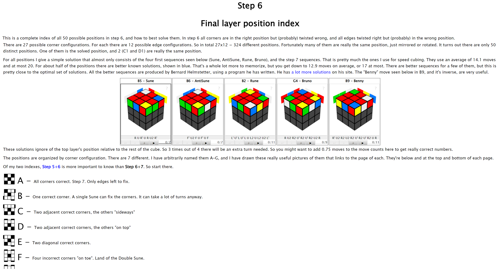
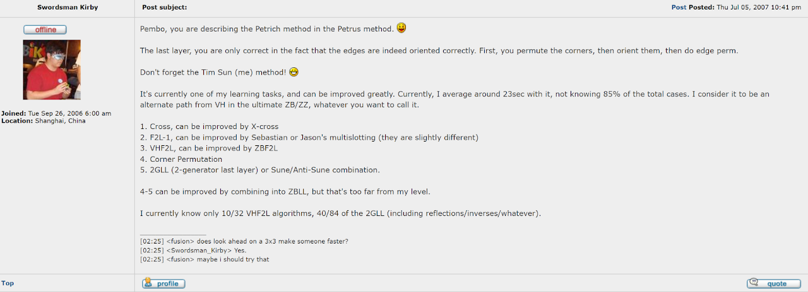

import AnimCube from "@site/src/components/AnimCube";

# 2GLL

<AnimCube params="buttonbar=0&position=lluuu&scale=6&hint=10&hintborder=1&borderwidth=10&facelets=lylyyylylwwwwwwwwwdbblbbdbbdgglggdggdldoooooodrrlrrdrr" width="400px" height="400px" />

## Description

2GLL solves the last layer in one step when the edges are oriented and the corners are correctly permuted.

**Proposer:** [Bernard Helmstetter](CubingContributors/MethodDevelopers.md#helmstetter-bernard)

**Proposed:** 2000.

[Click here for more step details on the SpeedSolving wiki]( https://www.speedsolving.com/wiki/index.php?title=2GLL)

## Development

### Petrus Method

In 1981, Lars Petrus developed the [Petrus method](3x3/Methods/Petrus.md). Upon reaching the last layer, the first step is to permute the corners [1]. The next two steps orient the corners then permute the edges [2].

### Bernard Helmstetter

Around the year 2000, Bernard Helmstetter generated all of the algorithms to combine the last two steps of the Petrus method [3]. This created a step that orients the four corners while permuting the four edges.

### Lars Petrus

Petrus eventually developed the algorithm set as well and placed it on the Petrus website [4]. On this page, Petrus links to Helmstetter’s website with the original algorithm list.

## Name Origin

The acronym 2GLL was created by Timothy Sun in July, 2007. Sun posted a message to twistypuzzles.com using the acronym and explaining what it stands for [5, 6].

## References

[1] L. Petrus, "Step 5," Petrus' Website, [Online]. Available: https://lar5.com/cube/fas5.html.

[2] L. Petrus, "Solving Rubik's Cube for speed.," Petrus' Website, [Online]. Available: https://lar5.com/cube/.

[3] B. Helmstetter, Helmstetter's Website, 2000. [Online]. Available: https://web.archive.org/web/20010428080630/http://www.ens-lyon.fr/~bhelmste/.

[4] L. Petrus, "Step 6 - Final layer position index," Petrus' Website, 2002. [Online]. Available: https://lar5.com/cube/xMain.html.

[5] T. Sun, "Speed Cubing Methods," TwistyPuzzles.com, 5 July 2007. [Online]. Available: https://www.twistypuzzles.com/forum/viewtopic.php?p=67102#p67102.

[6] J. Gouly, "What Method Do you Use?," TwistyPuzzles.com, 10 September 2007. [Online]. Available: https://www.twistypuzzles.com/forum/viewtopic.php?p=73596#p73596.