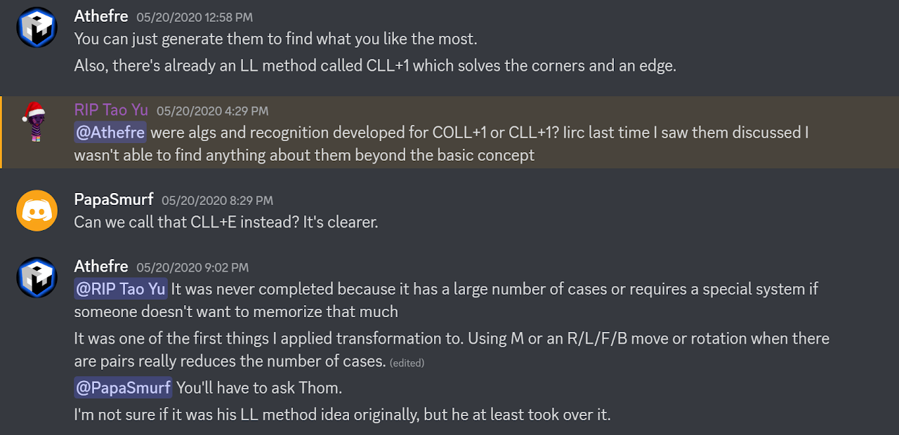
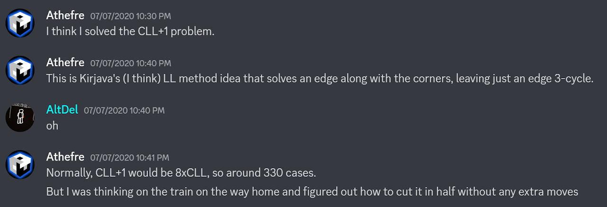

import AnimCube from "@site/src/components/AnimCube";

# CLL+1

<AnimCube params="buttonbar=0&position=lluuu&scale=6&hint=10&hintborder=1&borderwidth=10&facelets=yoyryyyyywwwwwwwwwbbbybbbbbgggggggggoyooooooorrrbrrrrr" width="400px" height="400px" />

## Description

CLL+1 is a method for solving the last layer.

**Proposer:** [Thom Barlow](CubingContributors/MethodDevelopers.md#barlow-thom-kirjava)

**Proposed:** 2010

**Developer:** [Michael James Straughan](CubingContributors/MethodDevelopers.md#straughan-michael-james-athefre)

**Developed:** 2020

**Steps:**

1. Solve the last layer corners and one edge.
2. Solve the last three edges.

[Click here for more step details on the SpeedSolving wiki](https://www.speedsolving.com/wiki/index.php/CLL%2B1)

## Origin

### Idea

Thom Barlow started discussing the idea around 2010 [1]. However, there wasn't a system to make it work. Solving the corners while solving a specific edge every solve was obvious, but Barlow wanted to solve any of the four U layer edges and reduce the number of algorithms to learn. Discussions for the idea were occurring in IRC and on speedsolving.com.

### Systems

In response to Barlow's search for a system to make CLL+1 work, Michael James Straughan offered a few ideas [2, 3, 4].

In February, 2017, Louis de Mendonça mentioned an idea of phasing or unphasing the LL edges and using inverted edge orientation algorithms depending on the edge orientation case [5, 6].

## Development

In May, 2020 James Straughan started looking into the CLL+1 problem again. A short conversation was had with Mendonça and Joseph Tudor [7].

In July, 2020, Straughan discovered the algorithm union concept while trying to solve the CLL+1 problem [8]. The idea was to have one algorithm that permutes the edges in one way, and another algorithm that permutes the edges in a different way. The two algorithms can together solve the 12 sub-cases for a COLL algorithm set. This made COLL+1 work. For CLL+1, Straughan had the idea of having one algorithm flip the edge orientation one way and another algorithm that flips the edge orientation in the opposite way. The edge orientation idea turned out to be the same as that once suggested by Mendonça.

In September, 2020, Straughan completed development of CLL+1 and COLL+1 [9].

## References

1. T. Barlow, "Random Cubing Discussion," SpeedSolving.com, 2 December 2010. [Online]. Available: https://www.speedsolving.com/threads/random-cubing-discussion.22862/post-495052.
2. M. J. Straughan, "Random Cubing Discussion," SpeedSolving.com, 2 December 2010. [Online]. Available: https://www.speedsolving.com/threads/random-cubing-discussion.22862/post-495230.
3. M. J. Straughan, "Random Cubing Discussion," SpeedSolving.com, 5 December 2010. [Online]. Available: https://www.speedsolving.com/threads/random-cubing-discussion.22862/page-21#post-496431.
4. M. J. Straughan, "Random Cubing Discussion," SpeedSolving.com, 4 May 2012. [Online]. Available: https://www.speedsolving.com/threads/random-cubing-discussion.22862/page-85#post-741058.
5. L. d. Mendonça, "(Need help) List of all ZZ variants," SpeedSolving.com, 15 February 2017. [Online]. Available: https://www.speedsolving.com/threads/need-help-list-of-all-zz-variants.63869/post-1220062.
6. L. d. Mendonça, "(Need help) List of all ZZ variants," SpeedSolving.com, 15 February 2017. [Online]. Available: https://www.speedsolving.com/threads/need-help-list-of-all-zz-variants.63869/post-1220075.
7. M. J. Straughan, L. d. Mendonça and J. Tudor, Discord, 20 May 2020. [Online]. Available: https://discord.com/channels/416929203607568404/416933073893195779/712514867403423765.
8. M. J. Straughan, Discord, 7 July 2020. [Online]. Available: https://discord.com/channels/416929203607568404/416933092620500992/730053033626435661.
9. M. J. Straughan, "CLL+1: An Advanced LL Method (Complete and fully generated!)," SpeedSolving.com, 26 September 2020. [Online]. Available: https://www.speedsolving.com/threads/cll-1-an-advanced-ll-method-complete-and-fully-generated.78631/.