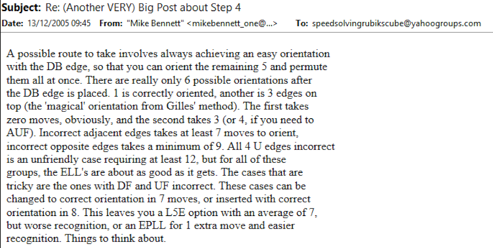
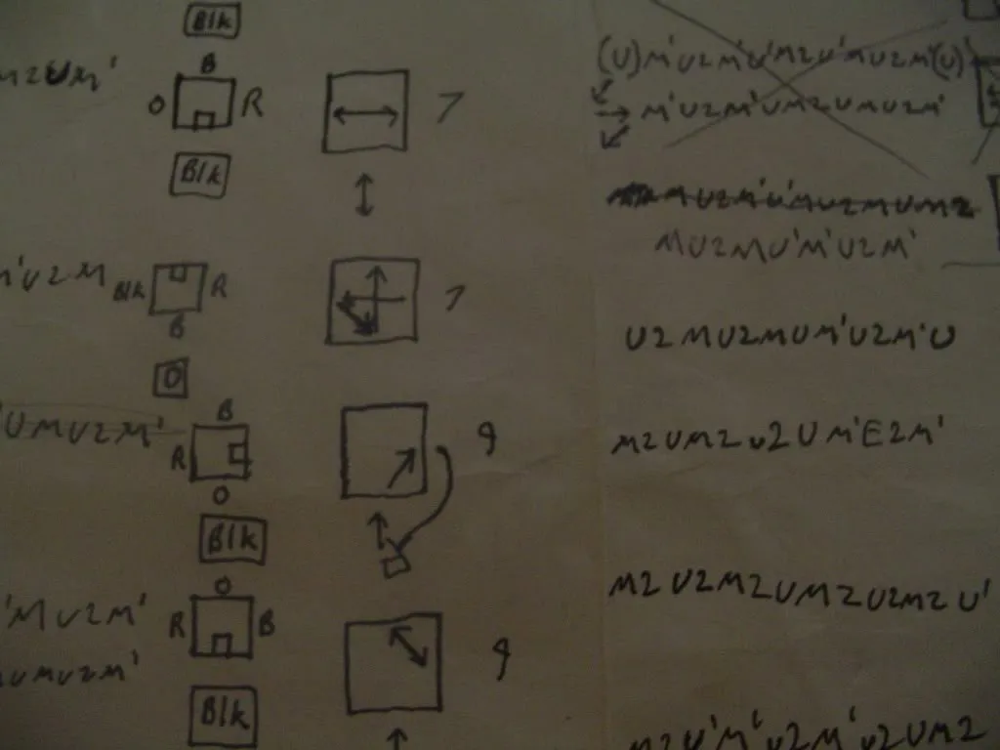
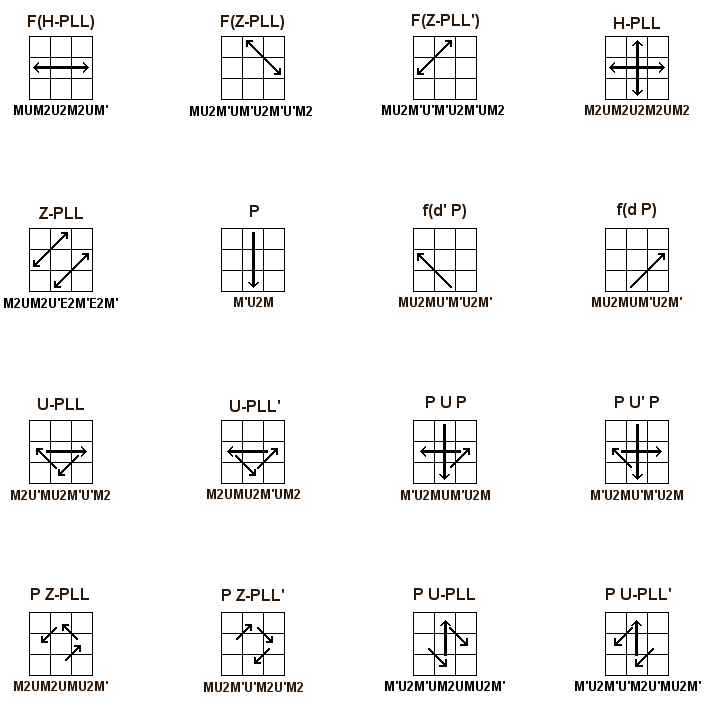

import AnimCube from "@site/src/components/AnimCube";

# L5EP

<AnimCube params="config=../../ExhibitConfig.txt&facelets=ylylylylywwwlwwwwwbbblblbbbggglgggggolooooooorrrlrrrrr" width="400px" height="400px" />

## Description

**Proposer:** [Mike Bennett](CubingContributors/MethodDevelopers.md#bennett-mike)

**Proposed:** 2005

[Click here for more step details on the SpeedSolving wiki](https://www.speedsolving.com/wiki/index.php/L5E#L5EP)

## L5EP 4U + 1D

### First Development

L5EP was first proposed by Mike Bennett in December, 2005 on the Speed Solving Rubik's Cube Yahoo group [1, 2]. Mike Bennet developed the algorithms and placed them on a website in January, 2006 [3].

### Other Developments and Popularity

#### Second Development

In mid-2006, Michael James Straughan independently had the same idea and developed the algorithms for use in the MI1 method [4].

#### Popularity

In 2008 Kennth Gustavsson developed a naming system for each case [5]. Within Kenneth's thread, Straughan developed and posted an arrow-based representation image using Kenneth's naming scheme and the algorithms previously developed by Straughan [6, 7]. The image and the wiki page helped L5EP gain some popularity, eventually making its way into various methods. Some example methods include ZZ-Portico, Hawaiian Kociemba, Mehta, and Squall.

#### Alternate Naming Scheme

An alternate set of names for each case was developed by Andrew Mahovich and Cubingcubecuber [8, 9].

## References

[1] M. Bennett, "Re: (Another VERY) Big Post about Step 4," Yahoo! Groups - Speed Solving Rubik's Cube, 13 December 2005. [Online]. 

[2] M. Bennett, "New Site up (Formerly: Shortest move Count...)," Yahoo! Groups - Speed Solving Rubik's Cube, 18 January 2006. [Online]. 

[3] M. Bennett, "MSM Step 6," Geocities - Bennet's Website, 18 January 2006. [Online]. Available: https://web.archive.org/web/20090807121113/http:/geocities.com/cubiks_ruber/msm6.html.

[4] M. J. Straughan, Straughan's Website, 2006. [Online]. Available: https://web.archive.org/web/20110224050936/http://athefre.110mb.com/.

[5] K. Gustavsson, "Last edges (Roux amoung other methods)," SpeedSolving.com, 6 October 2008. [Online]. Available: https://www.speedsolving.com/threads/last-edges-roux-amoung-other-methods.6754/post-91969.

[6] M. J. Straughan, "L5E," PhotoBucket, [Online]. Available: https://i140.photobucket.com/albums/r25/Athefre/L5EFinal.png.

[7] M. J. Straughan, "Last edges (Roux amoung other methods)," SpeedSolving.com, 7 November 2008. [Online]. Available: https://www.speedsolving.com/threads/last-edges-roux-amoung-other-methods.6754/post-100400.

[8] A. Mahovich and Cubingcubecuber, "L5EP," Google Docs, 8 May 2020. [Online]. Available: https://docs.google.com/document/d/1kb4JFX2WY5mh0gchb9gkbI-RoINaFfX5w0i4VJ1z5ek/edit.

[9] A. Mahovich and Cubingcubecuber, "Quest For Sub 10 Hawaiian Kociemba | New Directions," SpeedSolving.com, 5 June 2020. [Online]. Available: https://www.speedsolving.com/threads/quest-for-sub-10-hawaiian-kociemba-new-directions.76602/post-1376723.