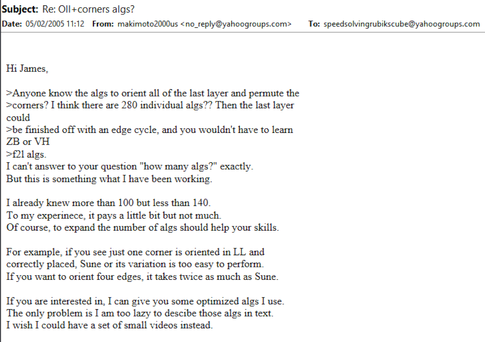
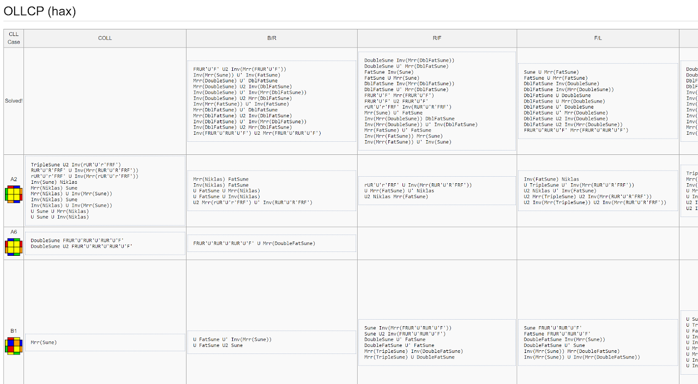

import AnimCube from "@site/src/components/AnimCube";

# OLLCP

<AnimCube params="buttonbar=0&position=lluuu&scale=6&hint=10&hintborder=1&borderwidth=10&facelets=yyyyyyyyywwwwwwwwwbbbdbbbbbgggdgggggodooooooorrrdrrrrr" width="400px" height="400px" />

## Description

OLLCP is a method for solving the last layer.

**Proposer:** [Masayuki Akimoto](CubingContributors/MethodDevelopers.md#akimoto-masayuki), others

**Proposed:** Early 2000s.

**Steps:**

1. Solve the last layer corners and orient all last layer edges.
2. Permute the last layer edges.

[Click here for more step details on the SpeedSolving wiki](https://www.speedsolving.com/wiki/index.php/OLLCP)

## Origin

### Masayuki Akimoto

The first known mention of OLLCP is in February 2005 [1]. Masayuki Akimoto was in the process of generating the algorithms [2, 3].

### Kenneth Gustavsson

In the mid-2000s, Kenneth Gustavsson started working on OLLCP as well [4, 5, 6]. Gustavsson's name for the algorithm set was XCLL.

### Thom Barlow

In 2011, Thom Barlow developed a version of OLLCP that uses combinations of short algorithms to solve each case [7, 8].

## Name

As seen in the initial proposals, Gustavsson had given the algorithm set the name XCLL. It was around 2010 that the community began calling it OLLCP [9, 10].

## References

1. J. Stuber, "Oll+corners algs?," Yahoo! Groups - Speed Solving Rubik's Cube, 5 February 2005. [Online]. 
2. M. Akimoto, "Re: Oll+corners algs?," Yahoo! Groups - Speed Solving Rubik's Cube, 5 February 2005. [Online]. 
3. D. Li, "Re: Your own method and algs," Yahoo! Groups - Speed Solving Rubik's Cube, 11 September 2005. [Online]. 
4. K. Gustavsson, "Re: Freeslice F2L," Yahoo! Groups - Speed Solving Rubik's Cube, 17 September 2006. [Online]. 
5. K. Gustavsson, "Extended CLL - Short: XCLL," Gustavsson's Website, September 2006. [Online]. Available: https://web.archive.org/web/20080415204030/http://web.comhem.se/solgrop/kub/XCLL.htm.
6. K. Gustavsson, "A collection of CxLL algs.," SpeedSolving.com, 3 October 2008. [Online]. Available: https://www.speedsolving.com/threads/a-collection-of-cxll-algs.6365/post-91112.
7. T. Barlow, "OLLCP (hax)," SpeedSolving.com, 15 August 2011. [Online]. Available: https://www.speedsolving.com/threads/ollcp-hax.31506/.
8. T. Barlow, "OLLCP (hax)," SpeedSolving.com Wiki, 2011. [Online]. Available: https://web.archive.org/web/20120113073719/https://www.speedsolving.com/wiki/index.php/OLLCP_%28hax%29.
9. T. Barlow and A. Brooks, "Accomplishment Thread," SpeedSolving.com, 20 July 2010. [Online]. Available: https://www.speedsolving.com/threads/accomplishment-thread.1688/post-420402.
10. T. Barlow, "CPEOLL (Fridrich add on method)," SpeedSolving.com, 4 August 2010. [Online]. Available: https://www.speedsolving.com/threads/cpeoll-fridrich-add-on-method.23005/post-428797.