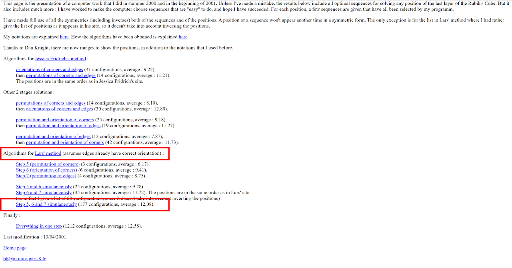
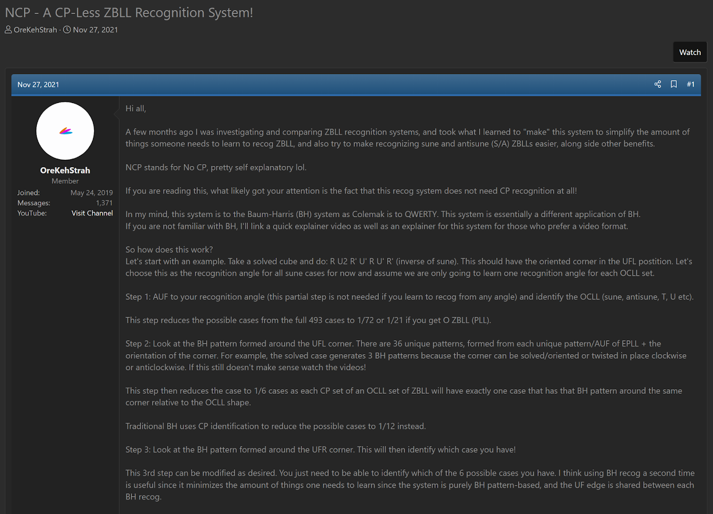
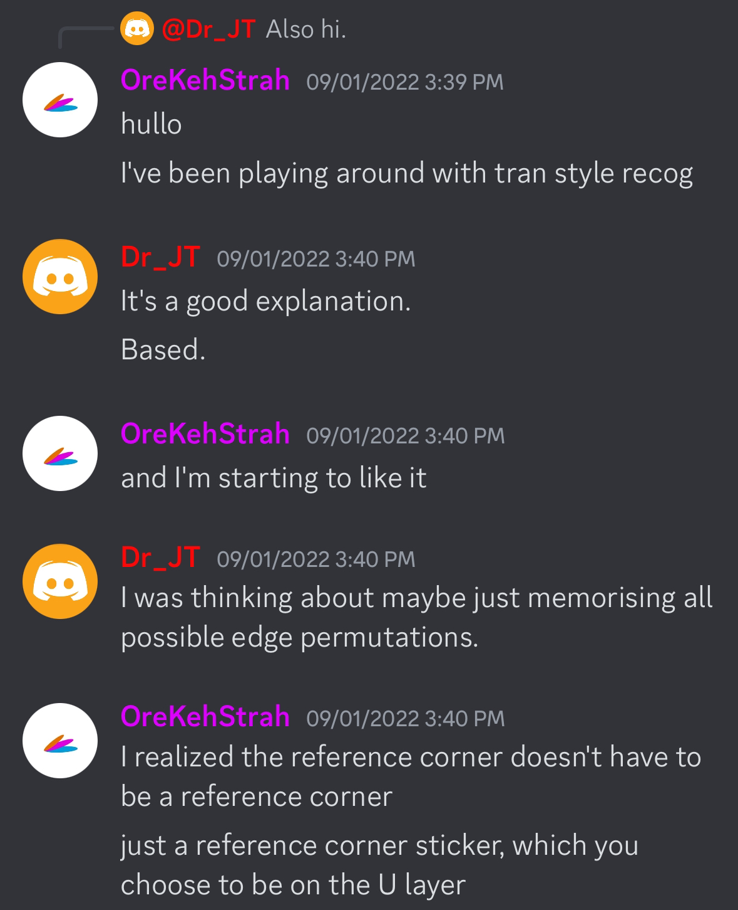
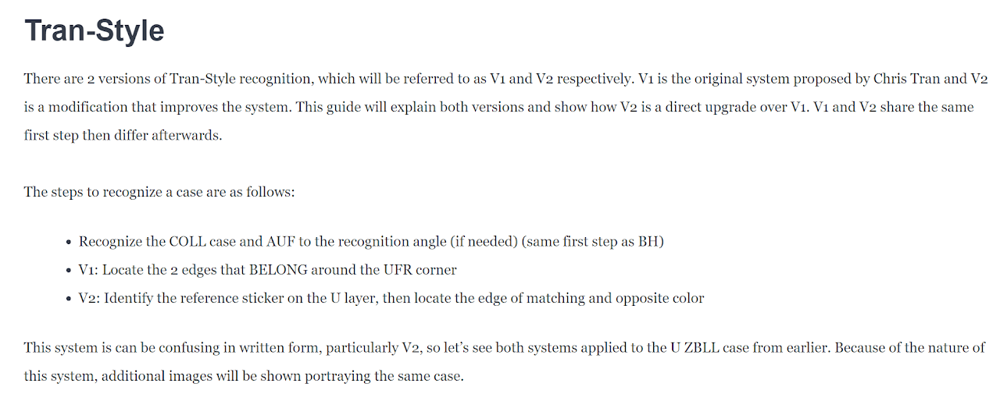
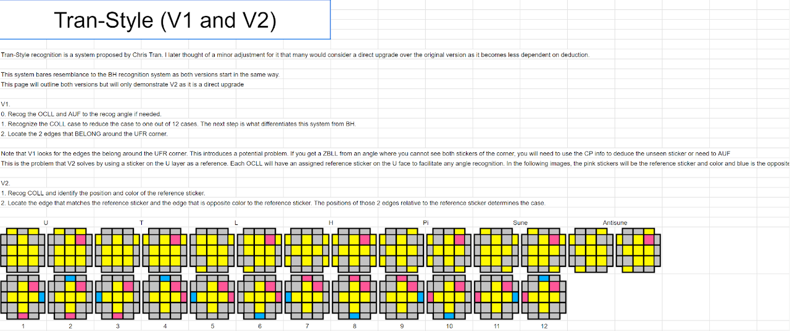
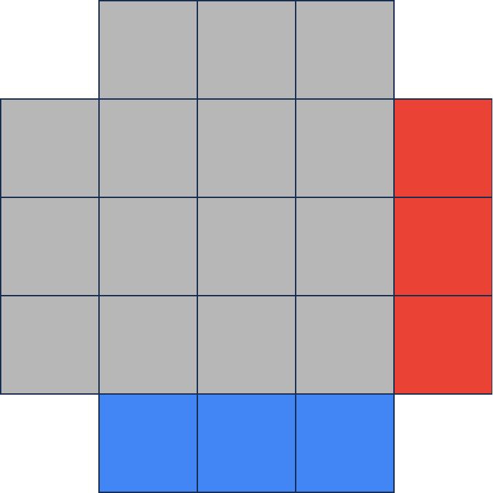
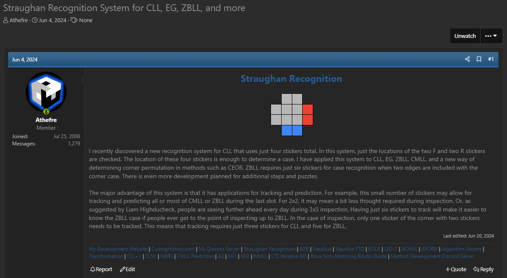
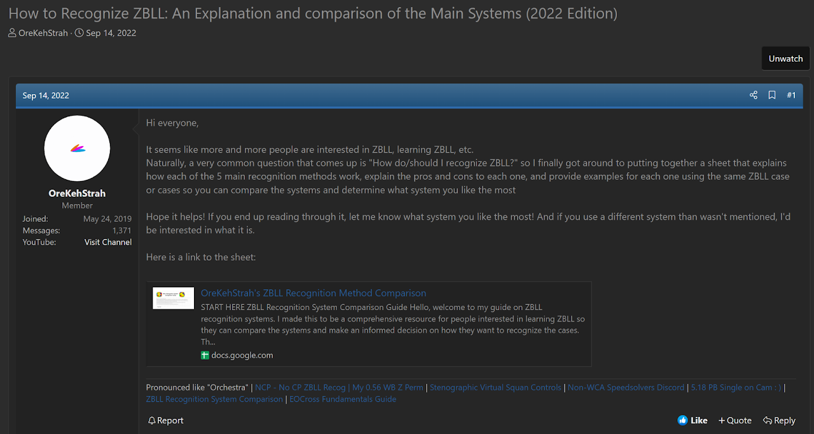
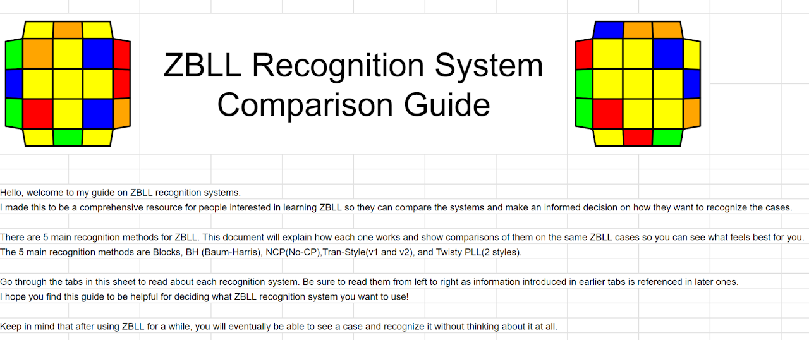

import AnimCube from "@site/src/components/AnimCube";

# ZBLL

<AnimCube params="buttonbar=0&position=lluuu&scale=6&hint=10&hintborder=1&borderwidth=10&facelets=lylyyylylwwwwwwwwwlbblbblbblgglgglggllloooooolrrlrrlrr" width="400px" height="400px" />

## Description

ZBLL solves the last layer in one step when all last layer edges are oriented.

**Proposer:** [Lars Petrus](CubingContributors/MethodDevelopers.md#petrus-lars), [Bernard Helmstetter](CubingContributors/MethodDevelopers.md#helmstetter-bernard)

**Proposed:** 1981 - 2000.

[Click here for more step details on the SpeedSolving wiki](https://www.speedsolving.com/wiki/index.php/ZBLL)

## Origin

### Petrus Method

In 1981, Lars Petrus developed the [Petrus method](3x3/Methods/Petrus.md), a method that intentionally orients all of the last layer edges early in the solve. The last layer can be solved in a single step. However, the algorithms hadn't yet been developed.

### Anneke Treep, Kurt Dockhorn, and Hans Dockhorn

In the 1980s, Anneke Treep, Kurt Dockhorn, and Hans Dockhorn generated all possible last layer solutions. This team had previously developed OLL and PLL for the [CFOP method](3x3/Methods/CFOP.md). In _Cracking the Cube_, Ian Scheffler recounts a conversation with Treep, stating that after developing OLL and PLL the team “went even further, delineating not only the orientation and permutation cases but the nearly 1,200 possible arrangements of the last layer, devising an algorithm for each of them.” [1]

In actuality, there are 3,916 last layer cases and 1,212 when symmetries and inverses are counted as the same case. In the early days of the community, it was common to create and learn algorithm sets from this reduced form. The development of the 1,212 cases may seem in modern times to be an incomplete development. But it is important to consider the mindset at the time.

### Bernard Helmstetter

From 2000 to 2001, Bernard Helmstetter also generated the algorithms to solve the last layer in one step. As part of the algorithm sets, Helmstetter specifically separated out the cases where all edges are oriented [2]. The all edges oriented cases were, as displayed on the site, targeting the Petrus method and its unique and intentional advantage of pre-orienting the last layer edges.

### Lars Petrus Comments

In May, 2003, stated on the Speed Solving Rubik's Cube Yahoo group that Helmstetter's algorithms would be a great way to exploit the Petrus method's advantage of having all last layer edges already oriented [3]. Petrus had planned to learn the algorithm set to use at an upcoming competition, but felt that he no longer had time.

Petrus also has Helmstetter's algorithms linked on the Petrus method website [4].

## ZB

### Edge Orientation

In 2001, Zbigniew Zborowski and Ron van Bruchem incorporated edge orientation into the last layer of CFOP, similar to the Petrus method. Zborowski and Bruchem independently had the idea to orient all last layer edges while solving the final pair of the first two layers [5].

### Zborowski and Bruchem Credit Helmstetter

#### Zborowski

Zborowski stated on his website for ZBLS for readers of the site to use Helmstetter's algorithms that were developed for the Petrus method [6]. Zborowski stated "The conception of [solving the last layer in one step] is not new! Bernard Helmstetter has created this for Lars Petrus a few years ago. This is the Helmstetter index called 'Lars method steps 5, 6, and 7 simultaneously." Zborowski then links to Helmstetter's website and algorithms.

#### Bruchem

In the early 2000s, Helmstetter's algorithms were added to speedcubing.com, a site owned by Ron van Bruchem [7].

## Name

The community eventually started calling the step ZBLL. The first known use of the acronym is by Shotaro Makisumi [8]. However, the acronym may have been used even earlier during the 1.5 year time period of messages that were deleted from the Speed Solving Rubik's Cube Yahoo group.

In the early years of what was called the ZB method, the community referred to ZBLS as ZBF2L. In order to have a name for the last layer step, it's likely that the community simply adopted the name ZBLL to create a matching pair. Some may not have been aware of the developments of Helmstetter and Petrus or that Zborowski and Bruchem both stated the use of Helmstetter's last layer algorithms on their websites.

## Recognition Methods

Several recognition methods have been developed to quickly determine the current case.

### Baum Harris (BH)

BH was proposed in 2004-2005 by Dan Harris and Jason Baum [10, 11].

### Tran Style

Tran Style recognition was first mentioned in 2015 in a seminar by Chris Tran then detailed in February 2016.

<iframe width="640" height="360" src="https://www.youtube.com/embed/JyW1dm6mG-s" frameborder="0" allow="accelerometer; autoplay; encrypted-media; gyroscope; picture-in-picture" allowfullscreen></iframe>

### No Corner Permutation (NCP)

No Corner Permutation (NCP) was developed in November 2021 by Ryan Hudgens [12].

<iframe width="640" height="360" src="https://www.youtube.com/embed/6fMDp5o2Ca8" frameborder="0" allow="accelerometer; autoplay; encrypted-media; gyroscope; picture-in-picture" allowfullscreen></iframe>

### Tran Style V2

TV2 was proposed by Ryan Hudgens in September 2022 [13, 14, 15].

> This is from a private conversation between Hudgens and Joseph Tudor.

### Polar

Polar was documented by Michael James Straughan in August 2023 [16]. Although documented in 2023, the idea goes back to around 2010-2012 when NMLL, the MI2 method, and the second version of NMCLL recognition were developed [17]. Each of those have a focus on positioning stickers or pieces on the left and right sides of the cube. Polar is similar to Tran V2, which was published first. The major difference is the CLL recognition system.

> This is from a private conversation between Straughan and Tim Mosher.

### Straughan

In June 2024, Straughan developed a new recognition method for ZBLL [18]. The recognition method is based on checking the minimum number of stickers necessary. Whereas other recognition methods are a two step process of checking corner orientation then looking at other information, Straughan recognition is a single step process of locating specific, pre-determined stickers. The standard sticker set to locate consists of the six stickers along the front and right side layers. U layer stickers aren't involved in this standard set with Straughan recognition.

## Resources

In September, 2022, Hudgens created a guide that describes the various ZBLL recognition systems [19, 14, 13].

## References

[1] I. Scheffler, in Cracking the Cube: Going Slow to Go Fast and Other Unexpected Turns in the World of Competitive Rubik's Cube Solving, Atria Books, 2016, p. 153.

[2] B. Helmstetter, Helmstetter's Website, 2001. [Online]. Available: https://web.archive.org/web/20030404233432/http://www.ai.univ-paris8.fr/~bh/cube/.

[3] L. Petrus, "Re: [Speed cubing group] Re: Solving the last layer in one step," Yahoo! Groups - Speed Solving Rubik's Cube, 16 May 2003. [Online].

[4] L. Petrus, "Final layer position index for step 6," Yahoo! Groups - Speed Solving Rubik's Cube, 2002. [Online]. Available: https://web.archive.org/web/20020305024947/https://lar5.com/cube/xMain.html.

[5] R. v. Bruchem and Z. Zborowski, "Back to cubing! What is everyone doing after WC 2003?," Yahoo! Groups - Speed Solving Rubik's Cube, 24 October 2003. [Online].

[6] Z. Zborowski, "Expert method to solve the 3x3x3 Rubik’s cube – step 3," Yahoo! Groups - Speed Solving Rubik's Cube, 2003. [Online]. Available: https://web.archive.org/web/20031004211939/http://www.zborowski.republika.pl/expert3x3x3methodstep3.html.

[7] R. v. Bruchem, "Algorithms for the final layer," SpeedCubing.com, 2002. [Online]. Available: https://web.archive.org/web/20020219153732/http://www.speedcubing.com:80/finallayer.html.

[8] S. Makisumi, "Re: Oll+corners algs?," Yahoo! Groups - Speed Solving Rubik's Cube, 5 February 2005. [Online].

[9] Z. Zborowski, "zz speedcubing system - 1.7.6 Classic system collection," Zborowski's Website, 2006. [Online]. Available: https://web.archive.org/web/20070428175325/http://www.speedcubing.com.pl/nooks_zz.htm#wprowadzenie_systemy_zb.

[10] D. Harris, "The Zborowski - Bruchem Last Layer," Harris' Website, 2005. [Online]. Available: https://web.archive.org/web/20050411020801/http://www.necrophagous.co.uk/cubestation/zb/zbll.html.

[11] J. Baum and D. Harris, "ZBLL," Baum's Website, 2006. [Online]. Available: https://web.archive.org/web/20100430213941/http://jmbaum.110mb.com/zbll.htm.

[12] R. Hudgens, "NCP - A CP-Less ZBLL Recognition System!," SpeedSolving.com, 27 November 2021. [Online]. Available: https://www.speedsolving.com/threads/ncp-a-cp-less-zbll-recognition-system.85816/.

[13] R. Hudgens, "OreKehStrah’s ZBLL Recognition Guide," Hudgens' ZBLL recognition guide, 2022. [Online]. Available: https://orecubingprojects.github.io./OreKehStrah%27s%20ZBLL%20Recognition%20Guide.html.

[14] R. Hudgens, "Tran-Style (V1 and V2)," OreKehStrah's ZBLL Recognition Method Comparison, 2022. [Online]. Available: https://docs.google.com/spreadsheets/d/1nrrO2xaIHcI8EKaJUxj0PDzx4CJ58jqhsFDZSbxQaoQ/edit#gid=1778839486.

[15] R. Hudgens and J. Tudor, Personal communication, 1 September 2022. [Online].

[16] M. J. Straughan, "Polar ZBLL Recognition," Straughan's Website, 2023. [Online]. Available: https://sites.google.com/site/athefre/other/polar-recognition.

[17] M. J. Straughan and T. Mosher, Personal communication, 21 September 2022. [Online].

[18] M. J. Straughan, "Straughan Recognition System for CLL, EG, ZBLL, and more," SpeedSolving.com, 4 June 2024. [Online]. Available: https://www.speedsolving.com/threads/straughan-recognition-system-for-cll-eg-zbll-and-more.92731/.

[19] R. Hudgens, "How to Recognize ZBLL: An Explanation and comparison of the Main Systems (2022 Edition)," SpeedSolving.com, 14 September 2022. [Online]. Available: https://www.speedsolving.com/threads/how-to-recognize-zbll-an-explanation-and-comparison-of-the-main-systems-2022-edition.87814/.
