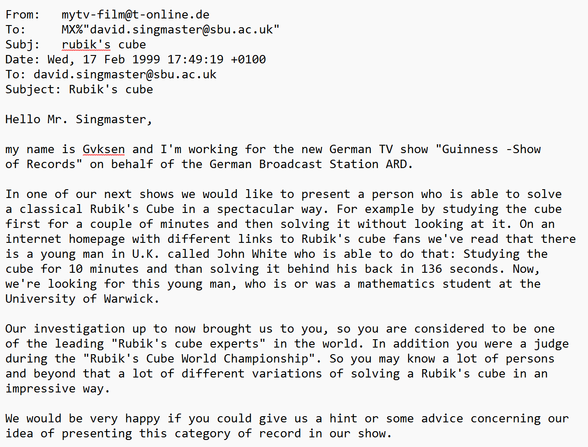
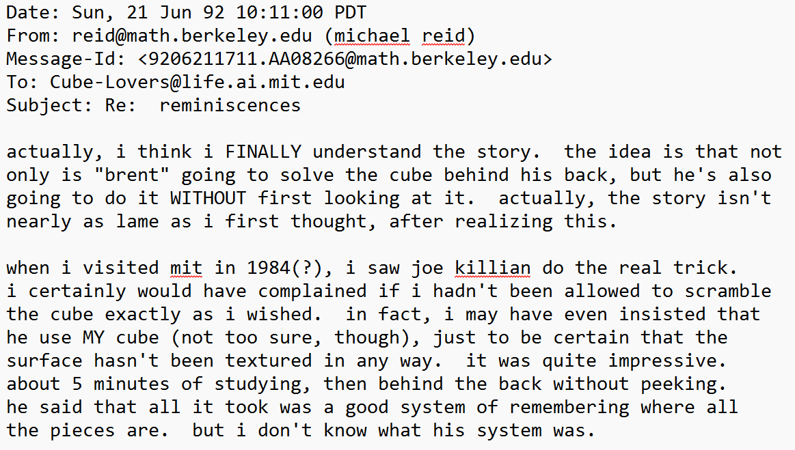
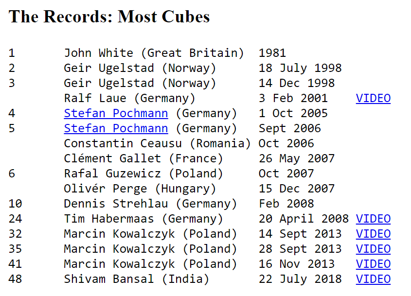
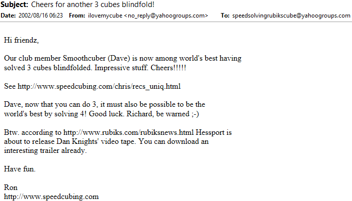
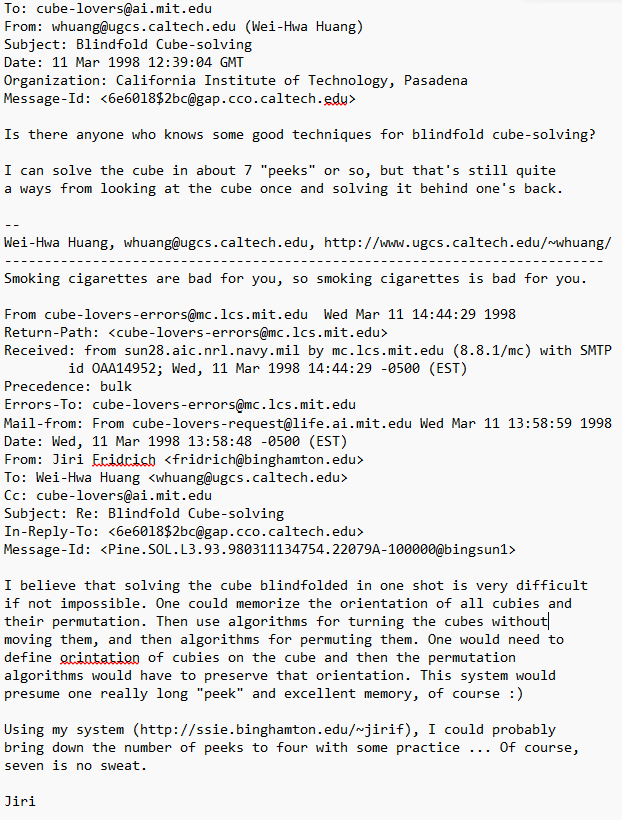
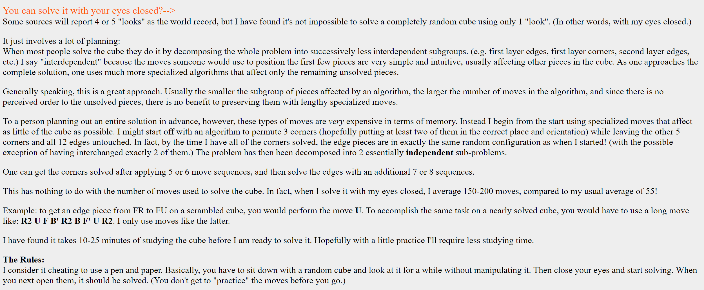
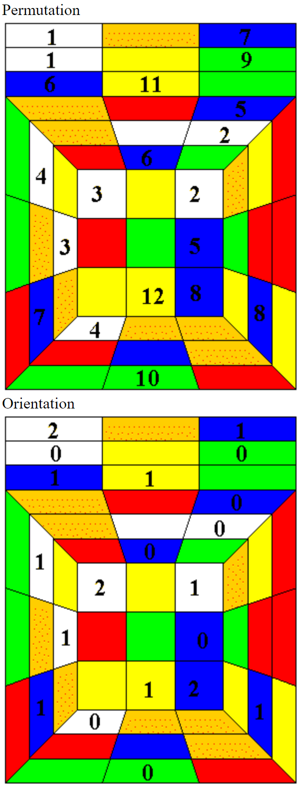
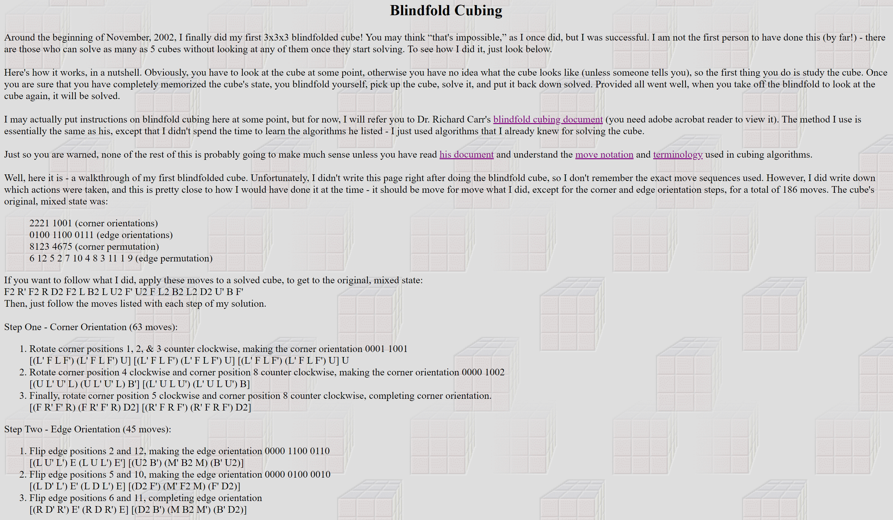

import AnimCube from "@site/src/components/AnimCube";
import ReactPlayer from 'react-player'
import ImageCollage from '@site/src/components/ImageCollage';
import YouTube from "@site/src/components/YouTube";

# Blindfold Solving Origins

## Is Blindfold Solving Possible?

Techniques for solving the cube while blindfolded were still being developed in the 1980s and 1990s. Early discussions occurring on the Cube Lovers mailing list about blindfold solving show people questioning if it is possible [1]. Several people brought up the idea of making the faces textured or to have raised symbols on each sticker [2]. These ideas were put forth as a way to solve the cube without looking, but of course aren’t quite what fits the modern definition of blindfold solving. Cubes such as these can now be seen for purchase in the form of braille cubes. Another brief appearance of the idea of blindfold solving can be seen in the 10th issue of Cubism For Fun in June 1985. One short article suggests a fun challenge of solving the cube using as few looks as possible. It is stated that Hans van der Zijden successfully solved the cube with a single look in a time of 32 minutes [3]. It is unknown whether this was a form of SpeedBLD, where a solver memorizes and solves using their normal speed solving method, or if a technique was used related to modern blindfold solving.

<ImageCollage
images={[
{ src: require("@site/docs/BlindfoldSolving/img/BlindfoldSolvingOrigins/Zimmermann.png").default},
{ src: require("@site/docs/BlindfoldSolving/img/BlindfoldSolvingOrigins/Atwood.png").default},
{ src: require("@site/docs/BlindfoldSolving/img/BlindfoldSolvingOrigins/CFF.png").default}
]}
/>

English translation of the Cubism For Fun article:

> ALTERNATIVE IDEAS FOR SOLVING CUBE PUZZLES.
>
> A fun but very patience- and effort-intensive way to solve the cube is to try to do it while looking as few times as possible. Time and the number of moves are then not important. After thoroughly studying the scrambled cube, you hold it behind your back and make as many moves as you remember in your head to solve it. Each time you need to look, you note it down.
> Hans van der Zijden usually needs to look about 5 times and takes an average of 2 minutes. One time, he only looked once, but that attempt lasted 32 minutes. Before he succeeded, he had failed about twenty times.
>
> Looking only once is very mind-numbing, according to Hans.

## First Solvers

### John White

The earliest person known to have been capable of solving the cube blindfolded is John White. In Cubic Circular, David Singmaster reported three separate times on White’s ability to solve the cube without looking [4, 5, 6]. These reports started in late 1981.

Cubic Circular Issue 1:

> John White, 19, a second year mathematics student at the University of Warwick can do the Cube behind his back with one look. He demonstrated this for Mal Davies, taking 10 minutes to study the Cube first. Unfortunately it came out with two pieces wrong, which he then corrected behind his back, in a total time of 154 seconds.

Cubic Circular Issue 2:

> I saw John White do the cube behind his back with only one look after he started.

Cubic Circular Issue 3/4:

> I saw John White do a cube completely behind his back (136 sec).

On February 17 1999, an employee of the German show “Guinness Show of Records” contacted David Singmaster on the Cube Lovers mailing list [7]. It was asked if Singmaster would be able to locate John White so that he may appear on the show.

### Joe Killian

Another mention on Cube Lovers is Joe Killian. On June 21, 1992, Michael Reid, one of the early contributors to finding the upper bound of God’s number, stated that he once saw Joe Killian solve the cube without looking [8]. Reid scrambled the cube then offered it to Killian who studied the cube for around five minutes and proceeded to solve behind his back. Reid had no knowledge of what method Killian used.

### Gaétan Guimond

In the early years of the online community, Gaétan Guimond often claimed that he was the first person to solve the cube blindfolded on television [9]. He occasionally posted messages to the Speed Solving Rubik’s Cube Yahoo group, including a link to his website that contains videos of him blindfold solving [10, 11]. The videos depict various different television appearances from the early 1990s through the early 2000s.

<ImageCollage
images={[
{ src: require("@site/docs/BlindfoldSolving/img/BlindfoldSolvingOrigins/Guimond1.png").default},
{ src: require("@site/docs/BlindfoldSolving/img/BlindfoldSolvingOrigins/Guimond2.png").default}
]}
/>

<YouTube embedId="VZuC1lXnUcc" />

## First Multi-Blind Solvers

Around the same time that blindfold solving started to gain popularity, multi-blind was also being practiced. The first recorded person to have memorized and blindfold solved more than one cube in a single session is Geir Ugelstad in 1998. Soon after, others followed, continually increasing the number solved. A history of a record of the most cubes solved can be viewed on recordholders.org [12]. This is a site created by Ralf Lau, one of the early multi-blind unofficial record holders.

There were others who were able to solve more than one cube in succession. Notably Richard Carr is missing from the record list. In August 2002, Carr posted that he had solved four cubes blindfolded in a total time of two hours including memorization [13]. Carr also mentions his multi-blind achievements on his page hosted on Jessica Fridrich’s website [14].

In August 2002, Ron van Bruchem announced to the Speed Solving Rubik’s Cube Yahoo group that Dave Barr had solved 3 cubes blindfolded [15].

Other early multi-blind solvers can be viewed on the speedcubing.com record page [16]. An interesting example is Dave Orser, who in 2003 solved 10 cubes in succession blindfolded.

## Early Method Development

### John White

John White was previously covered in the First Solvers section as the first known blindfold solver. In January 2004, Duncan Dicks stated that he used to practice blindfold solving with John White [17]. White was able to solve blindfolded in around 20 minutes on at least one occasion. They didn’t use any sort of piece preservation techniques as in modern blindfold solving. Instead, it appears that their blindfold solving style was more akin to SpeedBLD [18]. In SpeedBLD, a normal solving method is used and all pieces are tracked during the memorization phase.

<ImageCollage
images={[
{ src: require("@site/docs/BlindfoldSolving/img/BlindfoldSolvingOrigins/Duncan1.png").default},
{ src: require("@site/docs/BlindfoldSolving/img/BlindfoldSolvingOrigins/Duncan2.png").default}
]}
/>

### Jessica Fridrich

The first known online description of the idea of preserving the location of other pieces as a technique for blindfold solving comes from Jessica Fridrich. On March 11 1998, Fridrich responded to a question in the Cube Lovers mailing group about whether blindfold solving is possible. Fridrich suggested that it may be possible to first orient all pieces, preserving their permutation, then permute all pieces, preserving their orientation [19].

### Dan Knights

Around a year and a half later, Dan Knights described his blindfold solving process. On October 4 1999 in the Cube Lovers mailing list, Knights described a process similar to Fridrich’s discussion from the year prior [20]. Knights first solves the corners, preserving the edges, then solves the edges.

<ImageCollage
images={[
{ src: require("@site/docs/BlindfoldSolving/img/BlindfoldSolvingOrigins/Knights1.png").default},
{ src: require("@site/docs/BlindfoldSolving/img/BlindfoldSolvingOrigins/Knights2.png").default}
]}
/>

A few weeks later, Knights described the entire process in more detail [21]. This is the first known list of steps and written guide for blindfold solving. Knights also described the modern technique of memorizing the “path” or sequence of solutions rather than memorizing the locations of pieces then visualizing solving them. The steps are:

1. Permute corners
2. Orient corners
3. Permute the edges
4. Orient the edges

<ImageCollage
images={[
{ src: require("@site/docs/BlindfoldSolving/img/BlindfoldSolvingOrigins/Knights3.png").default},
{ src: require("@site/docs/BlindfoldSolving/img/BlindfoldSolvingOrigins/Knights4.png").default}
]}
/>

Knights later added a description of the method to his website [22].

### Richard Carr

In the early 2000s, Richard Carr began discussing his method with the Speed Solving Rubik’s Cube Yahoo group. Eventually Jessica Fridrich started hosting some of his webpages on her website. Carr’s solving process is described on three different pages [23, 24, 25]. This method is sort of the opposite of Dan Knights’ method in that pieces are oriented then permuted. The steps of the method as listed in the PDF:

1. Orient corners
2. Orient edges
3. Permute corners
4. Permute edges

Carr also explained his memorization process. First the cube is oriented to have the desired DBL corner in its correct position. The remaining seven corners are given a fixed number in order from 1 to 7. Going through each position, the corner currently in each numbered position produces a sequence of seven numbers describing the total corner permutation state. Then in each of those seven positions in line, a number is given to show its current orientation, either 0, 1, or 2. There is now one sequence of numbers to memorize for the corner permutation and one for the orientation. A similar process is followed for memorizing the edges.

### Olly Hayden

On March 23 2002, Olly Hayden added pages to his website describing blindfold solving [26]. The steps of the method are the same as those used by Richard Carr [27]. Hayden’s memorization process of assigning numbers to each piece is also similar [28]. In August 2002, Hayden explained the thought process behind the development of the method [29].

1. Orient corners
2. Orient edges
3. Permute corners
4. Permute edges

<ImageCollage
images={[
{ src: require("@site/docs/BlindfoldSolving/img/BlindfoldSolvingOrigins/Hayden1.jpg").default},
{ src: require("@site/docs/BlindfoldSolving/img/BlindfoldSolvingOrigins/Hayden2.jpg").default},
{ src: require("@site/docs/BlindfoldSolving/img/BlindfoldSolvingOrigins/Hayden3.png").default}
]}
/>

### Grant Tregay

On December 1 2002, Grant Tregay created a webpage describing blindfold solving [30]. On the page, Tregay states that his method is the same as Richard Carr’s [31]. One key difference is that Tregay used algorithms that he had already been using for normal solving rather than more blindfold solving optimal algorithms.

### Stefan Pochmann

In March 2004, Stefan Pochmann published a new blindfold solving method to his website [32, 33]. The method, now called Classic Pochmann, uses a single algorithm - the T Permutation PLL algorithm. The advancement provided by Classic Pochmann is the direct solving of pieces, contrasting with the separation of orientation and permutation seen in previous methods. On the webpage for the method, Pochmann stated that the reason for the development of the method was to prove that the cube could be solved blindfolded using just one algorithm. The methods that others had been using typically used involved the use of several algorithms. The method may have also been inspired by a post from Pochmann a couple of weeks prior to the new blindfold method announcement. Pochmann had been experimenting with using a single algorithm to solve CLL and other steps, and later in the post mentioned its application to blindfold solving [34].

The webpage also proposes the idea of a zero algorithm method that uses intuitive three cycles, which may be similar to the later developed method called 3-Style. Pochmann states “Actually of course you don't need to know any algorithms if you can invent what you need on the fly, e.g. with simple intuitive commutators doing 3-cycles (that's how I solved the Megaminx blindfolded).”

<ImageCollage
images={[
{ src: require("@site/docs/BlindfoldSolving/img/BlindfoldSolvingOrigins/Pochmann1.png").default},
{ src: require("@site/docs/BlindfoldSolving/img/BlindfoldSolvingOrigins/Pochmann2.png").default},
{ src: require("@site/docs/BlindfoldSolving/img/BlindfoldSolvingOrigins/Pochmann3.png").default},
{ src: require("@site/docs/BlindfoldSolving/img/BlindfoldSolvingOrigins/Pochmann4.png").default},
{ src: require("@site/docs/BlindfoldSolving/img/BlindfoldSolvingOrigins/Pochmann5.png").default}
]}
/>

### Hao Cheng, Chris Hardwick, and Daniel Beyer

Following Pochmann’s developments of direct solving pieces, blindfold solvers naturally progressed to direct solving two or more pieces at a time. The idea could already be seen in Pochmann’s use of freestyle 3-cycles in solving the Megaminx, and his subsequent mention of its possible application to 3x3x3 blindfold solving. The use of 3-cycles could also be seen in Chris Hardwick’s big cube blindfold solves [35]. However, for 3x3x3 applications, it wasn’t until around 2006 that the idea received development. In March 2006, 程浩 (Hao Cheng) proposed to the MF8 message board the use of 3-cycles for corners and edges to solve two pieces at a time [36]. Starting around 2007, Hardwick began suggesting that the use of freestyle 3-cycles may have potential when used in 3x3x3 blindfold solving [37]. From around 2008 to 2009 Hardwick and Daniel Beyer developed a complete 3-cycle method for 3x3x3 blindfold solving called BH [38, 39]. The developments by Cheng, Hardwick, and Beyer laid the foundations for the umbrella method of freestyle blindfold solving.

<ImageCollage
images={[
{ src: require("@site/docs/BlindfoldSolving/img/BlindfoldSolvingOrigins/Cheng.png").default},
{ src: require("@site/docs/BlindfoldSolving/img/BlindfoldSolvingOrigins/Hardwick6.png").default},
{ src: require("@site/docs/BlindfoldSolving/img/BlindfoldSolvingOrigins/BHSiteCorners.png").default},
{ src: require("@site/docs/BlindfoldSolving/img/BlindfoldSolvingOrigins/BHSiteEdges.png").default}
]}
/>

## “Blindfold” term

It is unknown who popularized or first used the term “blindfold” solving versus the longer and more popular in the early years term “behind the back”. However, the first known use of the term can be found in the Cube Lovers mailing list. On July 25 1980, Mark Zimmerman asked if solving blindfolded was possible [1]. Zimmerman was aware of and mentioned that other popular puzzles and games had blindfold players, so it was simple to transfer the term over to Rubik’s Cube solving. The term “blindfold” was used throughout the history of Cube Lovers and continued upon the creation of the Speed Solving Rubik’s Cube Yahoo group and other online communities.

## References

[1] M. Zimmermann, ""blindfold" cube?," Cube Lovers, 25 July 1980. [Online].

[2] M. Atwood, Cube Lovers, 12 March 1998. [Online].

[3] K. Steenhuis, "ALTERNATIEVE IDEEËN VOOR HET STELLEN VAN KUBUS-OPGAVEN," Cubism For Fun, no. 10, p. 5, 1985.

[4] D. Singmaster, "Cubic Circular Issue 1," Jaap's Puzzle Page, [Online]. Available: https://www.jaapsch.net/puzzles/cubic1.htm#p13.

[5] D. Singmaster, "Cubic Circular Issue 2," Jaap's Puzzle Page, [Online]. Available: https://www.jaapsch.net/puzzles/cubic2.htm#p4.

[6] D. Singmaster, "Cubic Circular Issue 3/4," Jaap's Puzzle Page, [Online]. Available: https://www.jaapsch.net/puzzles/cubic3.htm#p7.

[7] Gvksen, "Rubik's cube," Cube Lovers, 17 February 1999. [Online].

[8] M. Reid, "Re: reminiscences," Cube Lovers, 21 June 1992. [Online].

[9] G. Guimond, "EXTREME MESSAGE," Speed Solving Rubik's Cube Yahoo Group, 6 May 2004. [Online].

[10] G. Guimond, "Le premier humain à résoudre un cube sans regarder," YouTube, 13 February 2011. [Online]. Available: https://www.youtube.com/watch?v=VZuC1lXnUcc.

[11] G. Guimond, "TV Apparitions," [Online]. Available: https://web.archive.org/web/20050405213835/http://www.rubikscuberecord.com/.

[12] R. Laue, "World Record For Doing A Rubik's Cube While Blindfolded," recordholders.org, [Online]. Available: https://www.
recordholders.org/en/records/rubik-blindfold.html.

[13] R. Carr, "A night of 4s," Speed Solving Rubik's Cube, 29 August 2002. [Online].

[14] R. Carr, Carr's Page on Fridrich's Website, [Online]. Available: http://www.ws.binghamton.edu/fridrich/Richard/times.html.

[15] R. v. Bruchem, "Cheers for another 3 cubes blindfold!," Speed Solving Rubik's Cube Yahoo Group, 16 August 2002. [Online].

[16] R. v. Bruchem, "Rubik's Cube: Blindfolded number of cubes," speedcubing.com, [Online]. Available: https://speedcubing.com/records/recs_bf_333num.html.

[17] D. Dicks, "Re: [Speed cubing group] Finally, I solved 3x3 in blindfold manner!," Speed Solving Rubik's Cube Yahoo Group, 8 January 2004. [Online].

[18] D. Dicks, "Re: [Speed cubing group] $ at tournaments?," Speed Solving Rubik's Cube Yahoo Group, 9 February 2005. [Online].

[19] J. Fridrich, "Re: Blindfold Cube-solving," Cube Lovers, 11 March 1998. [Online].

[20] D. Knights, "3-Cube in 1 One-Look," Cube Lovers, 4 October 1999. [Online].

[21] D. Knights, "3-Cube in 1 Look," Cube Lovers, 28 October 1999. [Online].

[22] D. Knights, "About Rubik's Cube: You can solve it with your eyes closed?-->," Dan Knights, [Online]. Available: https://web.archive.org/web/20010421113506/http://benjerry.middlebury.edu/~knights/Cube/CubeInfo1.html.

[23] R. Carr, Carr's Page on Fridrich's Website, [Online]. Available: http://www.ws.binghamton.edu/fridrich/Richard/blindfoldtechnique.html.

[24] R. Carr, "Blindfold cubing," Carr's Page on
Fridrich's Website, [Online]. Available: http://www.ws.binghamton.edu/fridrich/Richard/BC.html.
[25] R. Carr, "Blindfold Cubing," Carr's Page on Fridrich's Website, 23 February 2002. [Online]. Available: http://www.ws.binghamton.edu/fridrich/Richard/BlindfoldRevenge.pdf.

[26] O. Hayden, "Blindfold Cubing," Olly Hayden, 23 March 2002. [Online]. Available: https://web.archive.org/web/20021221012211fw_/http://homepage.ntlworld.com/angela.hayden/cube/blindfold_frontpage.html.

[27] O. Hayden, "Blindfold Cubing," Olly Hayden, 23 March 2002. [Online]. Available: https://web.archive.org/web/20030407141931fw_/http://homepage.ntlworld.com/angela.hayden/cube/blind4.html.

[28] O. Hayden, "Blindfold Cubing," Olly Hayden, 23 March 2002. [Online]. Available: https://web.archive.org/web/20030407141316fw_/http://homepage.ntlworld.com/angela.hayden/cube/blind2.html.

[29] O. Hayden, "Re: [Speed Solving Rubik's Cube] Blindfold," Speed Solving Rubik's Cube Yahoo Group, 19 August 2002. [Online].

[30] G. Tregay, "Grant Tregay and Ernö Rubik's Cube," Grant Tregay, 1 December 2002. [Online]. Available: https://www.grantnbetty.com/cube/.

[31] G. Tregay, "Blindfold Cubing," Grant Tregay, 1 December 2002. [Online]. Available: https://www.grantnbetty.com/cube/blindfold.html.
[32] S. Pochmann, "Re: Blindfold cubing: Parity error," Speed Solving Rubik's Cube Yahoo Group, 7 March 2004. [Online].

[33] S. Pochmann, "Single algorithm 3x3 blindsolving," Stefan Pochmann, March 2004. [Online]. Available: https://www.stefan-pochmann.info/spocc/blindsolving/3x3_single_alg/old_index.php.

[34] S. Pochmann, "Boy am I proud - My CLL method and applications," Speed Solving Rubik's Cube Yahoo Group, 26 February 2004. [Online].

[35] C. Hardwick, "Re: more 4x4x4 BLD," Blindfold Solving Rubik's Cube Yahoo! Group, 15 November 2005. [Online].

[36] H. Cheng, "三循环同时解决位置和方向（思路）," 18 March 2006. [Online]. Available: http://bbs.mf8-china.com/forum.php?mod=viewthread&tid=2101&extra=&page=1.

[37] C. Hardwick, "Treating the 3x3x3 as part of a 5x5x5," Blindfold Solving Rubik's Cube Yahoo! Group, 21 January 2007. [Online].

[38] C. Hardwick, "Interest in a BH method website?," SpeedSolving.com, 3 May 2009. [Online]. Available: https://www.speedsolving.com/threads/interest-in-a-bh-method-website.10756/post-174576.

[39] C. Hardwick, "Interest in a BH method website?," SpeedSolving.com, 12 May 2009. [Online]. Available: https://www.speedsolving.com/threads/interest-in-a-bh-method-website.10756/post-178458.
