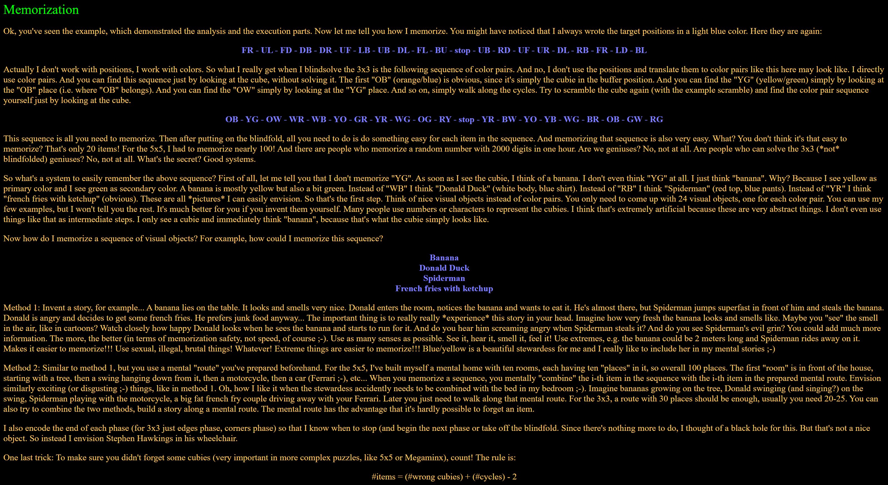

import ReconViewer from "@site/src/components/ReconViewer";
import YouTube from "@site/src/components/YouTube";
import ReactPlayer from 'react-player'
import ImageCollage from '@site/src/components/ImageCollage';

# Classic Pochmann

<ReconViewer
scramble="D2 R2 B2 L' R2 B2 R2 D' R2 F U B R2 D' B L' F' U2 F2 U' D2 R D' B U2"
solution={`(d2 L) R U R' U' R' F R2 U' R' U' R U R' F' (L' d2) . // FR edge
R U R' U' R' F R2 U' R' U' R U R' F' . // UL edge
(l') L' U R U' L U2' R' U R U2 R' (l) . // FD edge
(l2) L' U R U' L U2' R' U R U2 R' (l2) . // DB edge
(D2 L2) R U R' U' R' F R2 U' R' U' R U R' F' (L2 D2) . // DR edge
L' U R U' L U2' R' U R U2 R' . // UF edge
(d L') R U R' U' R' F R2 U' R' U' R U R' F' (L d') . // LB edge
L U' R' U L' U2' R U' R' U2 R . // UB edge
(L2) R U R' U' R' F R2 U' R' U' R U R' F' (L2) . // DL edge
(L') R U R' U' R' F R2 U' R' U' R U R' F' (L) . // FL edge
(l) L' U R U' L U2' R' U R U2 R' (l') . // BU edge
R U R' U' R' F R2 U' R' U' R U R' F' . // Corner parity fix
R2 U' R' U' R U R U R U' R . // Edge fix 3 cycle
(R D') R U' R' U' R U R' F' R U R' U' R' F R (D R') . // UBR corner
R U' R' U' R U R' F' R U R' U' R' F R . // Buffer fix
(F R') R U' R' U' R U R' F' R U R' U' R' F R (R F') . // UFL corner
(F) R U' R' U' R U R' F' R U R' U' R' F R (F') . // URF corner
(F') R U' R' U' R U R' F' R U R' U' R' F R (F) . // DLF corner
(R) R U' R' U' R U R' F' R U R' U' R' F R (R') . // RBD corner
(R F) R U' R' U' R U R' F' R U R' U' R' F R (F' R') . // FRD corner
(D2) R U' R' U' R U R' F' R U R' U' R' F R (D2) . // Orient last two corners
(D' R) R U' R' U' R U R' F' R U R' U' R' F R (R' D) // Swap last two corners`}
/>
**Example solve from Stefan Pochmann**

## Description

**Creator:** [Stefan Pochmann](CubingContributors/MethodDevelopers.md#pochmann-stefan)

**Created:** 2004

**Steps:**

Directly solve one piece at a time using a set of algorithms and setup moves.

[Click here for more step details on the SpeedSolving wiki](https://www.speedsolving.com/wiki/index.php?title=Classic_Pochmann)

## Origin

In March 2004, Stefan Pochmann presented a blindfold solving method that was different from the blindfold methods used at the time [^1] [^2]. Instead of orienting and permuting pieces separately, Pochmann’s method used a single algorithm, the T permutation R U R' U' R' F R2 U' R' U' R U R' F', in combination with setup moves to directly solve individual pieces. It is important to note that Pochmann’s intent wasn’t necessarily to combine orientation and permutation, but rather to reduce the complexity by solving one piece at a time instead of several [^3].

<ImageCollage
images={[
{ src: require("@site/docs/BlindfoldSolving/img/BlindfoldSolvingOrigins/Pochmann1.png").default},
{ src: require("@site/docs/BlindfoldSolving/img/BlindfoldSolvingOrigins/Pochmann2.png").default},
{ src: require("@site/docs/BlindfoldSolving/img/ClassicPochmann/PochmannClarification.png").default}
]}
/>

## A New Method

In October 2004 Pochmann improved upon the one algorithm method, evolving it into what is now called “Classic Pochmann” [^4] [^5]. Instead of a single algorithm, this new method uses four algorithms taken from the PLL algorithm set – T, Ja, Jb, and a modified T permutation that swaps the UBL and DFR corners and UB and UL edges. These additional algorithms bring versatility to setting up positions and solving pieces.
<ImageCollage
images={[
{ src: require("@site/docs/BlindfoldSolving/img/ClassicPochmann/PochmannSite.png").default},
{ src: require("@site/docs/BlindfoldSolving/img/ClassicPochmann/PochmannAnnouncement.png").default}
]}
/>

## Memorization

Pochmann also described memorization processes within the method tutorial [^4]. Many previous blindfold solving guides assigned numbers to a piece’s orientation and permutation and the number strings were memorized. Pochmann provided two new ways to memorize the solve – the story method and the memory palace technique. In addition to the two memorization techniques, Pochmann advocated for memorizing the solving path of the pieces rather than the piece states.

## BOP

In March 2021, Brant Holbein proposed a variant of Classic Pochmann called BOP [^6] [^7]. The idea behind the variant is to make use of the UF edge and UFR corner buffer locations, which are more popular in blindfold solving. Only one algorithm, the PLL algorithm Jb, Is used to solve the edges, corners, and parity.

<ImageCollage
images={[
{ src: require("@site/docs/BlindfoldSolving/img/ClassicPochmann/BOP1.png").default},
{ src: require("@site/docs/BlindfoldSolving/img/ClassicPochmann/BOP2.png").default}
]}
/>

[^1]: S. Pochmann, "Re: Blindfold cubing: Parity error," Speed Solving Rubik's Cube Yahoo Group, 7 March 2004. [Online].

[^2]: S. Pochmann, "Single algorithm 3x3 blindsolving," Stefan Pochmann, March 2004. [Online]. Available: https://www.stefan-pochmann.info/spocc/blindsolving/3x3_single_alg/old_index.php.

[^3]: S. Pochmann, "Key idea of my methods," SpeedSolving.com, 28 July 2008. [Online]. Available: https://www.speedsolving.com/threads/key-idea-of-my-methods.5427/.

[^4]: S. Pochmann, "Blindsolving the 3x3," Stefan Pochmann, October 2004. [Online]. Available: https://www.stefan-pochmann.info/spocc/blindsolving/3x3/.

[^5]: S. Pochmann, "My 3x3 blindsolving method," Speed Solving Rubik's Cube Yahoo Group, 22 October 2004. [Online].

[^6]: B. Holbein, "BOP method - An OP variant for the Beginner's BLD method using UF/UFR.," SpeedSolving.com, 23 March 2021. [Online]. Available: https://www.speedsolving.com/threads/bop-method-an-op-variant-for-the-beginners-bld-method-using-uf-ufr.80000/.

[^7]: B. Holbein, "Brant's Old Pochmann Variant Version 1 [B.O.P. v1] --- A Beginner's BLD method for speedcubers.," 7 April 2021. [Online]. Available: https://docs.google.com/spreadsheets/d/1P39BPCz_O1JXbJpEZ4Kz2ahVMQ22qUj6vfY2ASvqJXI/edit?usp=sharing.