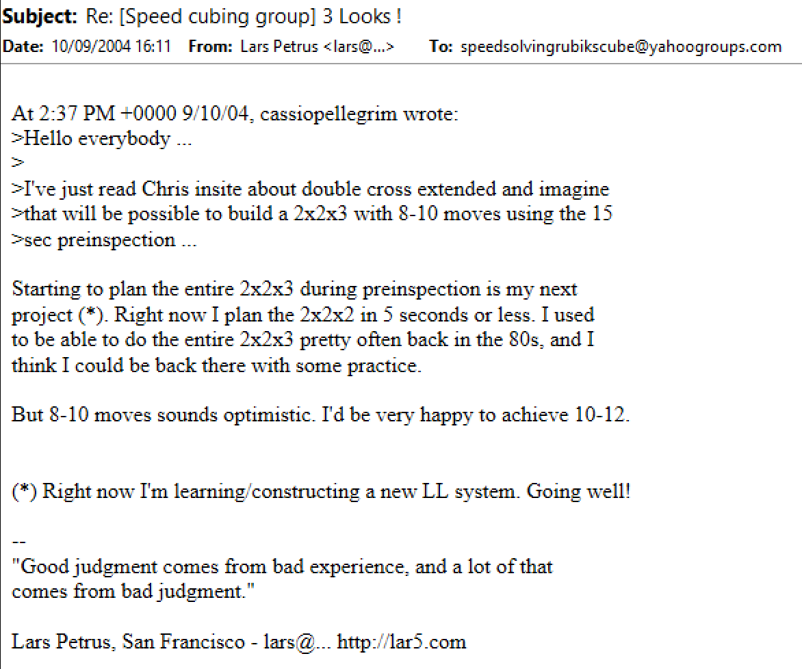
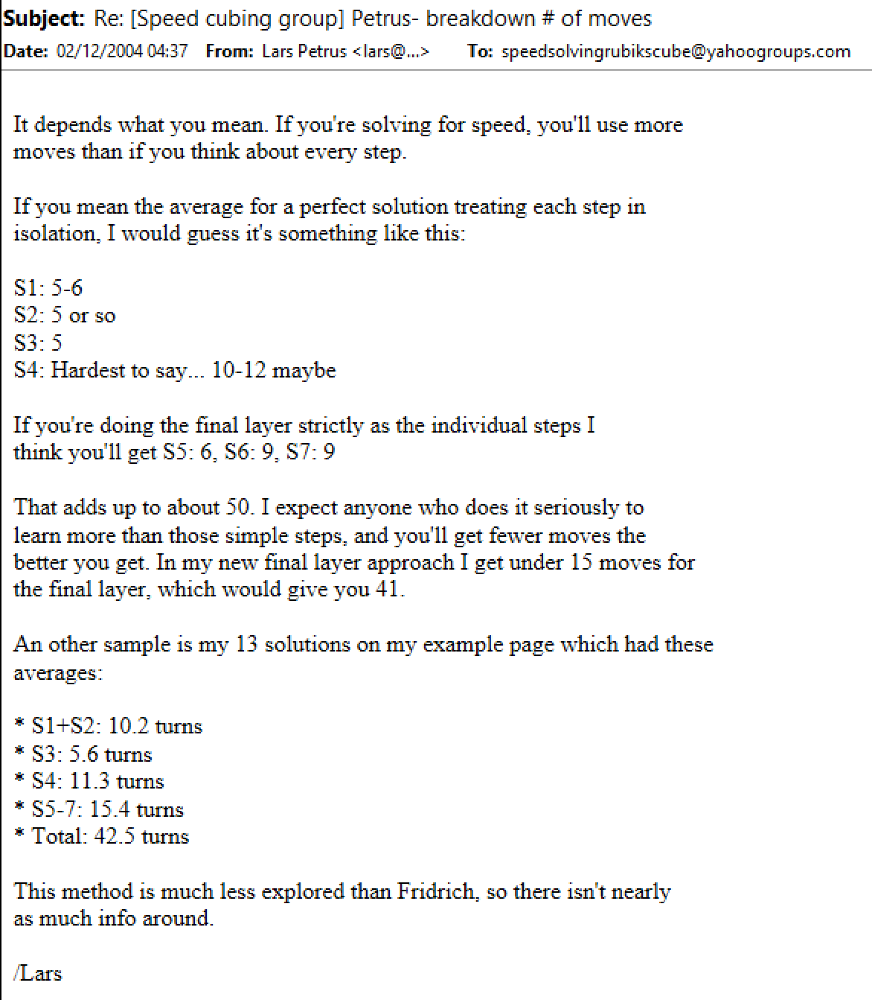
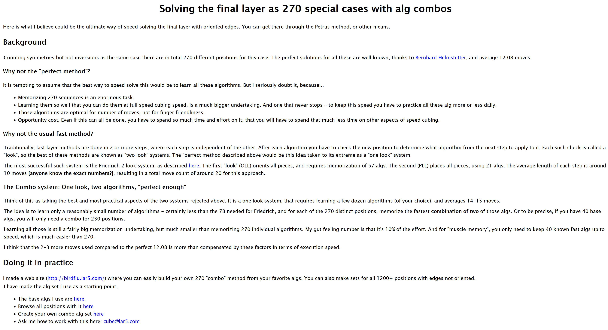
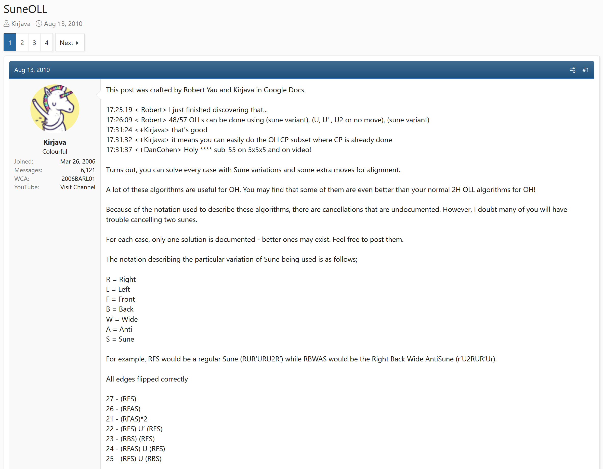
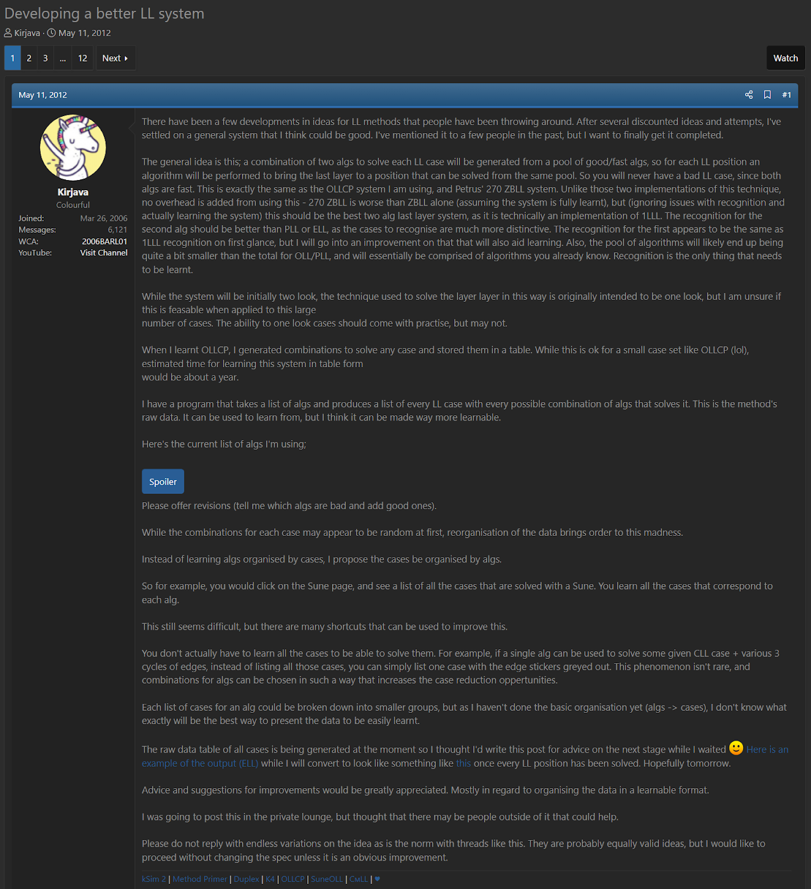
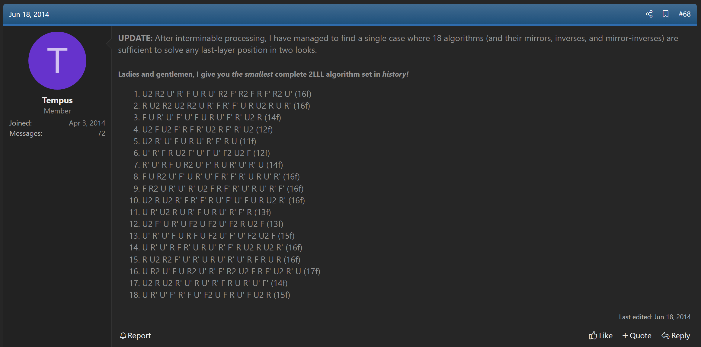
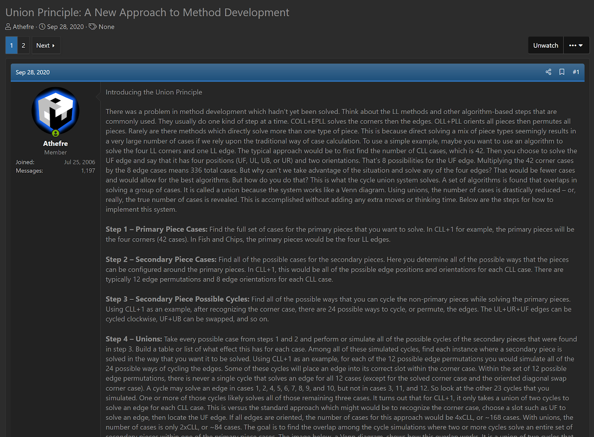
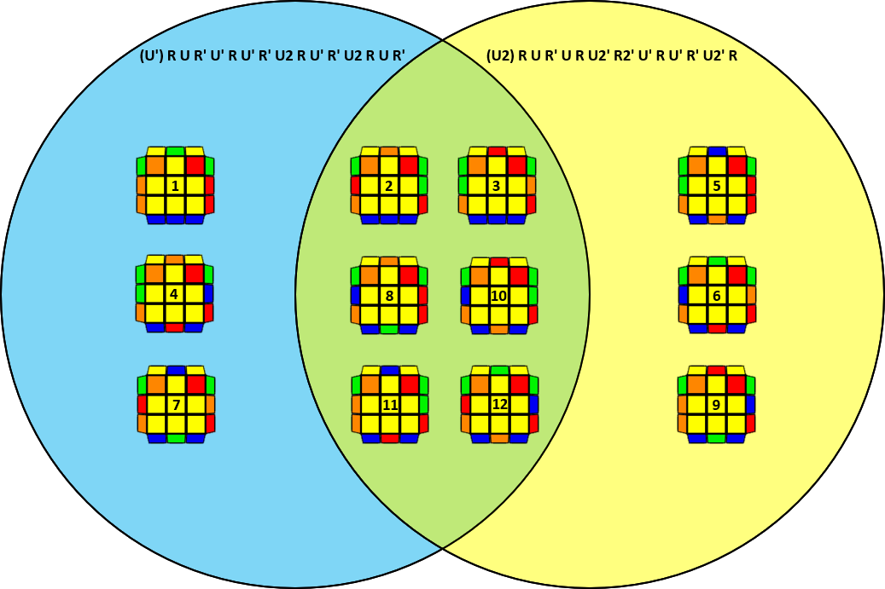
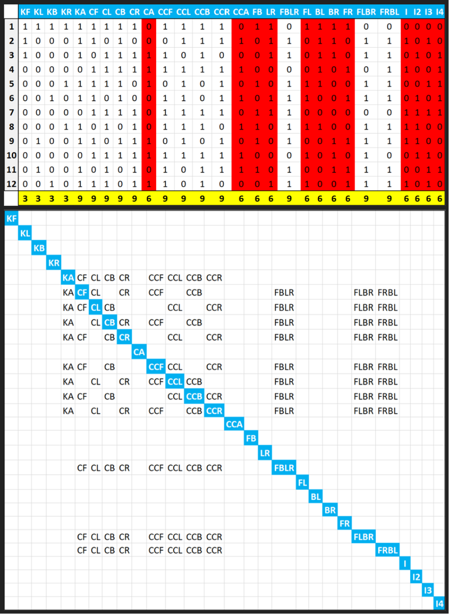

# Multi State Solving

## Description

Multi state solving is allowing for steps to be solved to one of a set of several states and not just the solved state.

## Algorithm Combination

In the algorithm combination technique, two algorithms are combined to solve a single case. The two algorithms are pulled from a larger pool of algorithms. The algorithm pool contains the necessary number of algorithms that can be combined to solve a larger algorithm set.

### Lars Petrus

In 2004, Lars Petrus started developing a system to reduce the number of algorithms required to solve the last layer of the Petrus method in a single step [^1] [^2] [^3] [^4] [^5]. Instead of learning 493 algorithms, Petrus’ idea was to develop a small pool of short and fast algorithms that can be combined in various ways to solve each last layer case.

### Thom Barlow

#### SuneOLL

In 2010, Thom Barlow and Robert Yau developed a system for combining variants of the Sune algorithm to orient the last layer [^6].

#### OLLCP

In 2011, Barlow developed a version of OLLCP that is solved using combinations of a pool of short and fast algorithms [^7] [^8].

#### Duplex

In 2012, Barlow extended Petrus’ combination system to solve the last layer when the edges are in any orientation [^9]. This covers all of the possible last layer cases. In 2019, Barlow announced the completed development of the system and the given name of Duplex [^10] [^11].

### Minimum Algorithms for Last Layer

On May 2014, Ben Whitmore posed a question to members of speedsolving.com, asking what would be the fewest number of algorithms required to solve the last layer in two steps [^12]. After a long discussion, a member by the username Tempus determined through the use of a program that the minimum is 18 [^13]. The technique behind the algorithms is the same as initially proposed by Petrus and extended by Barlow. However, the difference is in the intended use. Petrus 270 and Duplex are intended for speedsolving use. This can naturally lead to a slight increase in the number of minimum algorithms in order to have an ergonomic algorithm set. On the other side, the 18 algorithm minimum was primarily determined and generated for theoretical and informational purposes. The ergonomics of the 18 algorithm set may not match the quality of a Petrus 270 or Duplex set.

## Algorithm Unions

The algorithm unions technique is an extension of the algorithm combination system developed by Petrus and Barlow. Any number of algorithms can be combined, or placed into a union, and any desired end state can be achieved. Each algorithm union can lead any one of a set of desired end states.

In 2020, while trying to find a system for solving CLL+1, Michael James Straughan developed a system of placing algorithms into unions to solve to any of the four possible CLL+1 end states [^14]. A structure similar to Cayley tables was also developed. An algorithm list is placed on one axis and the desired end states on the other axis. The two axes are then crossed in all possible ways, either forwards or in reverse, to find the algorithm unions that solve to the desired end states.

[^1]: L. Petrus, "Re: [Speed cubing group] 3 Looks !," Yahoo! Groups - Speed Solving Rubik's Cube, 10 September 2004. [Online].

[^2]: L. Petrus, "Re: [Speed cubing group] Petrus- breakdown # of moves," Yahoo! Groups - Speed Solving Rubik's Cube, 2 December 2004. [Online].

[^3]: G. Roux, "Re: Sunes vs (O)LL," Yahoo! Groups - Speed Solving Rubik's Cube, 21 December 2005. [Online].

[^4]: L. Petrus, "Re: [Speed cubing group] Re: T PERM that flips 2 edges??," Yahoo! Groups - Speed Solving Rubik's Cube, 18 August 2006. [Online].

[^5]: L. Petrus, "Solving the final layer as 270 special cases with alg combos," Petrus' Website, [Online]. Available: https://lar5.com/cube/270/index.html.

[^6]: T. Barlow and R. Yau, "SuneOLL," SpeedSolving.com, 13 August 2010. [Online]. Available: https://www.speedsolving.com/threads/suneoll.23222/.

[^7]: T. Barlow, "OLLCP (hax)," SpeedSolving.com, 15 August 2011. [Online]. Available: https://www.speedsolving.com/threads/ollcp-hax.31506/.

[^8]: T. Barlow, "OLLCP (hax)," SpeedSolving.com Wiki, 2011. [Online]. Available: https://web.archive.org/web/20120113073719/https://www.speedsolving.com/wiki/index.php/OLLCP_%28hax%29.

[^9]: T. Barlow, "Developing a better LL system," SpeedSolving.com, 11 May 2012. [Online]. Available: https://www.speedsolving.com/threads/developing-a-better-ll-system.36791/.

[^10]: T. Barlow, "Duplex Method," SpeedSolving.com, 9 February 2019. [Online]. Available: https://www.speedsolving.com/threads/duplex-method.72533/.

[^11]: T. Barlow, "Duplex Method," Duplex Website, [Online]. Available: http://duplex.kirjava.xyz/.

[^12]: B. Whitmore, "What is the minimum number of algorithms needed for 2 look last layer?," SpeedSolving.com, 12 May 2014. [Online]. Available: https://www.speedsolving.com/threads/what-is-the-minimum-number-of-algorithms-needed-for-2-look-last-layer.47581/.

[^13]: Tempus, "What is the minimum number of algorithms needed for 2 look last layer?," SpeedSolving.com, 18 June 2014. [Online]. Available: https://www.speedsolving.com/threads/what-is-the-minimum-number-of-algorithms-needed-for-2-look-last-layer.47581/page-4#post-988568.

[^14]: M. J. Straughan, "Algorithm Unions: A New Approach to Method Development," SpeedSolving.com, 28 September 2020. [Online]. Available: https://www.speedsolving.com/threads/union-principle-a-new-approach-to-method-development.78642/.