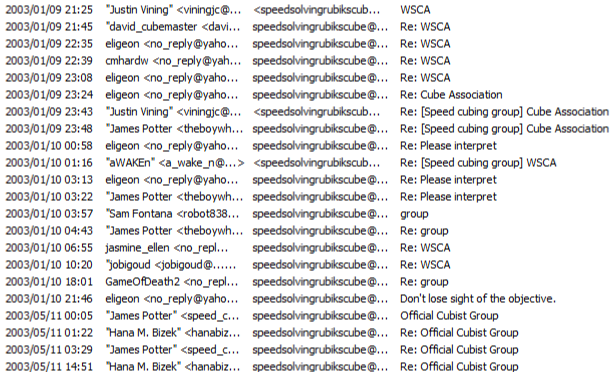
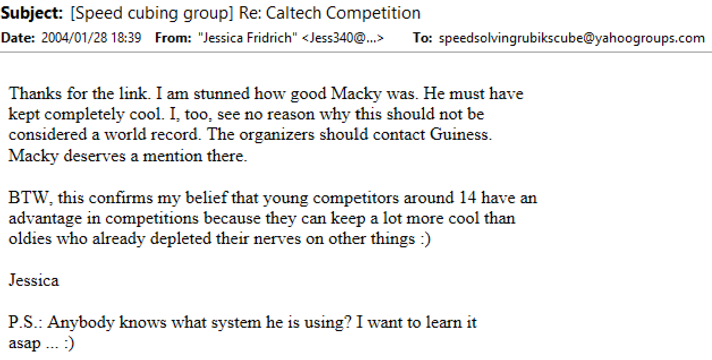
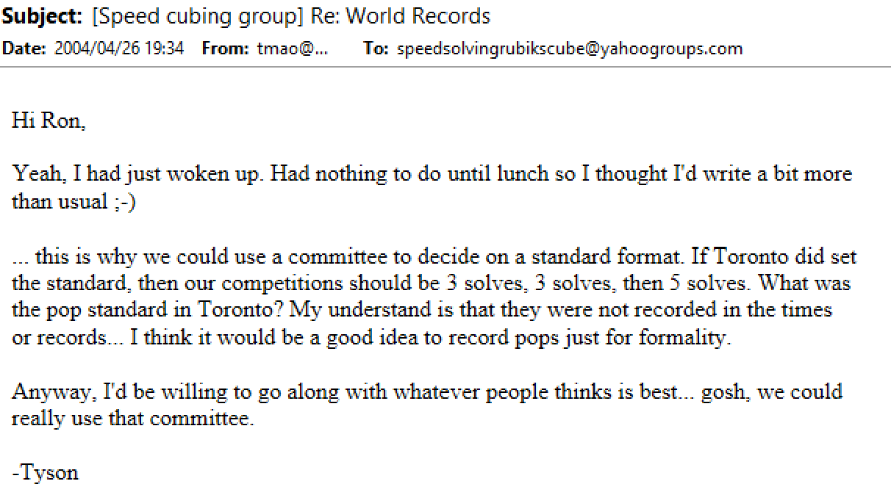
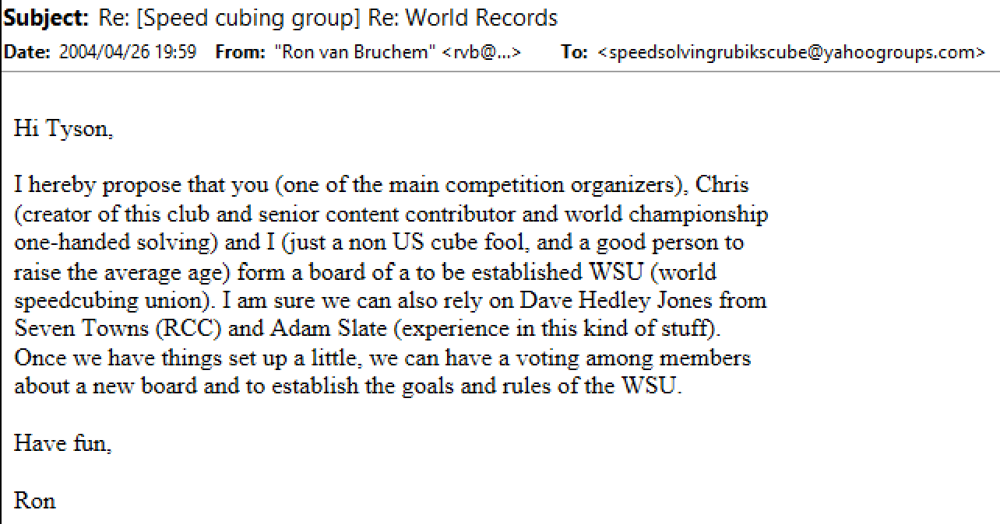
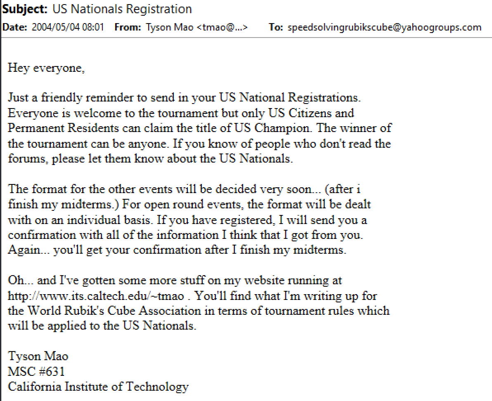
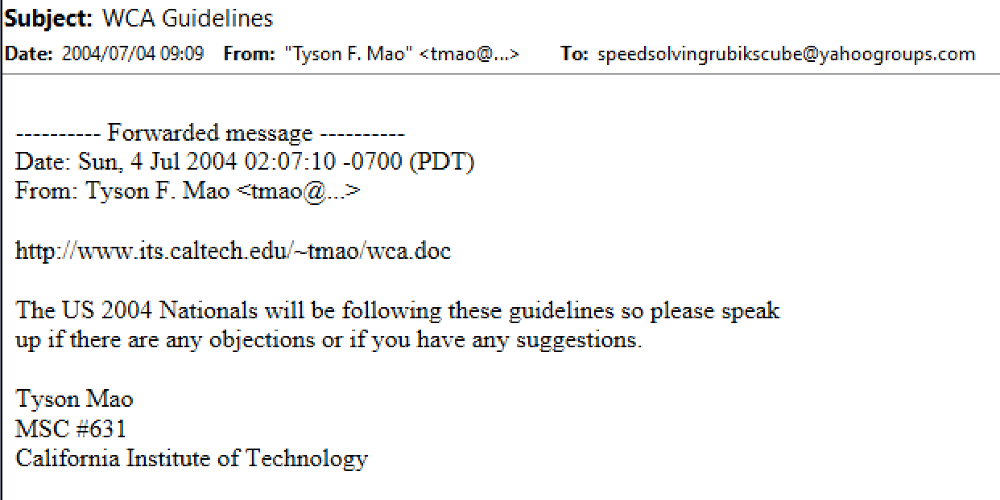
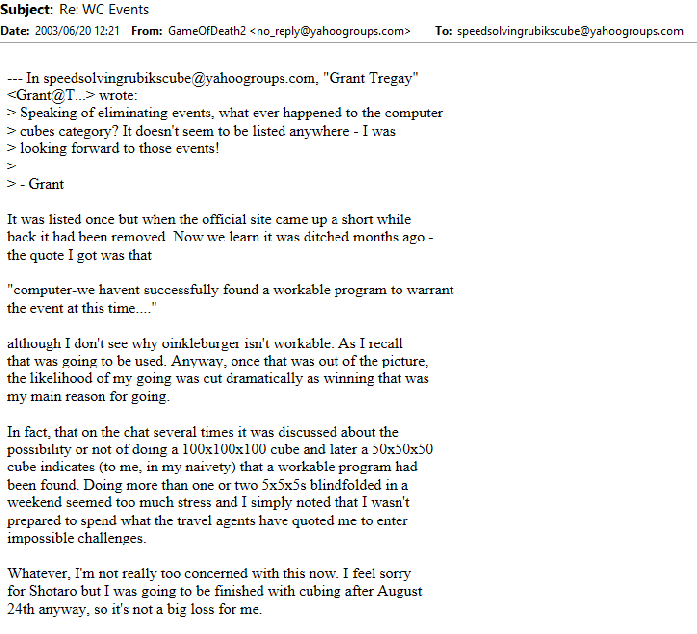
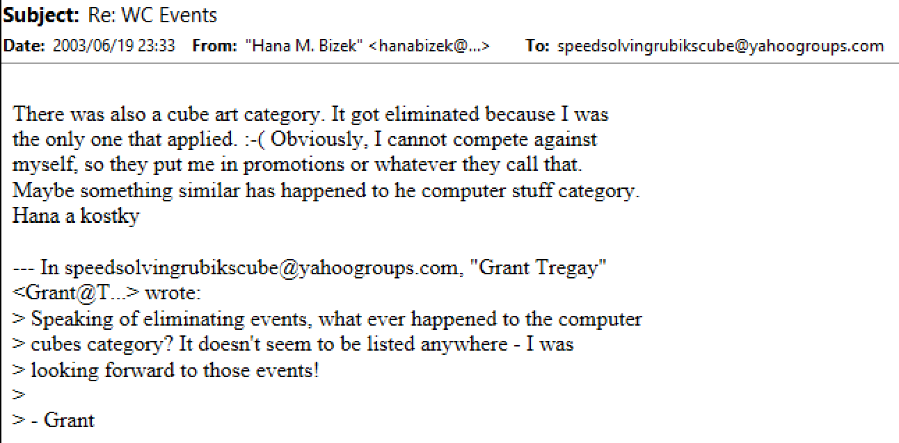

import ReactPlayer from 'react-player'

# World Cube Association

## Origin

## Before the World Cube Association

Before the formation of the World Cube Association, the landscape of world records was a sort of wild west. Many claimed to be the world record holder - some with absurdly low solving time claims - and keeping track of the records was close to impossible.

Several competitions were held during the early years of the cube, with each having the potential to be considered official. However, the Rubik’s Cube World Championship held in 1982 is the only competition of those early years considered official by the World Cube Association (WCA). In 2003, the World Rubik’s Games Championship 2003 was held and considered official due to it being a championship and the association with the Rubik name. Smaller competition results weren’t yet considered official. Only solves performed at championships were eligible for world record status.

## Association Proposal

In January 2003, Ron van Bruchem proposed the idea of an official association that defines the official regulations [1]. At the time, the community relied upon Guinness to be the certifier of world records. Many disagreed with the conditions set by Guiness and so the goal became to create a dedicated organization separate from Guinness World Records. This would be an organization that defines standards agreed upon by the community and certifies records that follow those standards.

Bruchem’s name suggestion was “World SpeedCubing Association”. This proposal spawned several discussions [2]. After a few months, the discussions went quiet.

> According to Bruchem, this was the second time he had made the proposal. However, the previous message may have been part of the series of deleted messages from when Yahoo! purchased the mailing group website.

## What Should Be Considered Official?

In January 2004, the Caltech Winter competition was held. The record times set by Makisumi at the Caltech Winter competition in January 2004 coudn’t counted as official world records at the time. Lars Petrus was the first to question why Makisumi’s solves wouldn’t be considered official [3]. Others also questioned the reasoning [4]. Tyson Mao responded by stating the intent to make the results official [5].

A day prior to everyone’s questioning of what counts as official, Mao asked the puzzle community what steps would need to be taken to make a competition official [6]. The response was that the same guidelines would need to be followed as in the World Rubik’s Games Championship 2003 [7]. In February 2004, Mao stated that Caltech Winter 2004 would be an official competition [8].

## Association Proposals Reappear

On April 26, 2004, just after the Caltech Spring competition, Mao proposed a committee to determine the official competition standard format [9]. This would be a similar proposal to the official association idea suggested by Ron around a year earlier. Ron van Bruchem then suggested that Mao, Chris Hardwick, and himself form the World Speedcubing Union [10].

Chris Hardwick started a discussion around the World Speedcubing Union idea [11]. Influenced by the cup stacking community, Hardwick suggested creating a separate website to hold the official records. At this time, records had been recorded on speedcubing.com.

## Formation of the World Cube Association

The World Cube Association was formed in 2004 by Ron van Bruchem and Tyson Mao. Initially the name of the organization was "World Rubik's Cube Association" [12], but was later changed to its current name [13] [14]. This created an organization whereby standards can be followed and records can be considered official.

The original WCA proposal document can be viewed <a href="/archive/wca.htm">here</a>.

## Logo

In January 2005, Mao asked if anyone was interested in designing the logo for the WCA [15]. Several people submitted designs, including Gilles Roux, Stefan Pochmann, and Josef Jelinek [16]. Ultimately the WCA chose one of Justin Eastman’s designs as the official logo.

<ReactPlayer
          className='react-player'
          playing controls url='/videos/wcb4.mp4'
          playing={false}
          width='100%'
          height='100%'
        />

> One of Gilles Roux's submissions

## Considered Events

Outside of the events that have persisted in competitions, other interesting events had been considered in the past. Computer cube solving and cube art were planned for the 2003 world championships [17, 18], but were scrapped due to little interest. Although this was before the formation of the WCA, this represents the early time and beginnings of a community and association working to determine the appearance of competitions.

## References

[1] R. v. Bruchem, "Re: [Speed cubing group] Re: World Records," 26 April 2004. [Online].

[2] Various, "WSCA," 2004. [Online].

[3] L. Petrus, "[Speed cubing group] Re: Caltech Competition," Speed Solving Rubik's Cube, 28 January 2004. [Online].

[4] J. Fridrich, "[Speed cubing group] Re: Caltech Competition," Speed Solving Rubik's Cube, 28 January 2004. [Online].

[5] T. Mao, "[Speed cubing group] Re: Caltech Competition," Speed Solving Rubik's Cube, 29 January 2004. [Online].

[6] T. Mao, "summer official tournament?," Speed Solving Rubik's Cube, 27 January 2004. [Online].

[7] D. Jones, "RE: [Speed cubing group] summer official tournament?," Speed Solving Rubik's Cube, 27 January 2004. [Online].

[8] T. Mao, "A Few Things," Speed Solving Rubik's Cube, 5 February 2004. [Online].

[9] T. Mao, "[Speed cubing group] Re: World Records," Speed Solving Rubik's Cube, 26 April 2004. [Online].

[10] R. v. Bruchem, "Re: [Speed cubing group] Re: World Records," Speed Solving Rubik's Cube, 26 April 2004. [Online].

[11] C. Hardwick, "World Speedcubing Union," Speed Solving Rubik's Cube, 26 April 2004. [Online].

[12] T. Mao, "US Nationals Registration," Speed Solving Rubik's Cube, 4 May 2004. [Online].

[13] T. Mao, "WCA Guidelines," Speed Solving Rubik's Cube, 4 July 2004. [Online].

[14] T. Mao, "Re: [Speed cubing group] Appeals," Speed Solving Rubik's Cube, 20 August 2004. [Online].

[15] T. Mao, "WCA Logo," Speed Solving Rubik's Cube, 18 January 2005. [Online].

[16] WCA, World Cube Association, 2005. [Online]. Available: https://web.archive.org/web/20050404032140/http://www.worldcubeassociation.org/index2.html.

[17] R. Carr, "Re: WC Events," Speed Solving Rubik's Cube, 20 June 2003. [Online].

[18] H. M. Bizek, "Re: WC Events," Speed Solving Rubik's Cube, 19 June 2003. [Online].
